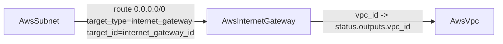

# AwsInternetGateway Deployment Component + Hermetic Go 1.26 SDK

**Date**: June 20, 2026
**Type**: Feature
**Components**: API Definitions, AWS Provider, IAC Stack Runner, Build System, Resource Management

## Summary

Adds `AwsInternetGateway`, a standalone deployment component that creates an internet gateway and attaches it to an AWS VPC, externalizing the gateway that `AwsVpc` currently bundles. The component ships the full anatomy — four protos, Pulumi and Terraform modules at behavioral parity, spec validation tests, documentation, two presets, kind registration, and an E2E verifier — and is validated end to end offline. It also bumps the hermetic Bazel Go SDK to 1.26 so the `e2e/framework/runner` target builds (Terratest now requires Go >= 1.26).

## Problem Statement / Motivation

AWS is the only major provider in the catalog that bundles networking sub-resources (subnets, NAT, internet gateway, route tables) inside a single `AwsVpc` component, so those resources cannot be standalone, independently referenceable graph nodes. The internet gateway is a natural composable primitive: a public subnet is "public" precisely because its route table targets an internet gateway, so the gateway needs to be a first-class node a subnet route can reference.

Separately, the `e2e/framework/runner` Bazel target stopped building because Terratest now requires Go >= 1.26 while the hermetic Bazel SDK was pinned to 1.25 (the repo's `go.mod`/`go.work` were already on 1.26).

## Solution / What's New

### AwsInternetGateway component

- **Spec** (`apis/org/openmcf/provider/aws/awsinternetgateway/v1/spec.proto`): a deliberately minimal surface matching the authoritative `aws_internet_gateway` resource — `region` and a required, **updatable** `vpc_id` (`StringValueOrRef` with `default_kind = AwsVpc`). No CEL rule (no cross-field constraints), no secret-bearing fields.
- **Stack outputs**: `internet_gateway_id`, `internet_gateway_arn`, `vpc_id`, `region` — `internet_gateway_id` is the value an `AwsSubnet` route consumes as its `target_id`.
- **Registration**: `AwsInternetGateway = 285` in `cloud_resource_kind.proto` (id_prefix `awsigw`, `prerequisites: [AwsVpc]`), wired into `pkg/crkreflect`.
- **IaC at parity**: Pulumi (`ec2.NewInternetGateway`) and Terraform (`aws_internet_gateway`) produce identical attachments, identity tags, and stack outputs.

### Attachment semantics

`vpc_id` is required (a declarative graph has no use for a dangling gateway) and **updatable** — unlike a subnet's ForceNew `vpc_id`, AWS allows detaching and re-attaching an internet gateway without replacing it. A VPC may have at most one internet gateway attached at a time.

### Hermetic Go 1.26 SDK

`MODULE.bazel`: `go_sdk.download(version = "1.26.0")`. Verified with `bazel build //e2e/framework/runner/...`.

## Implementation Details

- Mirrors the freshly-forged `AwsSubnet` sibling file-for-file (envelope, FK refs, output naming, layout, identity tagging), deriving field depth from the canonical AWS resource rather than from a sibling.
- `vpc_id` is declared as a flat string in `variables.tf` because the tofu generator flattens `StringValueOrRef` to its string value.
- Adds an `AwsInternetGateway` case to `pkg/outputs/conformance_test.go`; the whole-registry `TestResolve_AllRegisteredKinds` guard confirms the new api/status/outputs wiring (resolved=386, failed=0).
- E2E: `aa_e2e/verify/internet_gateway.go` (DescribeInternetGateways; `InvalidInternetGatewayID.NotFound` is the absent signal), plus `e2e/profile.yaml` and `e2e/scenarios/minimal.yaml`.

## Known Limitations

**Live E2E is gated on the thin-`AwsVpc` work and not yet executed.** A live attach needs a VPC without an internet gateway, but `AwsVpc` unconditionally bundles its own (and AWS permits only one per VPC). Adding a suppression knob purely to unblock a test would be a throwaway shim, since the thin-`AwsVpc` change removes the bundled gateway outright. The E2E verifier, profile (`status: blocked`), and scenario ship as ready artifacts; the harness entry funcs and the green run land with the thin-`AwsVpc` change. The component is otherwise fully validated offline.

## Verification

- `bazel build //e2e/framework/runner/...` (Go 1.26) — pass
- `make protos`, `make generate-cloud-resource-kind-map`, gazelle — pass
- `go test ./pkg/outputs/...` (registry resolution + `AwsInternetGateway` conformance) — pass
- `go run . validate-outputs --kind AwsInternetGateway ...` — 4/4 proto fields, 0 unmapped
- `go test ./apis/.../awsinternetgateway/v1/` — pass
- `go build` (component, both engines, aa_e2e, crkreflect, pkg/outputs) + release-equivalent pulumi entrypoint build — pass
- `tofu validate` — pass
- `go run . secret-coverage --check` — pass
- `bazel build` of all touched targets incl. nogo lint — pass

## Impact

Authors and coding agents can now model a VPC's internet gateway as its own referenceable node and wire public subnets to it explicitly, instead of relying on the implicit gateway buried in `AwsVpc`. This is the second composable primitive (after `AwsSubnet`) and a prerequisite LEGO block for the upcoming thin-`AwsVpc` decomposition.

## Related Work

- `2026-06-20-070523-aws-subnet-component-and-e2e-fk-resolution.md` — the first composability primitive and the E2E foreign-key resolution this component reuses.

---

**Status**: ✅ Production Ready (offline-validated; live E2E activated by the thin-AwsVpc change)
