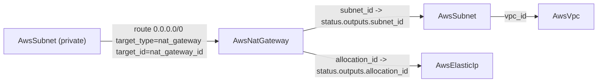

# AwsNatGateway Deployment Component + Deep-Composition E2E Prerequisites

**Date**: June 20, 2026
**Type**: Feature
**Components**: API Definitions, AWS Provider, IAC Stack Runner, E2E Framework, Resource Management

## Summary

Adds `AwsNatGateway`, a standalone deployment component that creates an AWS NAT gateway and composes its Elastic IP by reference, externalizing the NAT gateway that `AwsVpc` currently bundles. The component ships the full anatomy — four protos, Pulumi and Terraform modules at behavioral parity, spec validation tests, documentation, two presets, kind registration, and an E2E verifier — and is **live-proven on both engines**. To make that live proof possible, the E2E framework now resolves foreign-key references across a transitive prerequisite chain, so a two-level composition (VPC → Subnet → NAT gateway + Elastic IP) can be deployed and verified standalone.

## Problem Statement / Motivation

AWS is the only major provider in the catalog that bundles networking sub-resources (subnets, NAT, internet gateway, route tables) inside a single `AwsVpc` component, so those resources cannot be standalone, independently referenceable graph nodes. The NAT gateway is the egress primitive a private subnet routes its default route to; it needs to be a first-class node, and its stable outbound address (an Elastic IP) deserves to be a composable node too rather than an allocation buried inside another resource.

The E2E harness could resolve a component's own `value_from` references against deployed prerequisites, but it deployed each prerequisite's manifest raw. A NAT gateway's prerequisites form a chain — it needs an `AwsSubnet`, which itself references an `AwsVpc` — so the subnet prerequisite's `vpc_id` reference would have deployed unresolved.

## Solution / What's New

### AwsNatGateway component

- **Spec** (`apis/org/openmcf/provider/aws/awsnatgateway/v1/spec.proto`): `region`, a required `connectivity_type` (CEL-validated `public`/`private`), a required immutable `subnet_id` (`StringValueOrRef`, `default_kind = AwsSubnet`), and the Elastic IP composed by reference via `allocation_id` (`default_kind = AwsElasticIp`). Public-gateway scaling via `secondary_allocation_ids`; private-gateway addressing via `private_ip`, `secondary_private_ip_addresses`, and `secondary_private_ip_address_count`.
- **Cross-field validation**: four message-level CEL rules mirror the AWS resource's connectivity-type constraints (public requires an Elastic IP; private forbids any; private-IP addressing is private-only; the two secondary-private-IP forms are mutually exclusive).
- **Stack outputs**: `nat_gateway_id` (the value an `AwsSubnet` route consumes as its `target_id`), `public_ip`, `private_ip`, `network_interface_id`, `subnet_id`, `region`. A NAT gateway has no ARN, and the proto documents that so none is invented.
- **Registration**: `AwsNatGateway = 286` in `cloud_resource_kind.proto` (id_prefix `awsnat`, `prerequisites: [AwsSubnet, AwsElasticIp]`), wired into `pkg/crkreflect`.
- **IaC at parity**: Pulumi (`ec2.NewNatGateway`) and Terraform (`aws_nat_gateway`) produce identical gateways, identity tags, and stack outputs.

### Elastic IP composed, never embedded

A public NAT gateway's stable outbound address is referenced via `allocation_id` → `AwsElasticIp` (or a literal `eipalloc-` id), keeping the IP a first-class node with its own lifecycle.

### Deep-composition E2E prerequisites

`e2e/framework/runner/dependencies.go`: `DeployDependencies` now accumulates each deployed prerequisite's outputs and resolves the next prerequisite's `value_from` references against them before deploying it — the same resolution the component under test already received, extended transitively. This unblocks any deep composition under live E2E.

## Implementation Details

- Mirrors the freshly-forged `AwsInternetGateway`/`AwsSubnet` siblings file-for-file (envelope, FK refs, output naming, layout, identity tagging), deriving field depth from the canonical `aws_nat_gateway` resource rather than from a sibling.
- `subnet_id`/`allocation_id` are declared as flat strings and `secondary_allocation_ids` as `list(string)` in `variables.tf`, because the tofu generator flattens singular `StringValueOrRef` to a string and repeated to `list(string)`.
- Adds an `AwsNatGateway` case to `pkg/outputs/conformance_test.go`; the whole-registry `TestResolve_AllRegisteredKinds` guard confirms the new wiring.
- E2E: `aa_e2e/verify/nat_gateway.go` (DescribeNatGateways; deleted state / `NatGatewayNotFound` = absent) and `aa_e2e/verify/elastic_ip.go` (DescribeAddresses; `InvalidAllocationID.NotFound` = absent, so an Elastic IP can serve as a NAT prerequisite), plus `awselasticip/v1/e2e/prerequisite.yaml`, the NAT `e2e/profile.yaml` (green) and `e2e/scenarios/minimal.yaml`, and `TestAwsNatGateway_{Pulumi,Terraform}` entry funcs.

## Known Limitations

- **Regional / multi-AZ NAT availability mode** (the newer `availability_mode` / `availability_zone_address` / auto-provisioned-zones surface) is intentionally not exposed: the pulumi-aws v7 SDK does not provide those inputs, so surfacing them would break Pulumi/Terraform parity. The established one-NAT-per-AZ high-availability pattern is fully supported.

## Verification

- `make protos`, `make generate-cloud-resource-kind-map`, gazelle — pass
- `go test ./apis/.../awsnatgateway/v1/` (spec validation, public/private + CEL cases) — pass
- `go test ./pkg/outputs/...` (registry resolution + `AwsNatGateway` conformance) — pass
- `go test ./e2e/framework/runner/...` (transitive deploy-order + ref resolution) — pass
- `go run . validate-outputs --kind AwsNatGateway ...` — 6/6 proto fields, 0 unmapped
- `tofu validate`; `go run . secret-coverage --check` — pass
- `bazel build` of all touched targets incl. nogo lint (15 targets) — pass
- **Live E2E (keyless SSO, account 859666865785) GREEN on both engines**: `TestAwsNatGateway_{Pulumi,Terraform}` — DEPENDENCIES-UP (AwsVpc → AwsSubnet → AwsElasticIp) → VALIDATE → DEPLOY → VERIFY-OUT → VERIFY-RES (DescribeNatGateways) → DESTROY → VERIFY-CLN → DEPENDENCIES-DOWN, all pass; zero orphans.

## Impact

Authors and coding agents can now model a NAT gateway as its own referenceable node, compose its Elastic IP explicitly, and wire private subnets to it for outbound access — instead of relying on the implicit NAT buried in `AwsVpc`. This is the third composable AWS networking primitive (after `AwsSubnet` and `AwsInternetGateway`) and, with the deep-composition E2E capability, a prerequisite LEGO block for the upcoming thin-`AwsVpc` decomposition.

## Related Work

- `2026-06-20-083110-aws-internet-gateway-component-and-go-1.26-sdk.md` — the second composability primitive.
- `2026-06-20-070523-aws-subnet-component-and-e2e-fk-resolution.md` — the first primitive and the E2E foreign-key resolution this work extends transitively.

---

**Status**: ✅ Production Ready (live-proven on both Pulumi and Terraform)
