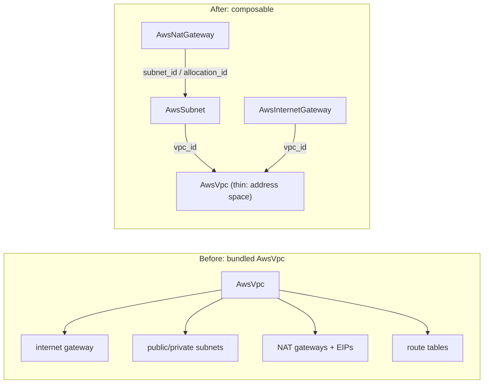

# Thin AwsVpc Decomposition + AwsInternetGateway Live E2E Activation

**Date**: June 20, 2026
**Type**: Breaking Change
**Components**: API Definitions, AWS Provider, Resource Management, E2E Framework

## Summary

`AwsVpc` is now a **thin** component: a real AWS VPC (an IP address space plus
network-wide settings) and nothing else. The internet gateway, subnets, NAT
gateways, and route tables it used to bundle are removed — they are composed from
the standalone `AwsSubnet`, `AwsInternetGateway`, and `AwsNatGateway` components
that reference the VPC. The spec is rebuilt to a 90/10 real-VPC field set (primary
and secondary IPv4 CIDRs, IPv4/IPv6 IPAM, Amazon-provided IPv6, tenancy, DNS, and
NAU metrics) with cross-field validation mirroring AWS, on both Pulumi and
Terraform at parity. `AwsVpc` gains its own live E2E gate, and the
`AwsInternetGateway` live E2E — blocked since it was forged because the bundled
VPC already had a gateway — is now activated.

## Problem Statement / Motivation

AWS was the only provider in the catalog that bundled networking sub-resources
inside its VPC component, so subnets, NAT gateways, and the internet gateway could
not be standalone, independently referenceable graph nodes. With the three
networking primitives now forged and live-proven, the VPC itself must become a
clean building block so a topology is composed from first-class nodes rather than
hidden inside one opaque resource.

## Solution / What's New

### Before vs after

### Thin AwsVpc

- **Spec** (`apis/org/openmcf/provider/aws/awsvpc/v1/spec.proto`): `region`;
  `cidr_block` (primary IPv4, immutable); `secondary_ipv4_cidr_blocks`; IPv4 IPAM
  (`ipv4_ipam_pool_id`, `ipv4_netmask_length`); `instance_tenancy`;
  `enable_dns_support` (proto3 `optional bool`), `enable_dns_hostnames`,
  `enable_network_address_usage_metrics`; and the IPv6 set (Amazon-provided +
  IPAM). Nine message-level CEL rules encode the same allocation-mode constraints
  AWS enforces (primary-source required; explicit-CIDR vs IPAM-netmask exclusive;
  the three-way IPv6 mode exclusivity; netmask ranges; border-group requires
  Amazon-provided).
- **Stack outputs**: `vpc_id`, `vpc_arn`, `cidr_block`, `ipv6_cidr_block`,
  `owner_id`, `main_route_table_id`, `default_security_group_id`,
  `default_network_acl_id`, `default_route_table_id`, `region`. The bundled
  subnet/NAT output messages are removed.
- **IaC at parity**: Pulumi (`ec2.NewVpc` + `ec2.NewVpcIpv4CidrBlockAssociation`)
  and Terraform (`aws_vpc` + `aws_vpc_ipv4_cidr_block_association`) produce
  identical VPCs, identity tags, and outputs.

### DNS-support defaulting (AWS-default-true)

AWS defaults DNS support to on, but a plain proto bool's zero value is omitted by
the tfvars converter — which would silently deploy with DNS resolution off.
`enable_dns_support` is therefore a proto3 `optional bool`: Pulumi omits the
argument when unset and Terraform declares `optional(bool, true)`, so *unset → AWS
default (on)* while an explicit `false` is still honored on both engines.

### AwsInternetGateway live E2E activated; AwsNatGateway prerequisite added

With the thin VPC no longer carrying a gateway, a standalone `AwsInternetGateway`
attaches cleanly to it — its live E2E is now wired and green on both engines.
Conversely, a **public** `AwsNatGateway` requires its VPC to have an internet
gateway attached (AWS rejects the create with `Gateway.NotAttached` otherwise),
which the bundled VPC used to provide implicitly. `AwsInternetGateway` is now a
declared prerequisite of `AwsNatGateway`, so the deploy order is
`AwsVpc → AwsSubnet → AwsElasticIp → AwsInternetGateway → AwsNatGateway`.

## Implementation Details

- Deleted `iac/pulumi/module/{subnets.go,nat_gateway.go}` and
  `iac/tf/{subnets.tf,nat_gateways.tf}`; rewrote the remaining module files to the
  thin shape. Fixed the Terraform identity-tag drift (unprefixed snake_case keys +
  an `env_label` bug) to the `planton.ai/*` `aws_tags` block used by the siblings.
- Rewrote `pkg/outputs` fixtures: `TestTransform_AwsVpc` to the thin shape, the
  bracket-index transform/populate tests repointed to `GcpSubnetwork`, and a new
  thin `AwsVpc` conformance case.
- Removed stale component artifacts (`iac/pulumi/Pulumi.e2e-dep-*.yaml`,
  `iac/pulumi/{debug.sh,README.md}`) to match the current sibling layout.
- Added `AwsVpc` e2e `profile.yaml` + `scenarios/minimal.yaml` + entry funcs, and
  `awsinternetgateway/v1/e2e/prerequisite.yaml` for its new prerequisite role.

## Breaking Changes

- `AwsVpcSpec` is restructured: `availability_zones`,
  `subnets_per_availability_zone`, `subnet_size`, and `is_nat_gateway_enabled` are
  removed; `vpc_cidr` is renamed to `cidr_block`. `AwsVpcStackOutputs` drops the
  embedded `private_subnets`/`public_subnets`/`internet_gateway_id`. There are no
  persisted consumers to protect; subnets/gateways are now composed from the
  standalone components.

## Verification

- `make protos`, `make gazelle` — pass
- `go test ./apis/.../awsvpc/v1/` (thin positives + CEL negatives) — pass
- `go test ./pkg/outputs/...` (transform/populate/conformance/registry) — pass
- `go test ./e2e/framework/runner/...` (new transitive deploy order) — pass
- `go run . validate-outputs --kind AwsVpc ...`; `tofu validate`;
  `go run . secret-coverage --check` — pass
- `bazel build` of touched targets incl. nogo lint — pass
- **Live E2E (keyless SSO, account 859666865785) GREEN on both engines** for
  `AwsVpc`, `AwsSubnet`, `AwsInternetGateway`, and `AwsNatGateway` — deploy →
  verify → destroy → verify-clean, zero orphans.

## Impact

`AwsVpc` is now a clean, composable root node. Authors and coding agents build a
network by composing `AwsSubnet`, `AwsInternetGateway`, and `AwsNatGateway`
against the VPC's `vpc_id`, with the VPC's own depth (secondary CIDRs, IPv6, IPAM)
available from day one. The ~31 components that still reference the VPC's old
subnet outputs migrate to `AwsSubnet` refs in the follow-on slice.

## Related Work

- `2026-06-20-091451-aws-nat-gateway-component-and-deep-composition-e2e.md`
- `2026-06-20-083110-aws-internet-gateway-component-and-go-1.26-sdk.md`
- `2026-06-20-070523-aws-subnet-component-and-e2e-fk-resolution.md`

---

**Status**: ✅ Production Ready (live-proven on both Pulumi and Terraform)
