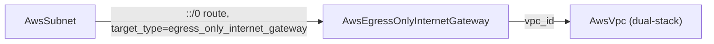

# AWS Subnet Consumer Migration + Foreign-Key Resolution Guard + AwsEgressOnlyInternetGateway

**Date**: June 20, 2026
**Type**: Breaking Change (consumer FK annotations) + New Component + New Tooling
**Components**: API Definitions, AWS Provider, Kubernetes Provider, Resource Management, CLI, E2E Framework

## Summary

Two coordinated changes. First, every AWS consumer that referenced the now-removed
thin-`AwsVpc` subnet outputs is migrated onto the standalone `AwsSubnet` — and a new
permanent, registry-wide guard (`openmcf validate-refs --check`, analyzer
`pkg/refcheck`) makes such drift impossible to ship silently. Second, the
`AwsEgressOnlyInternetGateway` component is forged end to end — the IPv6
outbound-only counterpart of a NAT gateway — completing the AWS networking primitive
set.

## Problem Statement / Motivation

When `AwsVpc` became thin, its bundled `private_subnets`/`public_subnets` stack
outputs were removed, but ~31 components still pointed their `subnet_ids` foreign
keys at `AwsVpc.status.outputs.private_subnets.[*].id`. They compiled green while
referencing a deleted output — a composition that silently fails to resolve at deploy
time. Nothing validated that a foreign-key `default_kind_field_path` points at an
output that actually exists, so the only safe way to migrate (and to prevent
recurrence) was to first build that validator.

## Solution / What's New

### Foreign-key resolution guard (new invariant)

- `pkg/refcheck` walks every production kind's `spec` descriptor (recursing nested and
  repeated fields) and resolves each `(foreignkey.v1.default_kind_field_path)` against
  the referenced kind, dispatching on the path root: `status.outputs.` → the kind's
  `StackOutputs`, `spec.` → its spec, `metadata.` → its metadata. Index segments
  (`[*]`, `[0]`) are skipped; a finding is emitted for any unresolved path.
- `openmcf validate-refs [--check]` exposes it as a CLI gate, mirroring
  `secret-coverage --check`; `pkg/refcheck/analyze_test.go` enforces zero findings in
  `go test`.
- The first run surfaced 45 dangling references — the 34 expected `private_subnets`
  consumer fields plus **11 pre-existing drifted refs** the guard caught for free.

### Consumer migration

- 34 `subnet_ids`/`subnet_id` fields across 31 components repointed from
  `AwsVpc / private_subnets.[*|0].id` to `AwsSubnet / status.outputs.subnet_id` (the
  established `AwsNatGateway.subnet_id` pattern), including the three FSx components'
  `preferred_subnet_id`. Separate `vpc_id → AwsVpc` annotations are untouched.
- 11 guard-surfaced pre-existing dangling refs fixed to the correct outputs:
  `AwsS3Bucket` → `bucket_id` (not `bucket_name`; `awscodebuildproject` ×3,
  `awscodepipeline`, `awsglobalaccelerator`, `awsmskcluster`); `AwsCertManagerCert` →
  `cert_arn` (not `certificate_arn`; `awscloudfront`, `awscognitouserpool`,
  `awsopensearchdomain`); `AwsSecurityGroup` → `security_group_id` (not `id`;
  `kubernetesingressnginx`); and `kubernetesingressnginx`'s removed
  `AwsVpc.public_subnet_ids` → `AwsSubnet / subnet_id`.
- All public artifacts (presets, catalog pages, READMEs, docs) rewritten to the
  `AwsSubnet` shape, expanding multi-subnet examples into distinct per-subnet refs and
  normalizing the inconsistent `field:`→`fieldPath:` key and malformed spellings.

### AwsEgressOnlyInternetGateway (new component, `= 287`)

- Four protos mirroring `AwsInternetGateway`: `region` + immutable `vpc_id`
  (`StringValueOrRef` → `AwsVpc`); outputs `egress_only_internet_gateway_id`,
  `vpc_id`, `region` (no ARN — AWS exposes none). No CEL, no secrets.
- Registered `AwsEgressOnlyInternetGateway = 287` (`id_prefix awseigw`,
  `prerequisites: [AwsVpc]`).
- Dual-engine IaC at parity: Terraform `aws_egress_only_internet_gateway`, Pulumi
  `ec2.NewEgressOnlyInternetGateway`; identical identity tags and output keys; new
  `pkg/outputs/conformance_test.go` case.
- spec_test, README/catalog/docs, two presets (greenfield by-ref, brownfield literal),
  hack manifest — mirroring the sibling's lean file set (no per-module READMEs/debug.sh).
- E2E: a `DescribeEgressOnlyInternetGateways` verifier that treats **both** an empty
  result set and the typed `InvalidEgressOnlyInternetGatewayId.NotFound` as absent (the
  describe's not-found behavior differs from `DescribeInternetGateways`); test
  entrypoints; green profile; prerequisite + minimal scenario.

## Breaking Changes

- The `subnet_ids`/`subnet_id` foreign-key `default_kind` on the migrated consumers
  changes from `AwsVpc` to `AwsSubnet`, and the resolved value is now a single subnet
  id per ref rather than an `[*]` fan-out across the VPC's subnets. Manifests that
  referenced the VPC's subnet outputs must enumerate `AwsSubnet` refs. No persisted
  consumers exist to protect.

## Verification

- `make protos` + `make generate-cloud-resource-kind-map` + gazelle — pass
- `go run . validate-refs --check` → all resolve (0 findings); `go test ./pkg/refcheck/...` — pass
- `go test ./pkg/outputs/...` (incl. new egress-only conformance case) — pass
- `go test -v ./apis/.../awsegressonlyinternetgateway/v1/` — pass
- `go vet -tags=e2e ./e2e/aws/... ./apis/.../aa_e2e/...`; `go run . secret-coverage --check`;
  `go run . validate-outputs --kind AwsEgressOnlyInternetGateway`; `tofu validate` — pass
- `go build` of the new component + Pulumi entrypoint, and a sample of migrated
  components — pass
- `bazel build` of all touched targets incl. nogo lint — pass
- **Live E2E** for `AwsEgressOnlyInternetGateway` is prepared (verifier + green profile +
  scenario) and pending one interactive `aws sso login` (the only step that needs a live
  cloud account).

## Impact

The AWS networking primitive set is complete (`AwsVpc`, `AwsSubnet`,
`AwsInternetGateway`, `AwsNatGateway`, `AwsEgressOnlyInternetGateway`), and the
consumer surface no longer references removed VPC outputs. `validate-refs --check`
becomes a standing guarantee that foreign-key composition resolves — proposed as a new
forge gate alongside `secret-coverage` and `validate-outputs`.

## Related Work

- `2026-06-20-102917-thin-awsvpc-decomposition.md`
- `2026-06-20-091451-aws-nat-gateway-component-and-deep-composition-e2e.md`

---

**Status**: ✅ Offline-validated on both Pulumi and Terraform; egress-only live E2E pending SSO login
