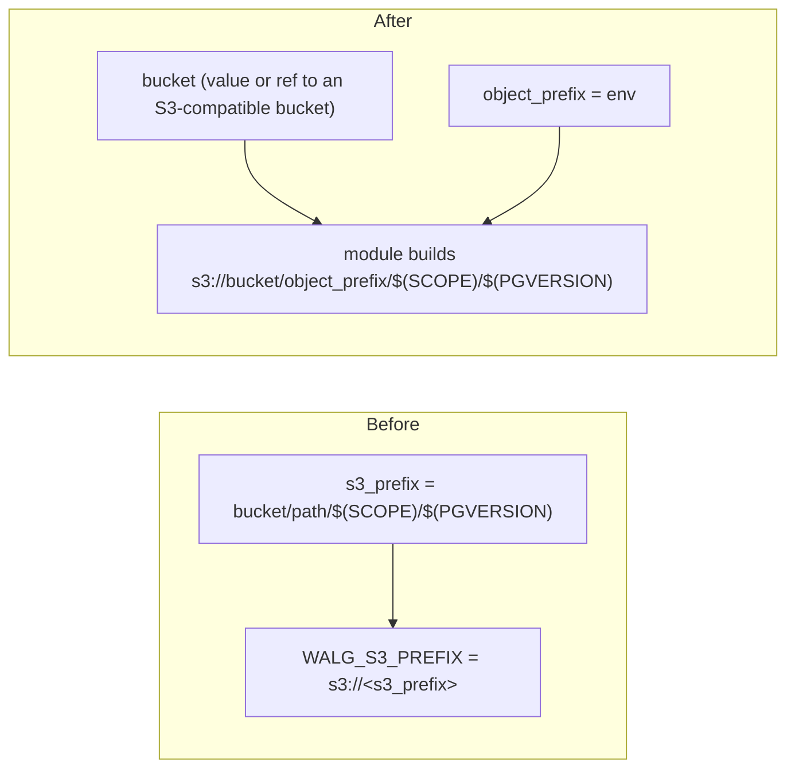

# Kubernetes Postgres R2 Backup: Referenceable Bucket + Composed WAL-G Path

**Date**: June 24, 2026
**Type**: Breaking Change
**Components**: API Definitions, Kubernetes Provider, IaC Modules (Pulumi + Terraform)

## Summary

The R2 backup/restore configuration on both Kubernetes Postgres components —
`KubernetesPostgres` (per-database) and `KubernetesZalandoPostgresOperator`
(cluster-wide) — is rebuilt to one symmetric, composable shape. The storage
bucket is now a first-class `StringValueOrRef` (`bucket`) that can reference any
S3-compatible bucket resource's output, separated from an `object_prefix`. The
modules compose the full WAL-G target — `s3://<bucket>/<object_prefix>/$(SCOPE)/$(PGVERSION)`
— internally on both engines, so callers never type Zalando/WAL-G path internals.
The duplicate per-direction R2-config messages are unified into a single
credentials message per component.

## Problem Statement / Motivation

The bucket was folded into a free-form S3 prefix string, so it could not be
cross-referenced from a bucket resource, and callers had to hand-encode the
operator's `$(SCOPE)/$(PGVERSION)` substitution. Backup and restore each defined
their own identical R2-config message. The two sibling components diverged on the
same concept, which undercuts the goal of an agent learning one provider by
reading another.

## Solution / What's New

### Canonical shape (both components)

- `bucket` — a bare `StringValueOrRef` (no `default_kind`): a literal name, or a
  `value_from` reference to any S3-compatible bucket output (for example a
  `CloudflareR2Bucket`'s `status.outputs.bucket_name`), with the referenced kind
  set explicitly so no single provider is assumed.
- `object_prefix` — the base path under the bucket; the module appends the
  per-cluster/per-version segments.
- A single `*R2Credentials` message per component
  (`KubernetesPostgresR2Credentials`, `KubernetesZalandoPostgresOperatorR2Credentials`)
  with `cloudflare_account_id`, `access_key_id`, and `(sensitive)` `secret_access_key`.

### KubernetesPostgres

- `KubernetesPostgresBackupConfig`: `enabled`, `bucket`, `object_prefix`,
  `schedule`, `retain_count`, `credentials`, and a nested `restore`.
- `KubernetesPostgresRestoreConfig`: `enabled`, `bucket`, `object_prefix`,
  `credentials`. Restore composes `s3://<bucket>/<object_prefix>` for the Zalando
  `spec.standby.s3_wal_path` (no runtime substitution — the source scope is
  historical).
- Conditional validation moved into the proto as message-level CEL: restore
  requires `bucket` + `object_prefix` + `credentials`; backup credentials require
  a `bucket`. The previous runtime guards in the Pulumi module are removed.

### KubernetesZalandoPostgresOperator

- `bucket` is lifted out of the credentials message into a top-level
  `StringValueOrRef`; `s3_prefix_template` becomes `object_prefix`; the cluster's
  single backup configmap composes the same WAL-G target. The operator keeps its
  `enable_wal_g_backup` / `enable_wal_g_restore` / `enable_clone_wal_g_restore`
  flags.

### IaC at parity

Pulumi and Terraform compose byte-for-byte identical `WALG_S3_PREFIX` and
`STANDBY_*`/`AWS_*` environment, with credentials delivered through a generated
Kubernetes Secret referenced via `secretKeyRef` (never plaintext).

## Breaking Changes

- `KubernetesPostgresBackupConfig` drops `enable_backup`, `s3_prefix`,
  `backup_schedule`, `backup_retain_count`, and `r2_config`; restore drops
  `bucket_name`, `s3_path`, and `r2_config`. The `KubernetesPostgresBackupR2Config`
  and `KubernetesPostgresRestoreR2Config` messages are removed.
- `KubernetesZalandoPostgresOperatorBackupConfig` drops `s3_prefix_template` and
  the bundled `bucket_name`; `backup_schedule` becomes `schedule`;
  `KubernetesZalandoPostgresOperatorBackupR2Config` is replaced by
  `KubernetesZalandoPostgresOperatorR2Credentials`.
- These fields have no persisted consumers, so there is no migration burden.

## Verification

- `make protos`, `make gazelle`, `make build-go` — pass
- `go test ./apis/.../kubernetespostgres/v1/...` and
  `./apis/.../kuberneteszalandopostgresoperator/v1/...` (new positives + CEL
  negatives) — pass
- `go run . secret-coverage --check` — pass
- `go run . validate-outputs` for both kinds (input-only refactor; outputs
  unchanged) — pass
- Standalone `tofu plan` asserting the composed `WALG_S3_PREFIX`; Pulumi/Terraform
  env parity — pass

## Impact

Authors and coding agents wire Postgres backups by referencing a bucket resource
and an environment prefix; the operator-internal path layout is owned entirely by
the modules. Both Kubernetes Postgres components now teach the same pattern.

---

**Status**: Production Ready (Pulumi and Terraform at parity)
