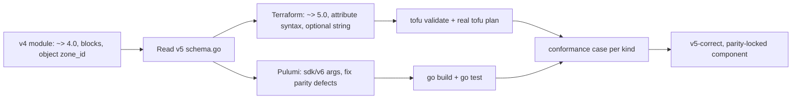

# Cloudflare provider v5 migration — the remaining eight components

**Date**: June 24, 2026
**Type**: Breaking Change
**Components**: API Definitions, Provider Framework, IAC Stack Runner, Pulumi CLI Integration, Manifest Processing

## Summary

Completes the migration of the entire Cloudflare provider family to Terraform provider **v5**
(`cloudflare ~> 5.0`) / Pulumi `sdk/v6`. With `CloudflareR2Bucket` already shipped, this change
brings the other eight kinds — D1, KV namespace, DNS record, DNS zone, ruleset, load balancer,
worker, and zero-trust access application — onto v5 with full Terraform↔Pulumi parity and outputs
that match each `*_stack_outputs.proto`. Every Cloudflare kind now plans and deploys on provider v5.

## Problem Statement / Motivation

The Cloudflare provider v5 is a generated rewrite of v4: resources were renamed, enum casing
changed, and many nested **blocks** became nested **attributes**. All nine Planton Cloudflare
modules were pinned to `~> 4.0` and used v4 syntax, so none could `plan` against v5. Beyond the
version pin, the audit surfaced real latent defects that would break deploys on any version.

### Pain Points

- **Every module pinned `cloudflare ~> 4.0`** and used removed/renamed resources and block syntax.
- **`StringValueOrRef` mistyped as `object({ value })`** in Terraform `variables.tf`. The tfvars
  converter flattens `StringValueOrRef` to a bare string, so these modules failed on real manifests
  (present in dns_record, ruleset, load_balancer, worker, zero_trust).
- **Enums typed as numbers.** The converter emits enum *names* (e.g. `cookie`, `random`), but the
  load balancer and worker modules treated `session_affinity`/`steering_policy`/`usage_model` as
  numeric lookups — always falling back to the default.
- **Cross-engine drift.** Several Pulumi modules lagged (deprecated `NewRecord`, an orphaned
  zero-trust policy, a load balancer missing the required `account_id`, a worker dropping secrets).
- **KV could not deploy at all on v5** — see Breaking Changes.

## Solution / What's New

Each component was migrated through the `update-planton-component` flow: read the component's own
docs, then the v5 `schema.go`; migrate Terraform and Pulumi together; reconcile parity; validate;
refresh public artifacts.



### Per-component highlights

- **D1**: `read_replication` v4 dynamic block → v5 single-nested attribute.
- **KV namespace**: built out the previously-stub Terraform module; **added required `account_id`**
  (see Breaking Changes).
- **DNS record**: `cloudflare_record` → `cloudflare_dns_record`; `.hostname` output → `.name`.
- **DNS zone**: nested `account = { id }`; removed v5-deleted `plan`/`jump_start` and the
  `cloudflare_zone_settings_override` resource; embedded records → `cloudflare_dns_record`.
- **Ruleset**: every `dynamic` block → v5 attribute syntax; header transforms became a map keyed
  by header name.
- **Load balancer**: `default_pools`/`fallback_pool`; the account-scoped pool and monitor now derive
  `account_id` from a `cloudflare_zone` data source (Pulumi `LookupZone`) — no spec change needed.
- **Worker**: per-type binding blocks → the flat v5 `bindings` list; `workers_route`; `main_module`.
- **Zero-trust access application**: v5 model where a standalone account-scoped policy is referenced
  by the application's `policies` list; include/require rules became single-nested objects.

## Implementation Details

- **Terraform**: provider pinned to `~> 5.0`; all v4 `dynamic` blocks rewritten to attribute
  (object/list/map) syntax; `StringValueOrRef` variables retyped to `optional(string)` with the
  `.value`/`.ref` dereferences removed; enum fields retyped to strings consumed directly.
- **Pulumi**: confirmed `sdk/v6` usage and fixed lagging calls — `NewDnsRecord` (dns zone + worker),
  `AccountId` on load balancer pool/monitor via `LookupZone`, `secret_text` worker bindings,
  and the zero-trust policy now created first and attached through the application's `policies` list
  with both resources scoped by `account_id`.
- **Outputs/parity**: each module reconciled to its `*_stack_outputs.proto`, and a per-kind case was
  added to `pkg/outputs/conformance_test.go` so Terraform↔Pulumi output parity is enforced in CI.

## Breaking Changes

- **`CloudflareKvNamespaceSpec` gains a required `account_id`** (field 4). Cloudflare provider v5
  makes `account_id` required on `cloudflare_workers_kv_namespace`, and a KV namespace is
  account-scoped with no zone to derive it from, so the field is unavoidable. It mirrors the existing
  `account_id` on `CloudflareR2Bucket` and `CloudflareD1Database` (plain required 32-hex string).
- **Provider major bump to v5 across all Cloudflare kinds.** Existing state created with the v4
  provider must be migrated per Cloudflare's v5 upgrade guidance.

## Validation / Testing Strategy

Agent-owned and green before handoff:

```bash
make -C apis protos                                   # KV proto regen
go test ./apis/dev/planton/provider/cloudflare/...    # all nine components
go test ./pkg/outputs/                                # conformance (all nine kinds)
planton secret-coverage --check
# per component:
tofu init && tofu validate                            # offline, against real v5 provider
tofu plan -var-file=<generated tfvars>                # real, read-only, live account
```

A real `tofu plan` against a live Cloudflare account confirmed D1, KV, DNS record, DNS zone,
ruleset, load balancer, and zero-trust (the load balancer and zero-trust data-source reads exercise
the live zone → account derivation). The worker module's R2 bundle data source needs a real object,
so its v5 `bindings` were type-checked against the live provider in isolation.

## Benefits

- Every Cloudflare kind plans and deploys on provider v5; the family is unblocked for downstream use.
- Real latent defects (the `object({ value })` mistyping, enum-as-number, cross-engine drift) are
  fixed, not just version-bumped.
- Terraform↔Pulumi output parity is now CI-enforced for all nine kinds.

## Impact

CLI users deploying any Cloudflare resource now run on the current provider. Anyone with existing
v4-provider state must follow the v5 upgrade path; KV manifests must add `accountId`.

## Related Work

- `_changelog/2026-06/2026-06-24-203431-cloudflare-r2-bucket-provider-v5.md` — the R2 migration that
  established the pattern this change follows.

---

**Status**: ✅ Production Ready
**Timeline**: Single session; eight components, one commit each.
