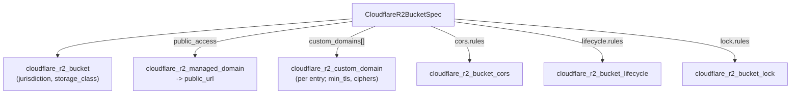

# Cloudflare R2 raised to 90/10, and the completeness doctrine moves to schema-as-floor

**Date**: June 25, 2026
**Type**: Enhancement
**Components**: API Definitions, Provider Framework, IAC Stack Runner, Manifest Processing

## Summary

Two connected changes. First, the component-completeness doctrine moves from **80/20** to
**90/10**: the provider's own schema is now the *floor* we benchmark coverage against, never the
ceiling we trim below. Second, `CloudflareR2Bucket` becomes the first reference implementation of
that bar — enriched from a thin five-field spec into a complete object-storage component that
covers jurisdiction, storage class, multiple custom domains, real managed public access, CORS,
object lifecycle, and object lock, with full Terraform↔Pulumi parity and a live-validated deploy.

## Problem Statement / Motivation

The doctrine codified in `architecture/` and `_rules/deployment-component/` defined a "complete"
component as the 20% of fields 80% of users need, and explicitly framed the provider API as
something to *under-cover* ("we don't expose every knob", "not a wholesale copy of the provider's
API"). That framing caps ambition: an advanced organization cannot reach the long tail of what a
provider actually offers.

`CloudflareR2Bucket` was the symptom — it modeled only bucket name, account id, location hint,
a boolean public-access flag, and a single custom domain. The v5 provider exposes far more that
real buckets use: data-residency jurisdiction, default storage class, multiple custom domains
(with min-TLS and cipher control), genuine public access via the managed r2.dev domain, CORS,
lifecycle transitions/expiration, and write-once object lock.

## Solution / What's New

### The doctrine: 90/10, schema-as-floor

Updated the canonical completeness doctrine across `architecture/deployment-component.md`,
`architecture/specification-guidelies.md`, `architecture/presets.md`, `architecture/README.md`,
the `_rules/deployment-component/{forge,audit,update,fix}` rules, and the public
`site/.../contributing/adding-components.md`. Completeness is now "broad majority-user coverage
benchmarked against the provider schema as the floor", with sensible defaults so breadth never
costs usability, and genuinely beta/niche surfaces skipped *with a recorded reason*. Quality
(tested, parity-verified, deploy-validated) remains the constant; coverage is raised on top of it.

### R2 as the reference implementation

`CloudflareR2Bucket` is enriched as a single rich component — its sub-resources are folded as
nested config (the shape `AwsS3Bucket` already uses for lifecycle/cors/logging), since each is
1:1 with the bucket and meaningless in isolation:

- `jurisdiction` (`default`/`eu`/`fedramp`) and `storage_class` (`Standard`/`InfrequentAccess`).
- `public_access` is now real: it provisions the managed `r2.dev` domain and exports `public_url`.
- `custom_domain` → `custom_domains` (repeated), each with `min_tls` and `ciphers`.
- `cors`, `lifecycle`, and `lock` nested configurations, each provisioning its underlying
  v5 resource only when rules are present.

## Implementation Details

- **Proto** (`spec.proto`): new enums `CloudflareR2StorageClass`, `CloudflareR2CorsAllowedMethod`,
  `CloudflareR2ConditionType`, dense nested config messages, and CEL rules (Age requires
  `max_age_seconds`; Date requires `date`; lifecycle conditions forbid `Indefinite`; CORS
  `max_age_seconds` range). `jurisdiction` and `min_tls` are validated strings rather than enums
  because their API values (`default`, `1.0`) are not legal identifiers across all five stub
  languages (`default` is a Java keyword) — a deliberate, portable choice.
- **Outputs**: `custom_domain_url` → repeated `custom_domain_urls`; added `public_url`.
- **Both engines** move together to the proto contract: the Terraform module provisions the
  bucket plus per-entry custom domains (`for_each`) and the conditional sub-resources; the Pulumi
  module mirrors it exactly (loop + conditional creates). `jurisdiction` flows to every
  sub-resource. The abort-multipart transition is always an `Age` condition and storage-class
  transitions always target `InfrequentAccess` (the sole supported class) on both sides.
- **Parity guard**: extended the `CloudflareR2Bucket` case in `pkg/outputs/conformance_test.go`
  to the new output set; updated `pkg/iac/MODULE_PARITY.md`.
- **Tests**: `spec_test.go` covers every new field, enum, and CEL path (happy + error + boundary).

## Validation

`make protos` (all five stub languages), `go test` for the component + `pkg/outputs` +
`pkg/secretcoverage`, `go build ./apis/...`, the Pulumi entrypoint build + `ensure_pulumi_entrypoints`
guard, `tofu validate`, and a **live `tofu apply` + `destroy`** against a real Cloudflare account:
a throwaway bucket exercising managed public access, CORS, lifecycle, and lock deployed cleanly,
populated `public_url` from the live r2.dev domain, and tore down with no leftover resources.

## Impact

- Every provider's components are now graded against the 90/10 bar; existing components are not
  retroactively changed and are revisited on their own cadence.
- `CloudflareR2Bucket` is a drop-in superset of its previous self — all prior specs remain valid
  except the `custom_domain` → `custom_domains` rename (no external consumer used the singular form).

## Related Work

- Builds on the Cloudflare provider v5 migration (`2026-06-24-203431`,
  `2026-06-24-230148`). Establishes the nested-config shape later Cloudflare families reuse where
  sub-resources are genuinely bucket-scoped configuration rather than independently-referenced nodes.

---

**Status**: ✅ Production Ready
