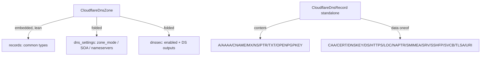

# Cloudflare DNS Family Raised to 90/10 (v5)

**Date**: June 25, 2026
**Type**: Breaking Change
**Components**: API Definitions, Manifest Processing, IAC Stack Runner, Provider Framework

## Summary

The Cloudflare DNS family — `CloudflareDnsRecord` and `CloudflareDnsZone` — was raised from
its initial surface to deep (90/10) coverage against Cloudflare provider v5. The standalone
record now covers all 21 record types with typed structured data, and the zone now models its
type, vanity name servers, folded zone-wide DNS settings, and folded DNSSEC — while keeping its
embedded records as the intentional lean convenience model. Both IaC engines (Terraform and
Pulumi) were reconciled to the proto contract and validated with live `tofu plan` against the
real v5 provider.

## Problem Statement / Motivation

After the v5 correctness migration, the DNS components were deployable but shallow: the record
exposed only 8 of 21 record types, no structured `data`, no `tags`/`settings`, and a mislabeled
`hostname` output; the zone carried two fields that do not exist in the v5 zone resource
(`plan`, `default_proxied`) and omitted `type`, vanity name servers, DNS settings, and DNSSEC.

### Pain Points

- Structured record types (SRV, CAA, DS, TLSA, HTTPS, ...) could not be expressed at all.
- The record's `hostname` stack-output field name didn't match the value it carried (v5 `name`).
- The zone spec advertised a `plan` enum that v5 treats as a deprecated/computed attribute.
- DNSSEC — whose DS material users must copy to a registrar — had no representation.

## Solution / What's New

### CloudflareDnsRecord — full v5 depth

- `value` → `content` (field number preserved; wire-compatible rename).
- `RecordType` expanded from 8 to all 21 v5 types (existing enum numbers preserved).
- Structured data modeled as a **typed `oneof`** with 13 per-type sub-messages
  (CAA, CERT, DNSKEY, DS, HTTPS, LOC, NAPTR, SMIMEA, SRV, SSHFP, SVCB, TLSA, URI) — each
  exposing only its relevant, validated fields rather than a flat bag of every attribute.
- Added `tags`, `settings{ipv4_only, ipv6_only, flatten_cname}`.
- CEL enforces exactly one of `content` or a `data` block, matching the record type; top-level
  `priority` is reserved for MX (structured types carry their own priority inside `data`).
- Output `hostname` → `record_name`, reconciled across proto, both engines, and the conformance
  guard.

### CloudflareDnsZone — v5 with folded settings and DNSSEC

- Added `type` (full/partial/secondary/internal) and `vanity_name_servers`.
- Dropped `plan` and `default_proxied` (reserved their field numbers); kept embedded `records[]`
  as the lean convenience model (its `value` → `content` for naming parity with the standalone).
- Folded `dns_settings{}` (zone_mode, flatten_all_cnames, foundation_dns, multi_provider,
  secondary_overrides, ns_ttl, soa{}, nameservers{}, internal_dns{}) and `dnssec{}` (enabled,
  multi_signer, presigned, use_nsec3) onto the zone. The module still provisions the separate
  underlying `cloudflare_zone_dns_settings` and `cloudflare_zone_dnssec` resources.
- Exported zone `status` plus the DNSSEC DS material (`dnssec_ds`, `dnssec_digest`,
  `dnssec_digest_type`, `dnssec_digest_algorithm`, `dnssec_algorithm`, `dnssec_key_tag`,
  `dnssec_public_key`, `dnssec_flags`).

## Implementation Details

- **Records stay embedded on the zone.** This is the intentional, consistent cross-provider
  design (AWS Route53, GCP, DigitalOcean all embed a lean record list); the standalone
  first-class record coexists for full depth (precedent: OCI ships both).
- **DNSSEC and DNS settings fold, not forge.** Each is singleton, referenced by nothing, and
  meaningless without the zone — the same decompose-test outcome that folded R2's sub-resources.
- **Converter ↔ Terraform mapping for the `data` oneof.** The proto oneof serializes (via
  `protojson` → snake_case) as `data: { <case>: {...} }`; the Terraform module declares each
  case as a nested optional object and `locals.tf` flattens the single active case into the
  provider's flat `data` object using `try()` so absent cases are skipped.

## Breaking Changes

- `CloudflareDnsRecord`: `value` → `content`; record value for structured types now comes from
  `data` rather than `content`; output `hostname` → `record_name`.
- `CloudflareDnsZone`: `plan` and `default_proxied` removed; embedded record `value` → `content`.

These are deliberate on this pre-1.0 surface.

## Known Limitations

- The record's `private_routing` field (Terraform v5) is deferred: the pulumi-cloudflare SDK
  (v6.10.1) does not expose it, and shipping it on one engine only would break tofu↔pulumi parity.

## Testing Strategy

- `make protos` (incl. the Java-stub compile gate) and full `go build ./apis/...`.
- Component spec tests for every new field/enum/CEL path on both kinds; `pkg/outputs`
  conformance and `pkg/secretcoverage` green.
- Live `tofu plan` against the real Cloudflare v5 provider for A, SRV, and CAA records and for a
  full zone (zone + dns_settings with SOA/nameservers + dnssec + records). Live `tofu apply` is
  pending a Cloudflare token with `Zone.DNS:Edit` (the available token is R2-scoped).

## Impact

Cloudflare DNS users can now express the entire record surface and manage zone-level DNS settings
and DNSSEC declaratively, with consistent outputs (including the DS material needed at the
registrar) across both IaC engines.

## Related Work

- Builds on the v5 correctness migration and the R2 90/10 work (and its fold doctrine).

---

**Status**: ✅ Production Ready (live `tofu apply` validation pending a DNS-scoped token)
**Timeline**: One session
