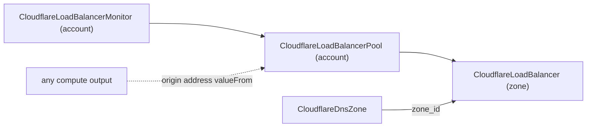

# Cloudflare Load Balancing decomposed into pool + monitor + load balancer

**Date**: June 25, 2026
**Type**: Breaking Change
**Components**: API Definitions, Provider Framework, IAC (Terraform + Pulumi), Resource Management

## Summary

Decomposed the bundled `CloudflareLoadBalancer` into the three resources
Cloudflare actually models, and raised the whole family to deep ("90/10") v5
coverage. `CloudflareLoadBalancerMonitor` (kind 1812) and
`CloudflareLoadBalancerPool` (kind 1811) are new account-scoped, reusable,
foreign-key-referenced kinds; `CloudflareLoadBalancer` is now a slim zone-scoped
resource that references pools and carries the full steering / session-affinity /
geo-routing surface. Both engines move together and were validated to a clean
`tofu validate` and `tofu plan` against the real v5 provider.

## Problem Statement / Motivation

The previous `CloudflareLoadBalancer` bundled the monitor, the pool, and the load
balancer into one flat zone-scoped spec and created the account-scoped pool and
monitor internally.

### Pain Points

- **Structurally wrong on v5.** `load_balancer_pool` and `load_balancer_monitor`
  are **account-scoped** resources; `load_balancer` is **zone-scoped**. Bundling
  them hid that boundary and prevented pools/monitors from being reused.
- **Shallow.** The bundled spec exposed ~6 knobs versus the provider's deep
  steering, session-affinity, geo-pool, and pool/origin surface.
- **Not composable.** A pool could not be referenced by more than one load
  balancer, and origins/health checks could not be shared.

## Solution / What's New

Three first-class kinds that mirror Cloudflare's own resource topology and
lifecycle boundaries — the same principle the codebase already applies when it
*bundles* tightly-coupled resources (e.g. `AwsAlb`), here producing a split
because Cloudflare models these as independent.

### CloudflareLoadBalancerMonitor — forged (kind 1812, `cflbm`)

Account-scoped health check: `type` (http/https/tcp/udp_icmp/icmp_ping/smtp),
`path`/`expected_codes`/`expected_body`/`method`/`headers`, `port`,
`interval`/`timeout`/`retries`, `consecutive_up`/`down`, `follow_redirects`,
`allow_insecure`, `probe_zone`. A message-level CEL rule requires a port for
tcp/udp_icmp/smtp. Outputs: `monitor_id`, `monitor_type`.

### CloudflareLoadBalancerPool — forged (kind 1811, `cflbp`)

Account-scoped origin group: `origins[]` (each `address` a `StringValueOrRef`
with no fixed kind, so an origin can reference any compute output; plus
`weight`/`enabled`/`port`/`host_header`/`virtual_network_id`/`flatten_cname`), a
`monitor` reference (FK → `CloudflareLoadBalancerMonitor`), `check_regions`
(enum), `minimum_origins`, `latitude`/`longitude`, `load_shedding`,
`origin_steering`, and `notification_filter`. `monitor_group` is reserved (niche
enterprise grouping). Outputs: `pool_id`, `pool_name`.

### CloudflareLoadBalancer — slimmed and deepened (kind 1804)

Removed the embedded `origins` and internal pool/monitor creation. Now references
pools: `default_pools[]` and `fallback_pool` (FK → `CloudflareLoadBalancerPool`).
Full steering surface added: expanded `steering_policy` (off/geo/random/
dynamic_latency/proximity/least_outstanding_requests/least_connections), expanded
`session_affinity` (none/cookie/ip_cookie/header) with `session_affinity_ttl` and
`session_affinity_attributes`, `region_pools`/`country_pools`/`pop_pools` (modeled
as `[{code, pool_ids[]}]` and rebuilt into the provider's `{code => pool_ids}`
map), `adaptive_routing`, `location_strategy`, and `random_steering`. The v5
`rules[]` (BETA, not GA) is a recorded skip. Fixed `load_balancer_cname_target`
to resolve to the hostname (it previously, incorrectly, echoed the LB id).

## Implementation Details

- **Field shapes follow established grain**: bare `repeated StringValueOrRef` for
  `default_pools` (as in `awsalb.subnets`); `StringValueOrRef` without a fixed
  `default_kind` for origin `address` (as in `digitaloceandnszone.values`); enums
  for safe fixed sets, with `samesite`/`secure`/policy values modeled as
  CEL-validated strings where a v5 value is not a legal identifier across all five
  stub languages (e.g. SameSite `None`).
- **Engine parity**: Pulumi `sdk/v6 v6.17.0` exposes the full LB/pool/monitor
  surface, so both engines model every field with **no deferrals** (consistent
  with the standing proto-leads principle).
- **Default handling**: `none`/`off` enum defaults and 0-valued tuning knobs are
  omitted by both engines so the provider applies its own defaults.

## Validation

`make protos` (incl. the Java compile gate) green; `go build` of all three
components and their Pulumi entrypoints (release contract); spec tests for all
three with happy/error/boundary cases per new field, enum, and CEL rule;
`pkg/outputs` conformance extended with the two new kinds (the tofu↔pulumi parity
guard); `pkg/secretcoverage` green (the family has no secret-bearing fields);
`tofu validate` of all three modules against the real v5 provider; kind-map
regenerated and gazelle BUILD files regenerated.

## Live validation

A full **live `tofu apply` + `destroy`** against a real Cloudflare account
exercised the whole dependency chain end to end: a Monitor, then a Pool wired to
that monitor (`monitor` FK resolved), then a zone-scoped Load Balancer wired to
that pool (`default_pools`/`fallback_pool` FKs resolved) on a throwaway hostname
(`lb-planton-test.gitr.dev`), followed by a clean teardown of all three (zero
leftover resources). The `load_balancer_cname_target` output correctly resolved to
the hostname. Cloudflare's own server-side validations were observed working
through the modules along the way (rejecting non-globally-routable origins under an
attached monitor; enforcing the plan's probe-region cap). Enabling this required
the account's Load Balancing add-on plus an API token carrying the account-scoped
`Load Balancing: Monitors and Pools` and the zone-scoped `Load Balancers`
permission groups.

## Related Work

- Follows the R2 (90/10 + fold), DNS family, and Workers/KV/D1 slices in the
  Cloudflare v5 coverage effort.
- Builds on the v6.17.0 SDK upgrade that established full tofu↔pulumi parity.

---

**Status**: ✅ Production Ready (live apply/destroy validated end to end)
