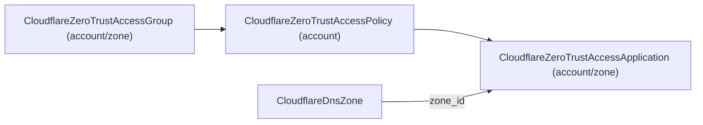

# Cloudflare Zero Trust Access family raised to 90/10 (decomposed into app + policy + group)

**Date**: June 25, 2026
**Type**: Breaking Change
**Components**: API Definitions, Provider Framework, IAC (Terraform + Pulumi), Resource Management

## Summary

Decomposed Cloudflare Zero Trust Access into the three resources the provider
actually models and raised the whole family to deep ("90/10") v5 coverage.
`CloudflareZeroTrustAccessPolicy` (kind 1813) and `CloudflareZeroTrustAccessGroup`
(kind 1814) are new, reusable, foreign-key-referenced kinds; the rewritten
`CloudflareZeroTrustAccessApplication` (kind 1806) is the protected resource that
binds policies by reference and now exposes the full v5 application surface. Both
IaC engines move together and were validated end to end with a live
`tofu apply`/`destroy` of the group -> policy -> application chain.

## Problem statement

The previous `CloudflareZeroTrustAccessApplication` bundled a single hard-coded
policy inside the application and exposed only a handful of knobs (name, hostname,
allowed emails, Google groups, MFA toggle). It could not express reusable policies
or groups, the deep application surface (SaaS/SCIM/destinations/CORS/target
criteria/MFA/MCP), or the full Access rule catalog.

## What's new

### CloudflareZeroTrustAccessGroup — forged (kind 1814, `cfztg`)

A reusable, account- or zone-scoped bundle of access rules. `include` / `exclude` /
`require` are lists of a `CloudflareAccessRule` oneof with all 26 v5 variants
(email, email_domain, email_list, everyone, ip, ip_list, certificate, group,
azure_ad, github_organization, gsuite, okta, saml, oidc, auth_context, auth_method,
common_name, geo, device_posture, external_evaluation, login_method, service_token,
any_valid_service_token, linked_app_token, user_risk_score, cloudflare_account_member).
The `group` rule references another group (`status.outputs.group_id`) for
group-of-groups composition. Output: `group_id`.

### CloudflareZeroTrustAccessPolicy — forged (kind 1813, `cfztp`)

A reusable, account-scoped decision (`allow` / `deny` / `non_identity` / `bypass`)
plus the same `CloudflareAccessRule` set and the governance surface:
`session_duration`, approval workflow (`approval_required` + `approval_groups`),
`isolation_required`, purpose justification, `connection_rules` (RDP clipboard),
and per-policy `mfa_config`. Output: `policy_id`.

### CloudflareZeroTrustAccessApplication — rewritten (kind 1806)

Full v5 surface: 14-value `type` enum; account XOR zone scope; policies referenced
by ID with precedence; `destinations` (public/private, the modern replacement for
self-hosted domain lists); app-launcher visuals (`landing_page_design`,
`footer_links`, logos/colors); self-hosted controls (WARP auth, iframe, CORS via
`cors_headers`, cookie attributes, interstitial, custom deny pages); `mfa_config`;
`oauth_configuration` (MCP authorization server); `target_criteria` for
rdp/infrastructure; and the deep `saas_app` (SAML + OIDC) and `scim_config`
subtrees. Outputs: `application_id`, `aud` (validate Access JWTs), `domain`, and the
SaaS signing/SSO material (`saas_client_id`/`saas_client_secret`/`saas_public_key`/
`saas_sso_endpoint`/`saas_idp_entity_id`).

## Design notes

- **Decomposition mirrors the provider's topology** (account-scoped reusable
  group/policy; the application is the leaf), the same meta-principle behind the
  Load Balancing decomposition. The application references policies rather than
  embedding rules, so authorization is reusable and lives in one place.
- **The access-rule oneof is defined independently in each of policy and group**
  (the codebase has no cross-component proto imports); a shared proto would be a new
  cross-component pattern. The Terraform modules pass the rule lists straight
  through (proto field names match the provider 1:1, including the nested
  `user_risk_score.user_risk_score`); the Pulumi modules map each variant explicitly.
- **Cross-resource IDs are `StringValueOrRef`** (group id -> CloudflareZeroTrustAccessGroup;
  identity-provider / list / service-token / device-posture / linked-app IDs are
  reference-ready for future first-class kinds).
- **`app_launcher_visible` and `http_only_cookie_attribute` are `optional bool`** so
  the provider's computed defaults apply when unset; the type-restricted toggles are
  sent only when enabled (the provider rejects them, even as `false`, on
  incompatible application types).
- **Secrets**: SCIM authentication `password` / `token` / `client_secret` are
  `(sensitive)`; look-alike non-secrets (`access_token_lifetime`,
  `read_service_tokens_from_header`) carry `sensitive_exempt_reason`.

## Engine parity (one documented gap)

The Pulumi Cloudflare SDK is pinned at **v6.17.0**, which exposes the group/policy
resources and every deep application nested type, so tofu↔Pulumi are at full parity
**except** the `cloudflare_account_member` access-rule variant: it exists in the
Terraform provider (v5.21.1) but not the Pulumi SDK. The proto models it (the
future-proof source of truth) and the Terraform modules provision it; the Pulumi
modules log a warning and skip that one variant, documented on each component's
Pulumi `README.md`. No proto `reserved` is used.

## Validation

`make protos` (incl. the Java compile gate); `go build ./...`; spec tests for all
three components (happy/error/boundary per field, enum, and CEL rule); `pkg/outputs`
conformance extended with all three kinds (the tofu↔pulumi parity guard);
`pkg/secretcoverage` green; `make generate-cloud-resource-kind-map`; `tofu validate`
of all three modules against the real v5 provider; all Pulumi entrypoints build the
release way; and a **live `tofu apply` + `destroy`** against a real Cloudflare
account of the full Monitor-free chain — a Group, a Policy that references it via a
`group` rule, and a self-hosted Application that references the Policy — confirming
the foreign keys resolve and the `aud` output populates, with a clean teardown
(zero leftover resources).

## Breaking changes

`CloudflareZeroTrustAccessApplicationSpec` was rewritten: the old
`application_name` / `hostname` / `policy_type` / `allowed_emails` /
`allowed_google_groups` / `require_mfa` / `session_duration_minutes` fields and the
`CloudflareZeroTrustPolicyType` enum are removed in favor of the v5 surface and
policy references. Stack outputs `public_hostname` / `policy_id` are replaced by
`aud` / `domain` / the SaaS outputs. Deliberate on this pre-1.0 surface.

---

**Status**: Production Ready (live apply/destroy validated end to end)
