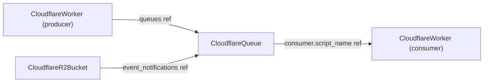

# Cloudflare Ruleset to 90/10 + first-class Cloudflare Queue

**Date**: June 25, 2026
**Type**: Feature / Breaking Change
**Components**: API Definitions, Resource Management, IAC Stack Runner (Terraform + Pulumi)

## Summary

Raised `CloudflareRuleset` to full v5 depth and forged a new first-class
`CloudflareQueue` kind (with its consumer folded in). Wired the two integrations the
queue unlocks: the Worker `queues` producer binding now references a `CloudflareQueue`,
and `CloudflareR2Bucket` gained folded `event_notifications` that forward object events
to a queue. Both engines (OpenTofu + Pulumi) move together on provider v5 / SDK v6.17.0,
with one documented Pulumi gap (`ruleset action_parameters.vary`). Validated through proto
regeneration, spec/CEL tests, the outputs-conformance and secret-coverage guards,
`make build-go`, `tofu validate` of all three modules against the real v5 provider, and a
live `tofu apply`/`destroy` of the queue → worker-consumer → R2 event-notification chain.

## What's New

### `CloudflareRuleset` → 90/10

The `cloudflare_ruleset` surface is now complete:

- **Actions: 13 → 20** — added `ddos_dynamic`, `force_connection_close`, `log_custom_field`,
  `serve_error`, `set_cache_control`, `set_cache_tags`, `set_config`.
- **Rule-level blocks** — `ratelimit` (characteristics, period, thresholds, mitigation
  timeout, counting expression, score-based limiting), `logging`, and
  `exposed_credential_check` (leaked-credential detection).
- **`action_parameters` expanded from 17 to ~50 leaves**: the full `set_config` family
  (ssl, security_level, polish, rocket_loader, autominify, bic, email_obfuscation, …);
  the full cache surface (`cache_key.custom_key` cookie/header/host/query_string/user,
  `cache_reserve`, `vary`, `additional_cacheable_ports`, origin/strip/respect toggles);
  the `set_cache_control` directives (modeled with three reusable shapes —
  value/qualifiers/flag — instead of duplicating 11 near-identical messages);
  `set_cache_tags`; `log_custom_field` lists; `from_list`; `algorithms`; `matched_data`;
  `increment`; and `serve_error` params.
- **Validation**: fixed value sets (ttl modes, header/cache-control operations,
  sensitivity levels, content types, ssl/security-level/polish/body-buffering) are now
  CEL-validated. Added `last_updated` to stack outputs.

### `CloudflareQueue` (new kind, id 1815)

A managed message queue for Workers. The single consumer is folded onto the queue (it is
1:1 and queue-keyed at the resource level — the same fold rationale as R2's bucket-scoped
sub-resources), modeled as an optional `consumer { type: worker|http_pull, script_name,
dead_letter_queue, settings }`. The module provisions `cloudflare_queue` and, when a
consumer is set, `cloudflare_queue_consumer` (so editing the consumer never recreates the
queue). Type-restricted settings are CEL-gated (max_concurrency/max_wait_time_ms →
worker; visibility_timeout_ms → http_pull). Outputs `queue_id`, `queue_name`,
`created_on`, `modified_on`.

### Integrations unlocked

- **Worker producer binding** — `CloudflareWorkerQueueBinding.queue_name` is now a
  `StringValueOrRef` → `CloudflareQueue` (`status.outputs.queue_name`).
- **R2 event notifications** — `CloudflareR2Bucket` gained folded `event_notifications[]`
  (each: a `CloudflareQueue` ref + `rules[]{actions, description, prefix, suffix}`),
  provisioning `cloudflare_r2_bucket_event_notification` per queue.

## Engine parity

Pulumi SDK v6.17.0 exposes the full ruleset depth and both queue resources, so Terraform
and Pulumi are at full parity **except** `ruleset action_parameters.vary`, which the SDK
does not expose — the proto models it (future-proof source of truth), Terraform
provisions it, and Pulumi omits it with an inline note. See `pkg/iac/MODULE_PARITY.md` and
the ruleset Pulumi `README.md`.

## Validation

`make protos` (incl. Java compile gate) · spec/CEL tests for ruleset (new actions,
ratelimit/logging/exposed_credential_check, enum value sets) and queue (settings ranges,
worker/http_pull CEL) · `pkg/outputs` conformance extended with `CloudflareQueue` ·
`openmcf secret-coverage --check` green (`exposed_credential_check.password_expression`
exempted as a wirefilter expression, not a secret) · `make generate-cloud-resource-kind-map`
· `make build-go` · `tofu validate` of the ruleset, queue, and r2 modules against the real
v5 provider · **live `tofu apply`/`destroy`** of a queue (with settings) + worker consumer
(+ dead-letter queue + settings) + R2 bucket event-notification chain on the full-permission
account, clean teardown.

## Notes

- **Breaking**: `CloudflareWorkerQueueBinding.queue_name` changed from `string` to
  `StringValueOrRef` (authorized under the v5 two-PR boundary; not yet released).
- The v5 API caps `message_retention_period` at 86400s (1 day) despite docs implying 14
  days; the CEL matches the API (revisit if the ceiling is raised).

**Status**: ✅ Committed (unreleased)
