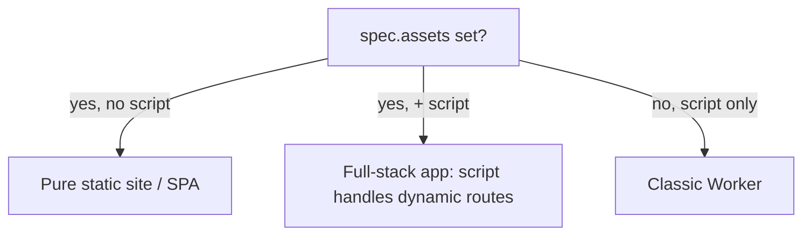

# CloudflareWorker: Workers Static Assets (static sites & full-stack apps)

**Date**: June 25, 2026
**Type**: Feature
**Components**: API Definitions, Kubernetes Provider (IaC), Pulumi CLI Integration, IAC Stack Runner, User Experience

## Summary

`CloudflareWorker` now supports **Cloudflare Workers Static Assets**: point the
new `spec.assets` block at a built site directory and the Worker serves it
directly from Cloudflare's edge — as a pure static site/SPA, or alongside a
script as a full-stack app. This makes `CloudflareWorker` the answer to "deploy a
static or full-stack site to Cloudflare," and it deploys as ordinary desired
state (a changed directory ships a new version) through the existing stack-job
flow. Both the Terraform and Pulumi modules implement it at full parity on
provider v5 / pulumi-cloudflare v6.17.0.

## Problem Statement / Motivation

Cloudflare converged its Pages product into the Workers runtime: a single
`cloudflare_workers_script` can now upload and serve a directory of static assets
(plus optional Functions). Until now `CloudflareWorker` modeled only executable
code (inline `content` or an R2 `r2_bundle`), so there was no way to deploy a
static site or a full-stack app whose front end is static and whose API is a
Worker — the most common modern Cloudflare hosting shape, and the one Cloudflare
now recommends for new projects over classic Pages.

### Pain Points

- No first-class way to host a static site / SPA on Cloudflare via OpenMCF.
- Full-stack apps (static front end + Worker API) could not be expressed.
- The spec required a script source, so "assets only" was impossible.

## Solution / What's New

A folded `CloudflareWorkerAssets` message on `CloudflareWorkerSpec` (field 30):

- `directory` — the built site directory to upload.
- `binding_name` — optionally expose the asset namespace to the script as
  `env.<NAME>` (e.g. `env.ASSETS.fetch(request)`).
- `config` — `html_handling`, `not_found_handling` (incl. the
  `single-page-application` fallback), `headers` (`_headers` body), `redirects`
  (`_redirects` body), and run-order control via `run_worker_first` (all paths)
  or `run_worker_first_rules` (per-path; mutually exclusive, CEL-enforced).

The script-source rule was relaxed from "exactly one script source" to **"a
script source, assets, or both"**, mirroring the Cloudflare API's own
`AtLeastOneOf(content, assets)` validator. Three shapes now fall out:



## Implementation Details

- **Spec** (`apis/.../cloudflareworker/v1/spec.proto`): added
  `CloudflareWorkerAssets` + `CloudflareWorkerAssetsConfig`; relaxed the
  message-level CEL to `has(content) || has(r2_bundle) || has(assets)`;
  `main_module` stays optional and is omitted in assets-only mode.
- **Pulumi** (`iac/pulumi/module/worker_script.go`, `bindings.go`): builds
  `WorkersScriptAssetsArgs`/`...ConfigArgs`; skips `Content`/`MainModule` in
  assets-only mode; appends an `assets`-type binding when `binding_name` is set.
- **Terraform** (`iac/tf/{variables,locals,main}.tf`): adds the `assets` block;
  makes `content`/`main_module` conditional.

### Surprise: HCL can't union-type a conditional, but the provider field is dynamic

The provider's `assets.config.run_worker_first` is a **dynamic** attribute that
accepts either a bool or a list of path rules. HCL conditionals must unify to a
single type, so `length(rules) > 0 ? rules : bool` fails with "inconsistent
conditional result types." The fix: encode the chosen branch to JSON (always a
string) and `jsondecode` it, deferring the bool-or-list typing to runtime:

```hcl
run_worker_first = jsondecode(
  length(...run_worker_first_rules) > 0
    ? jsonencode(...run_worker_first_rules)
    : (...run_worker_first ? "true" : "null")
)
```

Pulumi needs no such trick — `WorkersScriptAssetsConfig.RunWorkerFirst` is
`interface{}` in v6.17.0, so a `[]string` or a `bool` is passed directly. Full
tofu↔pulumi parity; no `PARITY-EXCEPTION`.

## Validation

- `make protos`; `go test ./apis/.../cloudflareworker/v1/` (new cases:
  assets-only, full-stack, run_worker_first switch/rules, invalid enums,
  exclusivity, missing directory).
- `openmcf secret-coverage --check` (green; assets carries no secrets).
- Repo-wide `go build ./...`; `go test ./pkg/outputs/...` (outputs unchanged).
- `tofu validate` against the real v5 provider; Pulumi entrypoint builds.
- **Live `tofu apply`/`destroy`** of a pure static-assets Worker on a real
  account (asset directory uploaded, `usage_model=standard`, clean teardown).

## Benefits

- One resource hosts static sites, SPAs, and full-stack apps at the edge.
- Deploys as desired state — a changed directory is a new version — via the
  normal stack-job flow, no new deploy modality required.
- Stays composable: assets sit alongside all existing bindings (KV/D1/R2/Queues/…).

## Impact

OpenMCF users can now deploy static and full-stack Cloudflare sites through
`CloudflareWorker`. No breaking change — `assets` is additive and optional; the
relaxed source rule only permits previously-invalid (assets-only) specs.

## Related Work

Pairs with the forthcoming `CloudflarePagesProject` (git-connected "Cloudflare
builds on push" model). Together they cover both Cloudflare hosting models:
build-and-upload (Workers Static Assets) and git-connected builds (Pages).

---

**Status**: ✅ Production Ready
