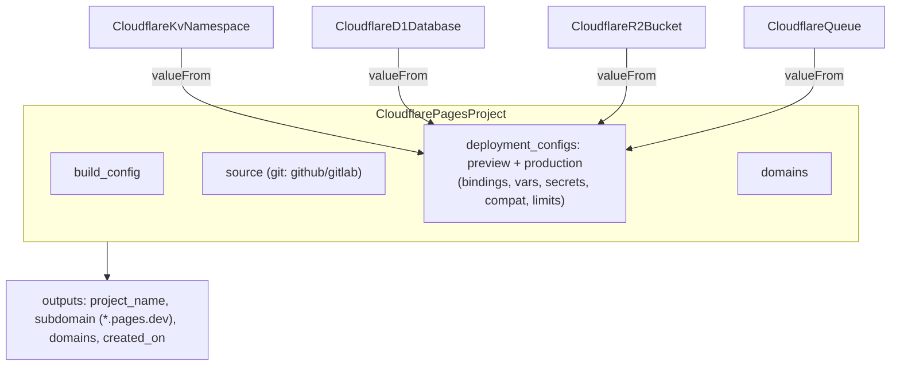

# Forge CloudflarePagesProject (git-connected & direct-upload site hosting)

**Date**: June 25, 2026
**Type**: Feature
**Components**: API Definitions, Kubernetes Provider (IaC), Pulumi CLI Integration, IAC Stack Runner, Resource Management

## Summary

Forged a new first-class kind, **`CloudflarePagesProject`** (enum 1816, id prefix
`cfpg`), that manages a Cloudflare Pages project: build configuration, an optional
git connection, per-environment runtime configuration (bindings, env vars,
compatibility, limits), and custom domains. It is the "Cloudflare builds on git
push" hosting model, complementing `CloudflareWorker` Static Assets (the
"you build and upload" model). Both Terraform and Pulumi modules are at full
parity on provider v5 / pulumi-cloudflare v6.17.0, validated with a live
apply/update/destroy on a real account.

## Problem Statement / Motivation

"Does Planton deploy Cloudflare Pages?" had no good answer. Cloudflare offers two
hosting models, and we now cover both:

- **Workers Static Assets** — your CI builds, then uploads the artifact; deploys
  as desired state. (Shipped separately on `CloudflareWorker`.)
- **Pages, git-connected** — you connect a repo and Cloudflare builds on push.
  Cloudflare is the CI; you manage the project. This component.

## Solution / What's New

`CloudflarePagesProject` with the full project surface:

- **Two source modes**: git-connected (`source` set) or direct-upload (omitted;
  versions pushed via `wrangler pages deploy`).
- **Bindings as composable FK lists** (the worker grain): KV/D1/R2/Queue/
  Hyperdrive/Worker via `StringValueOrRef`, plus Durable Objects, Analytics
  Engine, Vectorize, AI, mTLS, and Browser Rendering.
- **Env vars split** into plain `vars` + secret `secrets` (secret-by-default),
  recombined by the module into the provider's typed `env_vars` map.

## Implementation Details

- **Protos** (`cloudflarepagesproject/v1`): `spec.proto` (one reused
  `CloudflarePagesDeploymentConfig` for preview + production), `api.proto`,
  `stack_input.proto`, `stack_outputs.proto`; `spec_test.go`.
- **Registry**: `CloudflarePagesProject = 1816` in `cloud_resource_kind.proto`
  (`is_service_kind` intentionally NOT set — see Decisions); regenerated the kind
  map and conformance case.
- **Pulumi** (`iac/pulumi/module/`): `project.go` (project + folded domains),
  `deployment_config.go` (preview/production builders for every binding family).
- **Terraform** (`iac/tf/`): `cloudflare_pages_project` + per-domain
  `cloudflare_pages_domain`, with a single normalization transform applied to
  both environments.

## Decisions Made

- **One kind, domains folded.** A Pages domain is keyed by its project and useless
  in isolation, so `domains` is a repeated field on the project (mirrors worker
  `custom_domains`), not a separate kind. No separate deployment kind exists
  because the provider has no deployment resource.
- **`is_service_kind: false`.** With the git-connected model Cloudflare is the
  deployer, so Service Hub drives no version deploys; the flag stays off.
- **Stack outputs are project-level only** (`project_name`, `subdomain`,
  `domains`, `created_on`). Per-deployment URLs/ids don't exist at provision time.

## Surprises Encountered (and how they were resolved)

Three real Cloudflare API behaviors, learned from live apply, are now handled
identically in both engines:

1. **Paired environments.** Cloudflare rejects a project whose `preview` and
   `production` configs are inconsistent (`fail_open` must match). Supplying only
   `production` failed with `8000066`. Fix: when one environment is provided,
   mirror it to both.
2. **Empty maps must be omitted.** Sending `{}` for unset binding groups produced
   `Provider produced inconsistent result after apply ... was MapValEmpty ... but
   now null`. Fix: send `null` (omit) for empty binding groups.
3. **Sensitive env-var round-trip.** The earlier "inconsistent values for
   sensitive attribute" error was a symptom of (2) on the sensitive `env_vars`
   attribute; the empty→null fix resolved it.

## Validation

- `make protos`, `make generate-cloud-resource-kind-map`, `make reset-gazelle`.
- `go test` (spec + `pkg/outputs` conformance), `planton secret-coverage --check`,
  repo-wide `go build ./...`.
- `tofu validate` against the real v5 provider; Pulumi entrypoint builds.
- **Live `tofu apply` → update (env vars) → idempotent plan → `tofu destroy`** of
  a direct-upload project on a real account; outputs populated
  (`subdomain=...pages.dev`), clean teardown, no orphans.

## Impact

Planton now answers "deploy Cloudflare Pages" with a first-class, composable kind.
Together with `CloudflareWorker` Static Assets it covers both Cloudflare hosting
models. New kind requires Planton-side catalog/wizard/search wiring on
integration.

## Related Work

- `CloudflareWorker` Workers Static Assets (the build-and-upload model).
- Git-connected projects require a one-time dashboard git authorization (the
  provider manages the source config, not the OAuth/App connection).

---

**Status**: ✅ Production Ready
