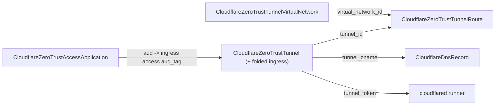

# Forge the Cloudflare Zero Trust Tunnel family (tunnel + virtual network + route)

**Date**: June 25, 2026
**Type**: Feature
**Components**: API Definitions, Provider Framework, Pulumi CLI Integration, IAC Stack Runner, Resource Management

## Summary

Adds first-class Cloudflare Tunnel (cloudflared) coverage as three composable kinds:
`CloudflareZeroTrustTunnel` (1817), `CloudflareZeroTrustTunnelVirtualNetwork` (1818),
and `CloudflareZeroTrustTunnelRoute` (1819). Tunnels expose private services to
Cloudflare's edge over an outbound-only connection — via public-hostname ingress and/or
WARP-reachable private routes — with no inbound firewall ports. Both the Terraform and
Pulumi modules ship at full behavioral parity on provider v5 / pulumi-cloudflare
v6.17.0, validated end-to-end with a live apply/destroy on a real account.

## Problem Statement / Motivation

The provider family covered R2, DNS, Workers/KV/D1, Load Balancing, Zero Trust Access,
Ruleset, Queues, and static/full-stack hosting, but had no way to connect a private
network to the edge. Cloudflare Tunnel is the highest-leverage remaining Tier-1 family:
it composes directly with the Access, DNS, and Worker kinds already shipped (an ingress
hostname CNAMEs to the tunnel; an ingress rule can be Access-protected; a connector runs
as a Worker/container).

## Solution / What's New

Three kinds, decomposed by lifecycle and composition (not 1:1 with the provider's four
resources):

- **CloudflareZeroTrustTunnel** — the anchor. The provider's separate ingress
  configuration (`zero_trust_tunnel_cloudflared_config`) is **folded in** as
  `spec.ingress` + `spec.origin_request`: it is 1:1 with the tunnel and has no
  independent lifecycle. The module still provisions it as a distinct provider resource,
  so editing ingress never recreates the tunnel.
- **CloudflareZeroTrustTunnelVirtualNetwork** — a separate account-scoped routing
  segment (overlapping CIDRs reachable through different tunnels).
- **CloudflareZeroTrustTunnelRoute** — a separate private-CIDR-to-tunnel route, with
  `StringValueOrRef` foreign keys to both the tunnel and the virtual network.

### Composability highlights

- `tunnel_token` (sensitive) is exported by reading the token data source
  (`data cloudflare_zero_trust_tunnel_cloudflared_token` / `GetZeroTrustTunnelCloudflaredTokenOutput`),
  since neither engine exposes it on the resource — so a downstream connector can
  authenticate.
- `tunnel_cname` (`<id>.cfargotunnel.com`) is exported for DNS CNAME composition.
- Ingress `origin_request.access.aud_tag` is a `repeated StringValueOrRef` defaulting to
  `CloudflareZeroTrustAccessApplication.status.outputs.aud`, making "tunnel ingress
  protected by an Access app" a real graph edge.

## Implementation Details

- **Spec**: full v5 depth — `config_src` (defaults to `cloudflare`/remote, a deliberate,
  documented divergence from the provider's `local` default so ingress is manageable as
  desired state), optional sensitive `tunnel_secret`, ordered ingress rules with a
  CEL-enforced catch-all last rule, and the complete ~15-field `origin_request` tree
  reused for both tunnel-level defaults and per-rule overrides.
- **Field-name nuance**: the spec exposes the corrected `match_sni_to_host`; both modules
  map it to the provider's misspelled `match_sn_ito_host` / `MatchSnItoHost` and document
  it (provider-lags-upstream pattern — proto stays correct, modules carry the workaround).
- **Parity**: both engines omit unset optional origin-request values (false booleans
  included) so plans are byte-for-byte equivalent. No `PARITY-EXCEPTION` required.
- **Registry/wiring**: registered 1817/1818/1819, regenerated the kind map and gazelle,
  added `pkg/outputs/conformance_test.go` cases for all three.
- Also annotated the pre-existing look-alike `CloudflareWorker.spec.env.secrets` wrapper
  field with `sensitive_exempt_reason` (the real secret is the inner binding's `value`,
  already `sensitive`) to keep `secret-coverage` green.

## Testing Strategy

- `make protos`, spec/CEL tests (all three), scoped `go build` of each package and each
  Pulumi entrypoint, `secret-coverage` (green), `pkg/outputs` conformance (3 new cases),
  and `tofu validate` of all three modules against the real v5 provider.
- **Live apply/destroy** on a real account: VirtualNetwork → Tunnel (with ingress) →
  Route. Confirmed `tunnel_token`/`tunnel_cname` populate, an idempotent re-plan (no
  drift on any of the three), and a clean teardown with no orphans.

## Impact

Platform users can now connect private networks and publish private services through
Cloudflare's edge as composable nodes, wired by reference to DNS, Access, and Workers.

## Related Work

- Builds on the Zero Trust Access family (`CloudflareZeroTrustAccess*`) and DNS records.
- Continues the PR2 breadth effort (Queues, static/full-stack hosting were prior slices).

---

**Status**: ✅ Production Ready (committed, not yet released)
**Timeline**: One session
