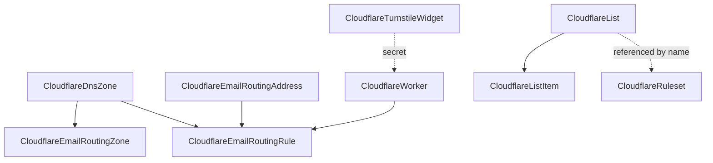

# Cloudflare breadth: Lists, Turnstile, and Email Routing

**Date**: June 25, 2026
**Type**: Feature
**Components**: API Definitions, Provider Framework, Pulumi CLI Integration, IAC Stack Runner, Resource Management

## Summary

Forged six new first-class, infra-chart-composable Cloudflare cloud resource kinds
across three Tier-1 product families — Lists, Turnstile, and Email Routing — each
modeled to the Cloudflare v5 provider's depth with full Terraform + Pulumi parity
(provider `~> 5.0`, `pulumi-cloudflare/sdk/v6 v6.17.0`). This extends the
Cloudflare provider family from 21 to 27 kinds.

## What's New

Six new kinds (enum ids 1820–1825 in the `1800–2099` Cloudflare range):

- **CloudflareList** (1820, `cflist`) — account-scoped, reusable named collection
  (ip / redirect / hostname / asn) referenced from rule expressions and Bulk
  Redirect rulesets.
- **CloudflareListItem** (1821, `cfli`) — a single list entry (`oneof` of
  ip / asn / hostname / redirect) with a `StringValueOrRef` FK to its
  `CloudflareList`. Mirrors the `CloudflareKvNamespace` + `CloudflareWorkersKvPair`
  container/item split rather than the provider's inline-items model (which the
  provider itself warns against mixing).
- **CloudflareTurnstileWidget** (1822, `cfturn`) — a Turnstile CAPTCHA widget that
  exports its public `sitekey` and a sensitive `secret` (the server-side
  `/siteverify` key).
- **CloudflareEmailRoutingZone** (1823, `cferz`) — the Email Routing anchor:
  enables routing on a zone (provisioning the required DNS), folds in the single
  per-zone catch-all, and optionally locks the DNS records.
- **CloudflareEmailRoutingRule** (1824, `cferr`) — a per-zone routing rule with a
  typed action (`forward_to` → `CloudflareEmailRoutingAddress`, `worker` →
  `CloudflareWorker`) mapped onto the provider's generic `{type, value[]}`.
- **CloudflareEmailRoutingAddress** (1825, `cfera`) — an account-scoped verified
  destination address.

## Composition (infra-chart wiring)

Every cross-resource reference is a `StringValueOrRef` with a `default_kind`, and
every kind exports the outputs a downstream resource needs (list_id, sitekey/
secret, zone enablement status, rule_id, address email).

## Implementation Details

- **Enums vs validated strings.** Fixed-value sets use proto enums whose value
  names match the provider strings (used via `.String()`), except Turnstile's
  `mode`/`clearance_level`/`region`, which are validated strings — `mode` includes
  the hyphenated `non-interactive` and `managed` is valid for both `mode` and
  `clearance_level`, which file-scoped proto enum values cannot express.
- **Typed actions over generic shapes.** Email Routing rule/catch-all actions are
  modeled as typed messages (with FK edges) and mapped back to the provider's
  generic `{type, value[]}` in both engines — more composable than the raw API.
- **Engine parity.** Optional booleans and empty values are omitted on both
  engines (Terraform `null`, Pulumi pointer omitted) so plans are byte-for-byte
  identical and the provider applies its own defaults. No `PARITY-EXCEPTION` was
  needed. `pkg/outputs/conformance_test.go` gains a case per kind.
- **Secret handling.** Turnstile's `secret` output is sensitive (Terraform
  `sensitive = true`, Pulumi `pulumi.ToSecret`); `secret-coverage --check` passes.

## Documented provider quirks

- `cloudflare_list_item`: a `/32` IPv4 (or `/128` IPv6) is normalized to a bare
  address, after which the provider's post-create read-back fails to match —
  documented guidance is to use the bare address or a wider CIDR.
- `cloudflare_email_routing_catch_all`: cannot be destroyed via the provider (no
  delete endpoint); persists at its last configuration.

Both are recorded on the affected module docs so a future agent can re-check
whether the provider has fixed them — without any spec change.

## Validation

- `make protos`, spec/CEL tests for all six kinds, scoped `go build` of each
  package and each Pulumi entrypoint, `make generate-cloud-resource-kind-map`,
  gazelle, `pkg/outputs` conformance (6 new cases), `secret-coverage --check`.
- `tofu validate` of all six modules against the real v5 provider.
- **Live `tofu apply`/`destroy`** on the real account for Lists (List + ListItem)
  and Turnstile — created, idempotent re-plan, clean teardown.
- Email Routing: live `tofu plan` for the Zone, Rule, and Address against the real
  provider and a real zone id (correct plans). Live apply of Email Routing
  enablement was intentionally not run because enabling rewrites a zone's
  MX/SPF/DKIM records; destination-address verification additionally requires an
  external mailbox action. Both are pre-staged for a confirmed-disposable zone.

## Impact

The Cloudflare provider family gains list/redirect primitives, bot protection, and
the full Email Routing surface as composable nodes. Adopters can wire WAF lists,
Turnstile-protected Workers, and email forwarding into infra charts. These kinds
are committed but unreleased; cutting an Planton release and integrating into
Planton (catalog/wizard/search wiring) is the follow-up.

---

**Status**: ✅ Production Ready (committed, unreleased)
