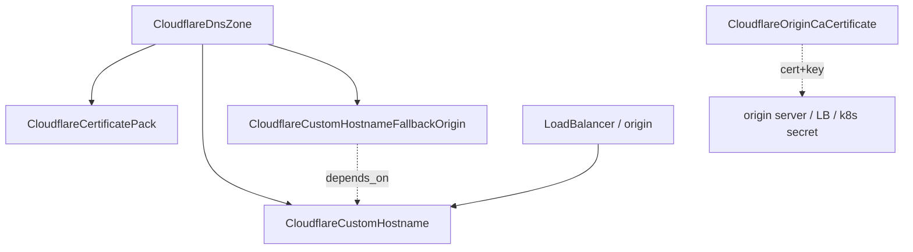

# Cloudflare breadth: TLS/Certificates and Cloudflare for SaaS

**Date**: June 25, 2026
**Type**: Feature
**Components**: API Definitions, Provider Framework, Pulumi CLI Integration, IAC Stack Runner, Resource Management

## Summary

Forged four new first-class, infra-chart-composable Cloudflare cloud resource kinds
across two Tier-1 product families — TLS/Certificates and Cloudflare for SaaS — each
modeled to the Cloudflare v5 provider's depth with full Terraform + Pulumi parity
(provider `~> 5.0`, `pulumi-cloudflare/sdk/v6 v6.17.0`). This extends the Cloudflare
provider family from 27 to 31 kinds.

## What's New

Four new kinds (enum ids 1826–1829 in the `1800–2099` Cloudflare range):

- **CloudflareOriginCaCertificate** (1826, `cfoca`) — a free Origin CA certificate
  for the Cloudflare→origin hop (Full (Strict) SSL). User-scoped (no zone/account
  id). A one-click cert+key node: when no `csr` is supplied it generates the private
  key + CSR (via the `tls` provider, keyed to `request_type`) and exports the
  certificate plus the sensitive generated `private_key`; supplying a `csr` keeps the
  key in the caller's control.
- **CloudflareCertificatePack** (1827, `cfcertp`) — an advanced edge certificate for
  a zone (selectable CA, validity, covered hosts) beyond Universal SSL.
- **CloudflareCustomHostname** (1828, `cfchost`) — the core Cloudflare for SaaS node:
  onboard a customer's domain onto a SaaS zone with a per-customer auto-renewed
  certificate, exposing the ownership-verification records the customer uses to
  activate it. Full `ssl{}` depth (bundle method, CA, method, type, wildcard,
  uploaded cert/key + cert bundles, and a `settings` block).
- **CloudflareCustomHostnameFallbackOrigin** (1829, `cfchfo`) — the zone-level
  singleton default origin all custom hostnames route to (kept a separate kind
  because it is shared by every custom hostname in the zone).

## Composition (infra-chart wiring)

Every cross-resource reference is a `StringValueOrRef`: `zone_id` defaults to
`CloudflareDnsZone`; backend endpoints (`custom_origin_server`, fallback `origin`)
are `StringValueOrRef` without a `default_kind` (the load-balancer pool `address`
precedent). Certificate SAN/host lists and the customer hostname are plain strings
(author-specified DNS naming, not produced handles).

## Implementation Details

- **One-click Origin CA cert+key.** Both engines generate the key + CSR with the
  `tls` provider when `csr` is empty (`tls_private_key`/`tls_cert_request` in
  Terraform, `NewPrivateKey`/`NewCertRequest` in Pulumi), keyed to `request_type`
  (RSA for `origin-rsa`, ECDSA P-256 for `origin-ecc`). The generated `private_key`
  is a sensitive output; the public `certificate` is not.
- **Validated strings + central defaults.** Fixed-value sets use CEL-validated
  strings matching the provider's exact values (no lossy enum mapping). Defaults
  (`request_type` `origin-rsa`, `requested_validity` 5475; cert pack `type`
  `advanced`; custom-hostname `ssl.bundle_method` `ubiquitous`, `ssl.type` `dv`) are
  `optional` + `(options.default)` and coalesced in BOTH modules so a standalone
  apply matches the control-plane middleware byte-for-byte.
- **Engine parity.** No `PARITY-EXCEPTION` was needed. The Pulumi SDK names two
  custom-hostname fields differently (`custom_cert_bundle`→`CustomCertBundles`,
  `settings.tls_1_3`→`Tls13`); the module maps them and the docs record the nuance.
  `pkg/outputs/conformance_test.go` gains a case per kind.
- **Secret handling.** Origin CA `private_key` and custom-hostname `ssl.custom_key`
  (and cert-bundle keys) are sensitive; public certs/CSRs are not flagged.
  `secret-coverage --check` passes.

## Documented provider/entitlement notes

- **Enterprise-gated custom-hostname `ssl` fields** (uploaded `custom_certificate`/
  `custom_cert_bundle` + keys, `custom_csr_id`, selectable `certificate_authority`,
  `wildcard`) are modeled in the proto (the cloud's real capability) but can only be
  `plan`-validated without an Enterprise account. Recorded as an "Upstream/provider
  parity" note on both module READMEs so a future agent can re-verify without a proto
  change.
- **Zone entitlements gate live apply.** `cloudflare_certificate_pack` requires
  Advanced Certificate Manager (API code 1450); `cloudflare_custom_hostname` and its
  fallback origin require the "SSL for SaaS" feature on the zone (API code 1456).
  Both are paid features; the modules are correct and plan cleanly.

## Validation

- `make protos`, spec/CEL tests for all four kinds, scoped `go build` of each package
  and each Pulumi entrypoint (the release contract), `make generate-cloud-resource-kind-map`,
  gazelle, `pkg/outputs` conformance (4 new cases), `secret-coverage --check`,
  `go vet`, `gofmt`.
- **Live `tofu apply`/`destroy`** on the real account for **CloudflareOriginCaCertificate**
  — issued a real certificate (key+CSR generated, outputs populated), clean teardown.
- **Live `tofu plan`** for CertificatePack, CustomHostname, and FallbackOrigin against
  the real account and real zone ids (correct plans; defaults coalesced). Their live
  apply is blocked only by the paid zone entitlements above (ACM, SSL for SaaS) — a
  pre-staged human handback, not a module defect.

## Impact

The Cloudflare provider family gains origin TLS, advanced edge certificates, and the
full Cloudflare for SaaS surface (white-label customer domains) as composable nodes.
These kinds are committed but unreleased; cutting an Planton release and integrating
into Planton (catalog/wizard/search wiring) is the follow-up.

---

**Status**: ✅ Production Ready (committed, unreleased)
