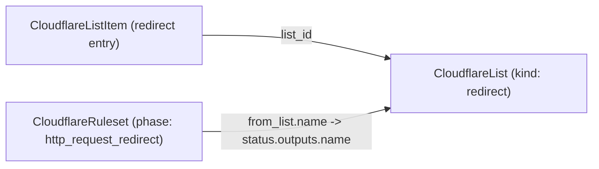

# Cloudflare Ruleset: Compose Bulk Redirects With a List via Foreign Key

**Date**: June 26, 2026
**Type**: Breaking Change
**Components**: API Definitions, Kubernetes/Cloud Provider (Cloudflare), Manifest Processing, Resource Management

## Summary

A Cloudflare Ruleset's bulk-redirect action (`action_parameters.from_list`) now
references its Bulk Redirect list as a first-class foreign key instead of a bare
string. The `from_list.name` field becomes a `StringValueOrRef` that defaults to a
`CloudflareList`'s name output, so a redirect ruleset and the list that backs it
compose as real, dependency-aware nodes in the resource graph. Both IaC engines
move together, and the change was validated with a live `tofu apply`/`destroy` of
a redirect list plus a bulk-redirect ruleset that references it.

## Problem Statement / Motivation

`CloudflareList` (the Bulk Redirect list container) and `CloudflareListItem` (its
entries) are already first-class kinds, and `CloudflareListItem.list_id` already
references the list via `StringValueOrRef`. But the one place that actually *uses*
a Bulk Redirect list at request time — a redirect ruleset's `from_list` — still
took the list name as a plain string:

```proto
message CloudflareRulesetFromList {
  string name = 1 [(buf.validate.field).string.min_len = 1];
  string key  = 2 [(buf.validate.field).string.min_len = 1];
}
```

### Pain Points

- A plain string forced users to hardcode the list name, so the ruleset could not
  express a dependency on the list that defines it.
- The dependency edge that makes "a Bulk Redirect list + the ruleset that applies
  it" a composable pattern was missing — the graph had a hole exactly where the
  two resources meet.
- It was inconsistent with the rest of the family, where every cross-resource
  reference is a `StringValueOrRef` with a `default_kind`.

## Solution / What's New

`from_list.name` is now a `StringValueOrRef` whose default reference is a
`CloudflareList`'s `name` output. Cloudflare resolves a Bulk Redirect list **by
name** (not by id), so the foreign key points at the list's `name` output — the
same value `CloudflareList` already exports and documents as "the identifier used
in rule expressions."

```proto
message CloudflareRulesetFromList {
  dev.planton.shared.foreignkey.v1.StringValueOrRef name = 1 [
    (buf.validate.field).required = true,
    (dev.planton.shared.foreignkey.v1.default_kind) = CloudflareList,
    (dev.planton.shared.foreignkey.v1.default_kind_field_path) = "status.outputs.name"
  ];
  string key = 2 [(buf.validate.field).string.min_len = 1];
}
```

### Composition



The redirect list is now referenceable from both sides: items flow into it, and
the ruleset that applies it references it by name.

## Implementation Details

- **Proto** — `apis/dev/planton/provider/cloudflare/cloudflareruleset/v1/spec.proto`:
  `CloudflareRulesetFromList.name` changed from `string` to `StringValueOrRef`
  with `default_kind = CloudflareList` and `default_kind_field_path =
  "status.outputs.name"`. The `foreignkey` import and BUILD dep were already
  present. No `reserved`, no history breadcrumbs — the message reads as if always
  designed this way.
- **Terraform** — no functional change. The proto->tfvars converter
  (`pkg/iac/tofu/generators`) flattens a `StringValueOrRef` to a plain string by
  message *type*, recursing through repeated and nested messages, so
  `rules[].action_parameters.from_list.name` arrives as a plain string exactly as
  the hand-written `variables.tf` already declares it. A clarifying comment was
  added for consistency with the rest of the family.
- **Pulumi** — `iac/pulumi/module/ruleset.go` now reads the value via a
  nil-guarded `ap.FromList.Name.GetValue()` (mirroring `cloudflarelistitem`'s
  `spec.ListId.GetValue()`).
- **Validation surface** — the literal arm is no longer regex-constrained at the
  spec level (a `StringValueOrRef` cannot carry a value-arm `string.pattern`),
  but this is not a regression: the prior field only enforced `min_len`, and both
  `CloudflareList.name` (a stricter subset, `^[a-zA-Z][a-zA-Z0-9_]*$`) and the
  provider (`^[a-zA-Z0-9_]+$`) enforce the format. The `StringValueOrRef`
  message-level CEL plus `required = true` preserve the non-empty guarantee.
- **Tests** — `spec_test.go` gains a positive case (a bulk-redirect rule with a
  literal list name passes) and two negatives (empty value fails the SVOR CEL;
  missing name fails `required`).
- **Docs & preset** — README/docs updated to show the value-or-ref; a new
  `presets/07-bulk-redirect.yaml` (+ `.md`) demonstrates wiring `from_list.name`
  to a `CloudflareList` via `valueFrom`.

## Breaking Changes

`CloudflareRulesetFromList.name` changes type from `string` to
`StringValueOrRef`. Manifests that set `from_list.name` as a bare string move to
the value-or-ref form:

```yaml
# before
from_list:
  name: my_redirects
  key: http.request.full_uri

# after (literal)
from_list:
  name:
    value: my_redirects
  key: http.request.full_uri

# after (reference)
from_list:
  name:
    valueFrom:
      kind: CloudflareList
      name: my-redirects
      fieldPath: status.outputs.name
  key: http.request.full_uri
```

## Testing Strategy

- `make protos`, `go test` (ruleset spec/CEL suite incl. the new from_list
  cases), `go build` of the package + Pulumi entrypoint, `go vet`, `gofmt` — all
  green.
- The converter flattening was confirmed with `planton tofu load-tfvars` on a
  bulk-redirect manifest: `from_list.name` (a `StringValueOrRef` nested under
  `rules[].action_parameters`) emitted as the plain string the module consumes.
- **Live `tofu apply`/`destroy` on a real account**: created a redirect
  `CloudflareList`, then a `CloudflareRuleset` (account-scoped,
  `http_request_redirect`) whose `from_list.name` referenced the list by name.
  The provider accepted the reference, a re-plan was idempotent (no drift), and
  both resources tore down cleanly.

## Impact

- Infra charts can now wire a Bulk Redirect list and the ruleset that applies it
  as dependency-aware nodes, deployed in topological order.
- Existing manifests using `from_list` must adopt the value-or-ref shape (see
  Breaking Changes).

## Related Work

- `CloudflareList` / `CloudflareListItem` — the list container and entries this
  reference targets.
- The broader Cloudflare provider v5 / 90-10 coverage effort that forged the
  Lists family.

---

**Status**: ✅ Production Ready
