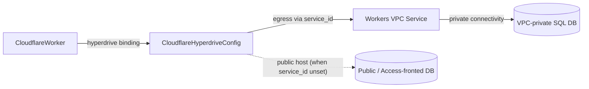

# Cloudflare Hyperdrive: Egress to a Private Origin via a Workers VPC Service

**Date**: June 27, 2026
**Type**: Feature (additive, non-breaking)
**Components**: API Definitions, Kubernetes/Cloud Provider (Cloudflare)

## Summary

`CloudflareHyperdriveConfig` can now reach a private origin database through a
Cloudflare Workers VPC Service. A new `origin.service_id` field tells Hyperdrive to
egress over the named VPC Service instead of dialing a public host. The field is
honored by both IaC engines and is mutually exclusive with the `mtls` block (TLS is
managed on the VPC Service), enforced by a spec-level validation rule. Resolves
plantonhq/openmcf#448.

## Problem Statement / Motivation

The live Cloudflare API/provider exposes `origin.service_id` on a Hyperdrive config
— "The identifier of the Workers VPC Service to connect through. Hyperdrive will
egress through the specified VPC Service to reach the origin database." Our
`CloudflareHyperdriveConfig` proto omitted it, so a Planton-managed Hyperdrive could
not front a VPC-private database — only public or Cloudflare-Access-fronted origins.

### Pain Points

- A Hyperdrive could only reach origins on a public address (or one fronted by
  Cloudflare Access); a database reachable only inside a VPC had no expressible path.
- The proto lagged the live provider surface, so a capability the API supports was
  invisible to Planton users and to the web wizard generated from the proto.
- Nothing encoded the provider's rule that mTLS and a VPC Service origin are
  incompatible, so an invalid combination could only fail late, at apply time.

## Solution / What's New

A new optional `service_id` on the origin message, plus a message-level CEL that
mirrors the provider's constraint that mTLS cannot be combined with a VPC Service
origin:

```proto
message CloudflareHyperdriveOrigin {
  // ... database, scheme, user, host, port, password, access_client_* ...

  // Identifier of the Workers VPC Service to connect through. When set,
  // Hyperdrive egresses to the origin over that VPC Service (private
  // connectivity) instead of dialing the public host. Mutually exclusive with
  // the spec-level mtls block, since TLS is managed on the VPC Service.
  string service_id = 9;
}

// On CloudflareHyperdriveConfigSpec:
option (buf.validate.message).cel = {
  id: "mtls.not_with_vpc_service"
  message: "mtls cannot be combined with a VPC Service origin (origin.service_id); TLS is managed on the VPC Service"
  expression: "!has(this.origin) || this.origin.service_id == '' || !has(this.mtls)"
};
```

### Topology



With `service_id` set, Hyperdrive egresses through the named Workers VPC Service to a
private origin; left empty, it dials the public host exactly as before.

## Implementation Details

- **Proto** — `apis/.../cloudflarehyperdriveconfig/v1/spec.proto`: added
  `origin.service_id = 9` (plain string, presence-by-empty like `host`/
  `access_client_id`) and the `mtls.not_with_vpc_service` message-level CEL. The
  CEL guards parent presence (`!has(this.origin)`) before the nested read,
  mirroring the `awsfsxwindowsfilesystem` message-CEL idiom; `service_id` is an
  identifier, not a secret, so it needs no `sensitive` annotation.
- **Pulumi** — `iac/pulumi/module/hyperdrive_config.go`: sets
  `originArgs.ServiceId` when non-empty (SDK v6.17.0 exposes
  `HyperdriveConfigOriginArgs.ServiceId`), guarded like `access_client_id`.
- **Terraform** — `iac/tf/variables.tf` adds `service_id = optional(string, "")`
  to the origin object (curated `optional()` form); `iac/tf/main.tf` passes it
  through, omitting it (null) when empty so the public host applies.
- **Tests** — `spec_test.go` gains a positive case (a VPC origin with
  `service_id` and no mtls validates) and a negative case (`service_id` + `mtls`
  is rejected by the new CEL). 15/15 specs pass.
- **Docs & preset** — `docs/README.md`, `README.md`, and `catalog-page.md` note
  `service_id` (Workers VPC egress, mutually exclusive with mtls); a new
  `presets/03-postgres-vpc.yaml` (+ `.md`) demonstrates a VPC-egress origin.
  `pkg/iac/MODULE_PARITY.md` records the new field's cross-engine parity.

## Compatibility

Additive and non-breaking: `service_id` is a new optional field (#9). Existing
manifests and presets are unaffected; only a config that set both `service_id` and
`mtls` (impossible before this field existed) is now rejected.

## Testing Strategy

`make protos`, `go test` / `go test -v` (15 specs incl. the new CEL cases),
`go build` of the package + Pulumi module, `gofmt`, `go vet`, and
`openmcf secret-coverage --check` — all green. `service_id` is not a stack output,
so the cross-engine outputs conformance guard is unaffected. Live `tofu apply`
against a real VPC Service was not run (requires a provisioned Workers VPC Service);
the proto + both engines are validated statically.

## Benefits

- **New capability**: Hyperdrive can front a VPC-private origin database, not just
  public/Access-fronted ones.
- **Validated early**: the mTLS/VPC-Service mutual exclusion is enforced at the spec
  level, so an invalid combination is rejected before any provider call.
- **Zero blast radius**: additive optional field with both engines at parity; existing
  manifests, presets, and stack outputs are unchanged.
- **Proto stays the source of truth**: the proto now matches the live provider surface,
  and the web wizard generated from it gains the field for free on its next forge.

## Impact

- Hyperdrive can now front VPC-private origin databases via a Workers VPC Service.
- The planton-web Hyperdrive wizard/detail will surface `origin.serviceId` on its
  next forge, once `@planton/protos` re-vendors these stubs (downstream, separate
  repo).

## Related Work

- `CloudflareWorker` — binds a Hyperdrive config via `hyperdrive_configs`.

---

**Status**: ✅ Production Ready
