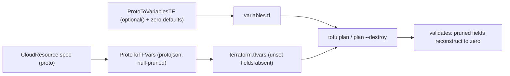

# Terraform `variables.tf` optional() schema + generator as single source of truth

**Date**: June 27, 2026
**Type**: Bug Fix + Refactoring
**Components**: IAC Stack Runner, API Definitions, Provider Framework, AWS Provider, Build System

## Summary

The Terraform `variables.tf` generator now emits `optional(<type>, <zero-default>)` for every
attribute that is not provably required, making the generated module schema agree *by construction*
with the runtime tfvars renderer, which null-prunes unset fields. A drift-guard test makes the
generator the single source of truth for provider-abstraction `variables.tf`. This fixes a class of
deploy/destroy failures where a pruned `terraform.tfvars` was rejected with `Invalid value for input
variable ... attribute "X" is required`, and migrates the AWS `aws-ecs-environment` chart kinds onto
the corrected schema.

## Problem Statement / Motivation

A default-values deploy/undeploy of the `aws-ecs-environment` chart failed at `tofu plan` /
`tofu plan --destroy` (the `updatePreview` / `destroyPreview` phase) before any resource was touched.
The authoritative diagnostics (in the failed operation's snapshot) were input-variable validation
errors, e.g.:

```
error: Invalid value for input variable
The given value is not suitable for var.spec ...: attribute "records" is required.
The given value is not suitable for var.metadata ...: attributes "annotations" and "tags" are required.
```

Root cause: the runtime tfvars renderer (`generators.ProtoToTFVars`) marshals with
`protojson{EmitUnpopulated:false}`, so any proto field at its zero value is **absent** from the emitted
`terraform.tfvars` ("null-pruned"). A Terraform object type rejects a value that omits a non-optional
attribute. The generated `variables.tf`, however, declared object attributes as **required** (no
`optional()`), and in legacy modules even mistyped `map<string,string>` as `object({key, value})`.
Renderer and module schema had silently diverged.

### Pain Points

- Resources whose spec legitimately omits optional fields could neither deploy nor destroy — the
  module rejected the pruned tfvars at validation time.
- The divergence was per-module: networking primitives (subnet/vpc/...) had a hand-written modern
  `optional()` schema and worked; the rest carried a legacy all-required schema and failed.
- The `variables.tf` generator (`ProtoToVariablesTF`) already fixed the map mistyping but still never
  emitted `optional()`, so even regenerating a module did not fix it.
- Nothing prevented a module's `variables.tf` from drifting away from the generator again.

## Solution / What's New

Make the generator emit a schema that is correct by construction for the null-pruning renderer, then
guard it against drift.



### Required-detection rule (proto is the authority)

An attribute is **required** (left bare) only when the proto field carries a presence guarantee;
everything else is `optional()`:

- `(buf.validate.field).required = true`, OR a presence-implying constraint
  (`string min_len >= 1`, repeated `min_items >= 1`) -> **required (bare)**.
- otherwise -> `optional(<type>, <zero>)` where the default equals the proto zero value
  (`string -> ""`, `number -> 0`, `bool -> false`, `map -> {}`, `list -> []`; nested objects / `any`
  default to `null`).

The default *must* equal the proto zero value because protojson prunes zero-valued scalars too, so the
module reconstructs the same zero rather than receiving a surprising value.

### Canonical metadata envelope

`CloudResourceMetadata` carries no field constraints and is uniform across kinds, so it is emitted from
one fixed canonical block (`name` required; `id`/`org`/`env`/`labels`/`annotations`/`tags` optional)
instead of being derived per kind — which also stops orchestrator-only envelope fields
(`slug`/`group`/`relationships`) from leaking into the module.

### Deterministic, offline generation + drift guard

`ProtoToVariablesTF` no longer downloads `docs.json` over HTTP for descriptions; output depends only on
the compiled proto descriptor, so it is reproducible. `TestVariablesTFDrift` asserts each migrated
module's committed `variables.tf` equals the generator output (`PLANTON_REGEN_VARIABLES=1` rewrites),
making the generator the single source of truth — a module can never silently regress to a hand-edited
or legacy schema.

## Implementation Details

**Generator** (`pkg/iac/tofu/generators/`):

- `tftype.go` — `TFField` gains `Optional`; `TFObject.Format` wraps optional attributes via
  `wrapOptional` / `zeroDefaultLiteral`. Per-field comments dropped for clean, deterministic output.
- `variablestf.go` — `isRequiredField` reads `buf.validate` (`FieldRules.GetRequired`,
  `GetString().GetMinLen`, `GetRepeated().GetMinItems`); `canonicalMetadataObject` emits the envelope;
  descriptions are derived locally (no network). The `apidocs`/`protoc-gen-doc` dependency is removed.
- `variablestf_drift_test.go` (new) — the regeneration tool + drift guard over a migrated-kind
  allowlist.
- `variablestf_test.go` — restored the existing cron-job tests and added optional()/required coverage.
- `doc.go` — documents the optional() contract.

**Migrated AWS modules** (regenerated `variables.tf`, validated with `tofu validate`): route53zone,
ecrrepo, iamrole, ecscluster, securitygroup, certmanagercert, alb, vpc, subnet, internetgateway,
natgateway, elasticip.

Legacy modules read foreign-key wrappers as `var.spec.<f>.value`; since the generator (and the
renderer) flatten `StringValueOrRef` to a primitive, their `main.tf`/`locals.tf` were migrated to read
the flattened value directly (securitygroup, alb, certmanagercert). Separately, the ecscluster module
used the wrong AWS provider argument: `s3_encryption_enabled` -> `s3_bucket_encryption_enabled` in the
`log_configuration` block.

## Benefits

- Provider-abstraction modules accept the null-pruned tfvars the platform actually renders — the whole
  `attribute "X" is required` failure class is eliminated for migrated kinds.
- The generator/renderer contract is enforced in CI by the drift guard, so it cannot regress.
- Generation is deterministic and offline (no `docs.json` download), so regeneration and the drift
  guard are reproducible.

## Impact

- The 12 migrated AWS kinds (notably the `aws-ecs-environment` chart members) deploy/destroy without
  the variable-validation failure.
- Module authors regenerate `variables.tf` with `PLANTON_REGEN_VARIABLES=1 go test ./pkg/iac/tofu/generators/ -run TestVariablesTFDrift`
  and rely on the drift guard to keep modules honest.

## Known Limitations / Future Enhancements

- Scope is AWS-first. The generator's conventions (wrapper flattening, canonical metadata) match AWS
  modules; providers that intentionally diverge (e.g. OCI modules expose the wrapper object) are
  migrated in later batches via the same generator + allowlist.
- `AwsEcsService` is not yet migrated — beyond wrapper flattening it has a pre-existing defect
  (a dynamic `lifecycle.ignore_changes`, which Terraform forbids) that needs a separate decision.
- E2E scenarios/verifiers for the previously-untested kinds are a tracked follow-up; the offline
  `tofu validate` + drift guard are the per-PR regression net.

## Related Work

- Planton — IaC Modules (provider-abstraction vs CRD-projection archetypes; the converter/generator).

---

**Status**: ✅ Production Ready (AWS-first; cross-provider rollout tracked)
**Timeline**: 1 session
