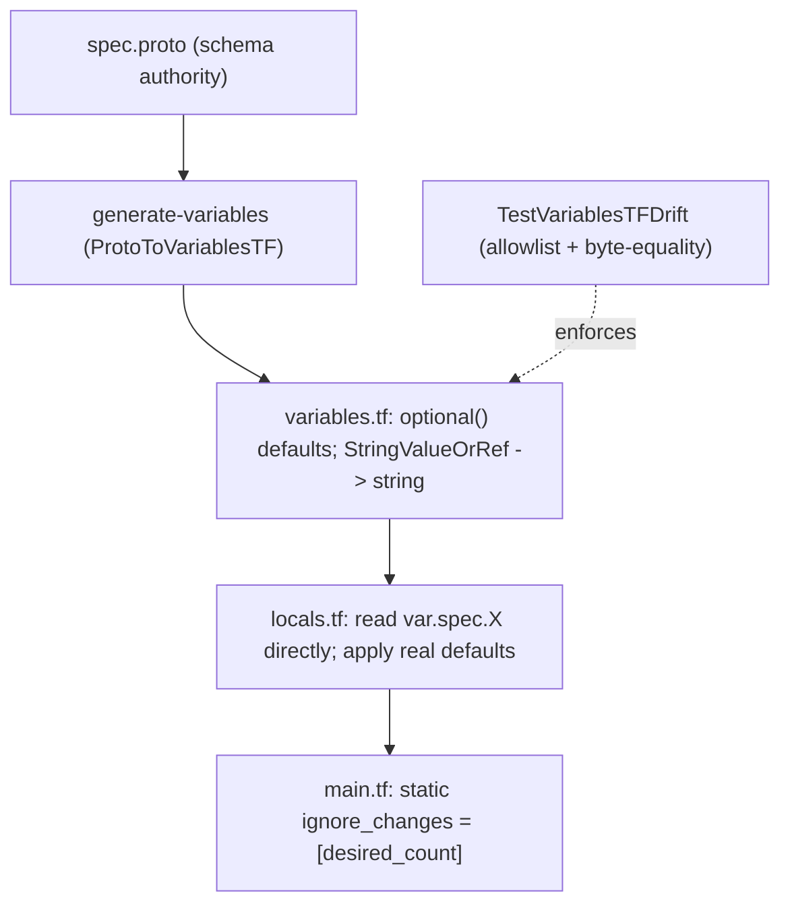

# AwsEcsService: static `ignore_changes` + variables.tf generator migration

**Date**: June 28, 2026
**Type**: Bug Fix
**Components**: AWS Provider (AwsEcsService), Provider Framework, IAC Stack Runner

## Summary

The `AwsEcsService` OpenTofu module failed at `tofu init` with `Invalid expression: A static list
expression is required.`, and even past that its hand-written `variables.tf` was a stale,
all-attributes-required schema that would have failed input validation against the runtime's
null-pruned tfvars. Both are fixed: `lifecycle.ignore_changes` is now a static list, and the module is
brought under the generator as the single source of truth for `variables.tf` — the same modern shape
the rest of the AWS provider already uses.

## Problem Statement / Motivation

A real deploy of the `aws-ecs-environment` chart failed on `AwsEcsService` at the very first phase:

```
error: Invalid expression
A static list expression is required.
```

`aws_ecs_service`'s `lifecycle.ignore_changes` was a conditional expression
(`local.autoscaling_enabled ? [desired_count] : []`). OpenTofu parses the `lifecycle` block before
expression evaluation, so its arguments must be static literals — a conditional is rejected at `init`,
before any variable is even read.

Behind that parse error sat a second, latent failure. The module's `variables.tf` was hand-written and
out of date with both the proto and its own `locals.tf`.

### Pain Points

- **Parse-time abort.** The conditional `ignore_changes` made the module impossible to `init`, so the
  resource could never deploy or tear down.
- **Stale, divergent schema.** `variables.tf` typed `metadata.labels` as a struct (it is a
  `map(string)`) and omitted `autoscaling`, `health_check_grace_period_seconds`, and
  `alb.health_check` entirely — all of which `locals.tf` reads and `spec.proto` declares.
- **Hidden next failure.** The runtime renderer marshals with `protojson{EmitUnpopulated:false}`, so
  unset fields are absent from the emitted `terraform.tfvars`. An all-required object schema rejects
  such a value with `attribute "X" is required` — so fixing only the parse error would have surfaced
  this class on the next run.

## Solution / What's New

Two coordinated changes: make the `lifecycle` block static, and regenerate the module's input schema
from the proto (the established provider-abstraction contract), then rewrite the module body to consume
the flattened shape.



### Static `lifecycle.ignore_changes`

`desired_count` is runtime state — when autoscaling is enabled the appautoscaling target owns it, and
operators may scale out of band — so Terraform now sets the initial count from
`spec.container.replicas` and then leaves it alone via the static `ignore_changes = [desired_count]`.
This matches the house convention for autoscaling-managed counts (e.g. `gcp-gke-node-pool`'s static
`ignore_changes = [node_count]`); every other module already uses static lists. Conditionally ignoring
would require duplicating the whole resource via `count` — a divergence the codebase avoids.

### Generator-owned `variables.tf` + flattened module body

The module joins the migrated AWS set: `variables.tf` is regenerated from the proto (canonical
`metadata` block, `optional()` defaults, and every `StringValueOrRef` flattened to a primitive — the
orchestrator resolves `value_from` before the module runs), and `locals.tf` is rewritten to consume it.

## Implementation Details

**`apis/dev/planton/provider/aws/awsecsservice/v1/iac/tf`**

- `main.tf`: `lifecycle { ignore_changes = [desired_count] }` (was the conditional).
- `variables.tf`: regenerated via `PLANTON_REGEN_VARIABLES=1`. Foreign keys are now primitives —
  `cluster_arn = string`, `network.subnets = list(string)`, `iam.task_execution_role_arn`,
  `alb.arn`, etc. — and `autoscaling` / `health_check_grace_period_seconds` / `alb.health_check`
  appear with `optional()` defaults.
- `locals.tf`: refs are read directly (`var.spec.cluster_arn`, `var.spec.network.subnets`) instead of
  `coalesce(try(var.spec.X.value, null), try(var.spec.X.value_from.name, null))`. Because the
  generator's `optional()` defaults are proto **zero values**, the non-zero defaults the module needs
  are applied here: `replicas → 1`, logging on, `listener_priority → 100`, grace period `→ 60`,
  autoscaling min/max, and "`0` means unset" normalization for `container.port` and the autoscaling
  target percentages.

**`pkg/iac/tofu/generators/variablestf_drift_test.go`**

- Added `AwsEcsService` to the `migratedKinds` allowlist (the guard is a hardcoded allowlist), so the
  generator now owns its `variables.tf` and it can never silently regress to a hand-edited schema.

## Benefits

- The `aws-ecs-environment` chart's ECS service can `init`, `plan`, and deploy/tear down again.
- The module's input schema is now generated and drift-guarded — one less hand-maintained file, and
  the `attribute "X" is required` class is structurally impossible for this kind.
- Behavior matches the platform's existing convention for autoscaling-managed counts.

## Impact

Adopters deploying ECS services (directly or via the `aws-ecs-environment` chart). Strictly a
correctness fix plus a schema migration to the modern shape; no proto/API change, so existing
manifests continue to apply unchanged.

## Verification

```bash
# Generator owns variables.tf (drift guard green for AwsEcsService and every migrated kind)
go test ./pkg/iac/tofu/generators/

# Isolated, offline reproduction against a null-pruned tfvars (ALB on, autoscaling off):
tofu init -backend=false && tofu validate        # both pass on the migrated module
tofu plan                                         # evaluates config + typed vars; only AWS creds fail
```

Reproduced the original error to confirm the fix is causal: restoring the conditional `ignore_changes`
yields `A static list expression is required.`; the static list yields a valid configuration.

## Related Work

- `2026-06-27-192445-tofu-variables-optional-schema-generator-source-of-truth.md` — established the
  `optional()` generator contract and the `TestVariablesTFDrift` guard this change extends.
- `2026-06-27-223000-ecr-lifecycle-and-iam-inline-policies-freeform-map.md` — the prior batch of
  `aws-ecs-environment` module fixes; this completes the deferred `AwsEcsService` migration.

---

**Status**: ✅ Production Ready
**Timeline**: Single focused session (module fix + migration + offline verification)
