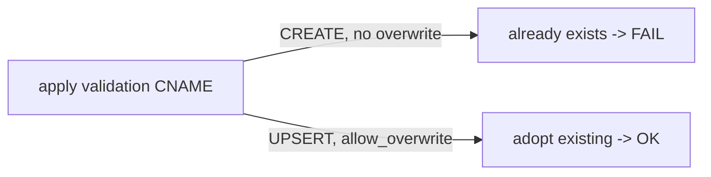
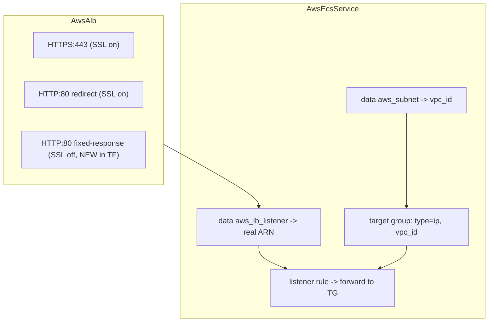

# ALB-fronted ECS deploys: Route53 idempotency + Terraform/Pulumi parity

**Date**: June 28, 2026
**Type**: Bug Fix
**Components**: AWS Provider (awsecsservice, awsalb, awsnetworkloadbalancer, awscertmanagercert), Terraform Modules, Pulumi Modules

## Summary

Fixes the chain of defects that prevented an ALB-fronted ECS service (e.g. the `aws-ecs-environment`
chart) from ever reaching a running task on the Terraform/OpenTofu provisioner. Two classes of bug:
(1) module-owned Route53 records collided on `CREATE` instead of adopting existing records, and
(2) the Terraform `AwsEcsService` ALB integration had drifted from the already-correct Pulumi module
in three apply-time ways. Every change brings the Terraform side to parity with the Pulumi sibling and
the canonical AWS pattern.

## Problem Statement / Motivation

An `aws-ecs-environment` deploy failed at the ACM certificate node, and the ECS service node had in
fact never once reached `apply` — so its ALB apply path was unexercised and had silently rotted.

### Pain Points

- **ACM DNS validation collided.** A cert with a domain plus its wildcard SAN (`app.example.com` +
  `*.app.example.com`) shares one ACM validation CNAME. The Terraform module created it twice and
  without `allow_overwrite`, failing with `InvalidChangeBatch ... already exists` — and any record left
  by a prior partial apply caused the same failure.
- **ALB / NLB alias records** had the same `CREATE`-collision exposure on re-runs.
- **Terraform `AwsEcsService` ALB integration was broken** three ways, all only surfacing at `apply`:
  - listener rule used a synthesized `"<lb-arn>:listener/<port>"` string — not a valid ELBv2 listener ARN;
  - target group set `vpc_id = null` (required for non-lambda target groups);
  - target group had no `target_type = "ip"` (Fargate/awsvpc tasks register by IP).
- **HTTP-only ALB had no listener** in Terraform when SSL was disabled, so an HTTP-only service had
  nothing to attach to (the Pulumi module already created one).

## Solution / What's New

The Pulumi modules were already correct; the Terraform modules were the outliers. Each fix is a parity
port, not a new design.

### Route53 idempotency (module-owned records)

- `awscertmanagercert`: `allow_overwrite = true` on the validation record (TF) / `AllowOverwrite` (Pulumi).
- `awsalb`, `awsnetworkloadbalancer`: `allow_overwrite` / `AllowOverwrite` on the module-owned alias records.

### Terraform AwsEcsService ALB integration (ported from the Pulumi module)

- Derive the VPC from the service's first subnet via `data "aws_subnet"` (mirrors `ec2.LookupSubnet`).
- Target group: `target_type = "ip"`, `vpc_id = data.aws_subnet.first[0].vpc_id`.
- Resolve the real listener via `data "aws_lb_listener"` by load balancer + port (mirrors
  `lb.LookupListener`); the rule now uses `data.aws_lb_listener.selected[0].arn`.

### HTTP-only ALB listener

- `awsalb` (Terraform): create an HTTP:80 listener with a fixed-response `200` default when SSL is off,
  matching the Pulumi module so both toggles work.

## Implementation Details

No `spec.proto` / `stack_outputs.proto` changes — this is an IaC-module-body fix only. Component
`spec_test.go`, `go build`, `tofu validate`, and the secret-coverage gate all pass.

## Benefits

- ALB-fronted ECS services deploy to a running task on OpenTofu, not just Pulumi.
- Re-runs after a partial failure self-heal (records are adopted, not collided with).
- Terraform and Pulumi now behave identically for these components — no provider divergence.
- HTTP-only (`httpsEnabled: false`) environments work on both engines.

## Impact

Anyone deploying `AwsEcsService` behind an `AwsAlb` (including the platform `aws-ecs-environment`
chart) on the Terraform/OpenTofu provisioner. Cert/ALB/NLB idempotency improvements apply to every
consumer of those components on re-deploys.

## Related Work

Builds on the prior `awsecsservice` fix (`db05ae26d`, static `ignore_changes = [desired_count]`),
which addressed the `init`-time error; this change addresses the `apply`-time path.

---

**Status**: ✅ Production Ready
