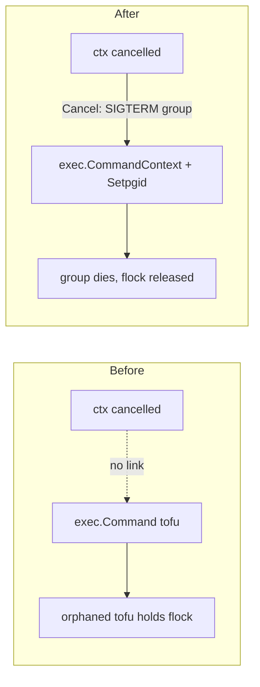

# Context-bound tofu exec with process-group reaping

**Date**: June 28, 2026
**Type**: Bug Fix / Reliability
**Components**: IAC Stack Runner, OpenTofu/Terraform CLI invocation (pkg/iac/tofu/tofumodule)

## Summary

`RunOperation` and `Init` now take a `context.Context` and run the `tofu`/`terraform` child in its own process group, terminating the WHOLE group when the context is cancelled. Previously these used a context-less `exec.Command`, so a caller that cancelled its context (e.g. a cancelled/superseded Temporal stack job in the Planton runner) could not stop the child -- the `tofu` process was orphaned and kept holding the state lock, wedging the next operation on the same state.

## Problem Statement / Motivation

On the local filesystem backend the state lock is an OS `flock`. A long-running `tofu apply` (for example one polling ACM certificate DNS validation for up to ~75 minutes when a zone is not yet delegated) holds that lock for its entire run. When the owning operation was cancelled, the child was never signalled, so it kept running and holding the lock; a subsequent `destroy` then failed with `Error acquiring the state lock ... resource temporarily unavailable`.

### Pain Points

- A cancelled/superseded operation **orphaned** its `tofu` child (and the provider plugins it spawned).
- `tofu force-unlock` does NOT help: against a live holder it reports `LocalState not locked` and the retry still fails, because force-unlock manipulates the lock-info file, not the live flock. The only correct fix is to terminate the holder.
- The apply/destroy/init path used a context-less `exec.Command`, inconsistent with the rest of the runner which already binds tofu state subcommands to a context.

## Solution / What's New

The command now dies with its context, and the whole process group is reaped.

- `RunOperation(ctx, ...)` and `Init(ctx, ...)` accept a context as the first parameter and build the command via a new `newReapableCommand`:
  - `exec.CommandContext(ctx, ...)` binds the child's lifetime to the context.
  - On unix, `SysProcAttr{Setpgid: true}` puts the child in its own process group so `tofu` plus its provider-plugin children can be signalled together.
  - `cmd.Cancel` sends SIGTERM to the whole group (tofu treats it as a graceful stop that finishes the current atomic state write and releases the lock); `cmd.WaitDelay` escalates to SIGKILL if it lingers.
- Process-group control is split across `procattr_unix.go` (`//go:build unix`) and a non-unix no-op (`procattr_other.go`) so the CLI still builds on every platform.

## Implementation Details

- New files: `pkg/iac/tofu/tofumodule/reapable_command.go` (the `newReapableCommand` constructor + `reapGraceWaitDelay`), `procattr_unix.go`, `procattr_other.go`, `reapable_command_test.go`.
- Updated callers: `RunCommand` passes `context.Background()` (no cancellation context in that path); the CLI `init` commands (`cmd/planton/root/init.go`, `cmd/planton/root/tofu/init.go`, `cmd/planton/root/terraform/init.go`) pass `cmd.Context()` so Ctrl-C reaps the child.
- The existing `streamCommandJSONOutput` read-before-Wait ordering is preserved -- on cancel, the killed child closes the stdout pipe, the reader drains to EOF, then `Wait` returns.

## Benefits

- A cancelled/superseded operation no longer orphans `tofu`; the state lock is freed deterministically.
- Brings the apply/destroy/init path in line with the context-bound exec already used by the runner's state subcommands -- removes an inconsistency rather than adding a pattern.
- CLI gains Ctrl-C reaping of the IaC child for free.

## Impact

- **API change (breaking for direct callers)**: `RunOperation` and `Init` gain a leading `ctx context.Context` parameter. All in-repo callers are updated; downstream consumers (the Planton runner) must pass their operation context. This is the change that lets the Planton control plane reap a cancelled stack job's tofu and unblock undeploys.

## Testing Strategy

- `go build ./...` green.
- `go test ./pkg/iac/tofu/tofumodule/` green, including the new `TestNewReapableCommand_KillsProcessGroupOnCancel` -- a tofu-free test that runs a backgrounded `sleep` through the helper, cancels the context, and asserts the ENTIRE process group is gone (not just the leader).

## Related Work

- Consumed by the Planton runner's stack-job cancellation reaping (activity heartbeat + `WAIT_CANCELLATION_COMPLETED`), which together stop a cancelled deploy from wedging a later undeploy on the local backend.

---

**Status**: ✅ Production Ready
