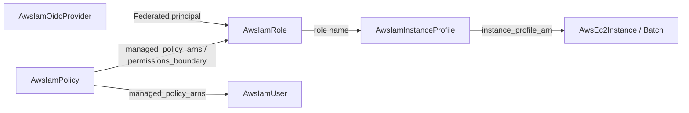

# AWS IAM Decomposition into First-Class Composable Kinds

**Date**: July 2, 2026
**Type**: Feature
**Components**: AWS Provider, API Definitions, IAC Modules, E2E Framework, Resource Management

## Summary

Rebuilds the AWS IAM family around first-class, composable kinds. Two new
kinds — `AwsIamPolicy` (the reusable unit of permissions) and
`AwsIamInstanceProfile` (the container that delivers a role to EC2) — join an
enriched `AwsIamRole` and `AwsIamUser` whose policy attachments are now
references instead of plain strings. The redundant `AwsSecretsManager` kind is
removed. All five IAM kinds now carry live dual-engine E2E coverage, and the
E2E harness gained repeated-reference resolution to make composed IAM
topologies testable.

## Problem Statement / Motivation

The IAM surface was the shallowest high-value corner of the AWS catalog:

- **No managed-policy kind.** Permission documents were duplicated inline
  across roles and users, with no single place to define, version, or reuse a
  permission set — and nothing for a permissions boundary to reference.
- **The role silently created an instance profile.** Every role — Lambda
  execution roles, ECS task roles, service roles — minted an EC2-only wrapper
  it would never use, and EC2-shaped resources referenced the *role's* outputs
  for what is really a separate AWS object with its own lifecycle.
- **Attachments were opaque strings.** `managed_policy_arns` as
  `repeated string` meant the resource graph could not show which principals
  carry which permissions.
- **`AwsSecretsManager` duplicated Planton Config Manager**, the platform's
  single secrets system.

## Solution / What's New

### New kinds

- **`AwsIamPolicy` (enum 230)** — a customer-managed policy: free-form
  permission document, IAM path, description; outputs
  `policy_arn`/`policy_id`/`policy_name`. Both engines prune policy versions
  automatically so document updates never hit AWS's 5-version cap.
- **`AwsIamInstanceProfile` (enum 231)** — the profile that delivers a role to
  EC2. Its `role` field is a required reference to an `AwsIamRole`'s
  `role_name` (the AWS API attaches roles by name), and the kind declares
  `AwsIamRole` as a registry prerequisite. The carried role is swappable in
  place.

### Enriched kinds

- **`AwsIamRole`** — `managed_policy_arns` is now
  `repeated StringValueOrRef` (default kind `AwsIamPolicy`); adds
  `max_session_duration`, `permissions_boundary` (reference), and
  `force_detach_policies`; **no longer creates an instance profile** — EC2
  delivery composes through `AwsIamInstanceProfile`, and the
  `AwsEc2Instance`/`AwsBatchComputeEnvironment` foreign keys were re-pointed
  accordingly. Outputs slim to `role_arn`/`role_name`/`role_id`.
- **`AwsIamUser`** — same reference conversion; adds `path`,
  `permissions_boundary` (reference), and `force_destroy`; the Terraform
  module now base64-encodes the secret access key so both engines emit
  byte-identical outputs.
- **`AwsIamOidcProvider`** — documents the AWS quirk that thumbprints cannot
  be cleared in place; its Terraform module's variable contract was repaired
  (see below).

### Removal

- **`AwsSecretsManager`** deleted (component, catalog docs, enum 214 retired).
  Planton Config Manager is the single secrets system; no kind referenced it
  as a foreign key and no chart used it.

### Framework

- **The E2E harness ref resolver now handles repeated `StringValueOrRef`
  fields** — each element resolves independently, so a list can mix literals
  (AWS-managed policy ARNs) with references to deployed prerequisites.
- **IAM verifiers** for all five kinds (AWS IAM SDK; `NoSuchEntity` as the
  absent signal; region-agnostic since IAM is global), E2E profiles/scenarios
  per kind, and an `AwsIamRole` prerequisite manifest consumed by the
  instance-profile tests.
- Five `charts/aws/*` templates updated to the `- value: <arn>` manifest shape
  for `managedPolicyArns`.

## Implementation Details

The composed identity chain in E2E exercises the full dependency machinery:
the instance-profile scenario declares nothing special — the harness reads
`prerequisites: [AwsIamRole]` from the kind registry, deploys the role's
prerequisite manifest, resolves the profile's `valueFrom` role reference
against the role's live outputs, applies the profile, verifies via
`GetInstanceProfile`, and tears down in reverse.

Live E2E immediately paid for itself: the OIDC provider's Terraform module
still carried the old generated variable shape (`labels`/`annotations` typed
as `{key,value}` objects, `url` as a strict object requiring both oneof arms),
which the tfvars pipeline can never satisfy — the module had never actually
deployed on Terraform. `terraform validate` cannot catch this class (it
validates the module against itself, not against real tfvars); the first live
run did. The contract was rewritten to the current grain.

## Validation

- Spec/CEL tests for all five kinds (valid + error paths) — green.
- `planton validate-refs --check` — all foreign keys resolve (including the
  two re-pointed instance-profile references).
- `planton secret-coverage --check` — gate passed.
- `pkg/outputs` conformance — new cases for the four IAM kinds guard the
  role's output slimming and the user's byte-identical secret encoding.
- `tofu init && tofu validate` per Terraform module; release-equivalent
  `go build` per Pulumi entrypoint; full `go build ./...` green.
- Field-by-field parity check across both engines — no gaps, zero
  `PARITY-EXCEPTION`s.
- **Live dual-engine E2E: 10/10 pass** (5 kinds x 2 engines; create → verify
  via AWS SDK → destroy → verify-destroyed; the instance-profile chain deploys
  its role prerequisite both times). Zero orphaned resources.

## Impact

IAM is the leaf nearly every AWS architecture composes onto. Permission sets
are now first-class, referenceable, and centrally updatable; the EC2 identity
chain (role → profile → instance) is three honest nodes instead of a hidden
side effect; and boundaries — the mechanism that makes delegated role creation
safe — plug in as references. The repeated-reference resolver unblocks
composed E2E for every existing and future kind with reference lists.

---

**Status**: ✅ Production Ready
