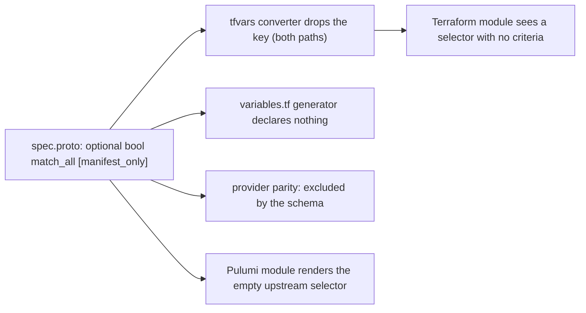

# Every switch a block carries states itself, and a manifest word the wire spells by absence is declared once

**Date**: September 15, 2026
**Type**: Feature
**Components**: API Definitions (42 catalog kinds across cloudflare, gcp, azure, aws, kubernetes), Protobuf Schemas (`shared/options`), Terraform generators (`pkg/iac/tofu/generators`), Provider Parity (`pkg/providerparity`)

## Summary

Forty-two catalog kinds used to mean something by leaving a block or a row empty: a present-but-empty logging block meant "manage it, with defaults", an empty selector meant "every pod", an empty access config meant "an ephemeral address", a set of plain booleans inside an optional block could not say "off" because false was indistinguishable from unset. Every one of those switches is now stated in the schema, in words the YAML, the CLI, an agent composing a manifest, and a form all agree on. A new field option, `manifest_only`, declares the words the manifest needs and no engine forwards, and the tfvars converter, the `variables.tf` generator, and provider parity honor it by construction.

## Problem Statement

A manifest is the one artifact every door writes. When a schema lets an empty block carry a meaning, two authors who mean different things -- "turn this on with defaults" and "I never touched this" -- write the same bytes. Modules read presence and do the right thing for the YAML author; a form cannot, because an untouched block and an engaged-but-default block look identical to it, and a save path that prunes untouched blocks silently deletes the author's choice. Four shapes recur:

- A plain `bool` inside an optional block, where `false` is the zero value and cannot be told from unset (a Total TLS switch, a set of public-access guards, a boot-diagnostics toggle).
- A block whose presence is the setting and whose content can be entirely default (flow logs, a user-managed key, Cloud Logging integration, a PSC allowlist).
- Sibling arms under a "set exactly one" counting rule, where a legitimately empty arm (`managed: {}`, `standard: {}`, `text_format: {}`) is a complete choice.
- A choice with no wire spelling of its own: "select every pod" is the empty selector, "an ephemeral external IP" is an access config without a static one, "match every request" is the empty Istio rule.

## What Changed

### The spelling of a switch, decided per kind by reading both engines

Three spellings, taken from the catalog's own idiom (the tree already spelled a switch on an optional block as `optional bool enabled` 141 times):

1. A dial whose absent block means a value carries that value as `(dev.planton.shared.options.default)`. Unset inside a present block is filled to what the absent block meant; only a stated other value changes it. The S3 bucket's four public-access guards default ON; relaxing one never relaxes the others by omission.
2. A switch beside other dials, where a present block has meant "on, with defaults", is `optional bool enabled [default = "true"]`. `{}` keeps its meaning and now states it; `enabled: false` is "declared, off". Subnetwork flow logs, GKE Cloud Logging, a service account's user-managed key, Vertex AI private service connect, the AKS add-ons, the ML feature store, Athena's result storage and log destinations, Cognito email MFA, SES auto-suppression, the Config rule's organization scope, Bedrock agent memory, VM boot diagnostics.
3. A switch that is the block's only meaningful content is `optional bool enabled [required]`, because `{}` there means nothing and a silent default would choose for the author. Cloudflare's ruleset and gateway-policy logging blocks, NEL, HSTS, APO, Total TLS, GCS Autoclass, the identity platform's sign-in arms, AlloyDB's Dataplex integration, SES VDM.

A dial whose zero is a real value takes no default and the module reads its pointer: the URL map's `0s` durations, the flexible servers' maintenance window at Sunday midnight, an EFS POSIX user's root uid and gid, an application gateway's autoscale floor of 0.

### Sibling arms become protobuf oneofs

Eight kinds' "set exactly one" counting rules became `oneof`s with field numbers kept (the JSON did not move), a marker message for every legitimately empty arm (Pub/Sub's wrapper and text output, the JWT pass-through credential, the standard backup vault, the managed knowledge base), and `required` only where a choice is mandatory. The Pub/Sub subscription and topic, the region network endpoint group, the Data Factory dataset and integration runtime, the backup vault, the Bedrock knowledge base and AgentCore gateway, and Kinesis Firehose.

### Words the wire spells by absence

```yaml
# Before: the same bytes for "every pod" and "nothing authored"
pod_selector: {}

# After: the choice is written down, and refused when it is not
pod_selector: { match_all: true }
```

```yaml
# Before: an empty row was the ephemeral request
accessConfigs:
  - networkTier: PREMIUM

# After
accessConfigs:
  - ephemeral: true
    networkTier: PREMIUM
```

```yaml
# Istio: an empty rule matched every request, silently
rules:
  - matchAll: true
```

Each such field is an `optional bool` carrying `(dev.planton.shared.options.manifest_only) = true`, with two message-level rules: the word beside the content it stands in for is a contradiction the API names, and a block that names neither is refused. The NetworkPolicy's label selector, the compute instance's access config, and the AuthorizationPolicy's rule carry the first three.

The backend service's strong-affinity cookie block took the opposite resolution: choosing STRONG_COOKIE_AFFINITY is the whole statement, the cookie block is now optional under it (both engines send GCP the cookie configuration it requires, GCP-defaulted when the spec has none), and it is still refused under any other mode.

### One declaration, every engine path



The converter every Terraform run rides (`pkg/iac/tofu/generators`) drops a marked field as its first check per field, on the snake_case path a hand-written module reads and on the manifest projection a CRD-faithful module forwards verbatim -- so an unknown key never reaches an apiserver, and the nineteen generated projection modules did not change. The `variables.tf` generator declares no attribute for it. Provider parity records the leaf in the spec census (it is authored surface) and reads it as an exclusion the schema declares; a `specExclusions` entry that repeats one is reported stale, so the fact lives in one place.

## Benefits

- A manifest says what it means on every door: `enabled: false`, `match_all: true`, `ephemeral: true`, `text_config: {}` are statements, not accidents of an empty block.
- A form can carry every one of these switches without a hand-written per-kind save path, because the schema no longer asks it to tell an untouched block from an engaged one.
- A word the manifest needs is declared once in the proto; no module declares a dead variable for it, no parity manifest repeats it, and no projection module has to learn it.
- The forge's spec doctrine carries the three spellings, the meaningful-zero rule, and the marker, so the next kind is modeled this way from the start.

## Verification

Per kind: both engines build, the spec tests cover each new shape (on validates, off validates, refused where the law says refuse, "a second arm replaces the first" for every oneof), `tofu validate`, every preset and e2e manifest validated with the CLI built from the tree, provider parity at total accounting for every instrumented kind, secret coverage. Whole tree: `make protos` (generation, the Java stub compile, the protovalidate-java CEL conformance gate, gazelle), `make generate-reference`, `make buf-breaking` against `v0.5.57` (88 advisory, all alpha; 0 blocking), the provider-parity public report drift test, the generators' and parity's own suites. Not run: the live per-kind e2e lanes against real clouds.

## Related Work

The forge's spec rule (`_rules/component/forge/flow/001-spec-proto.mdc`) and Terraform rule (`012-terraform-module.mdc`) carry the doctrine. The public parity pages and every kind's reference page regenerate from the tree.

---

**Status**: Production Ready
