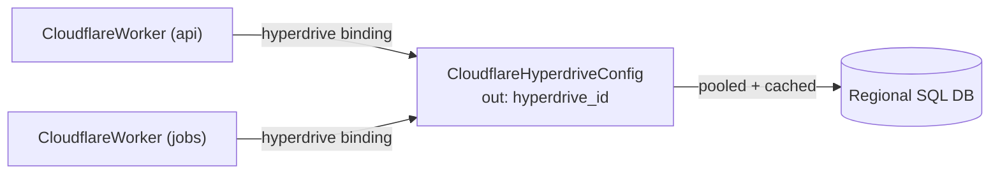

# Cloudflare Hyperdrive: Making a Regional Database Feel Local at the Edge

## The problem Hyperdrive solves

Cloudflare Workers run in hundreds of locations; a conventional SQL database runs
in one. That mismatch creates two problems for edge applications:

1. **Connection setup latency.** A TLS + auth handshake to a database in another
   continent can dominate request time, and it happens on every cold path.
2. **Connection exhaustion.** Databases cap concurrent connections. Thousands of
   concurrent Worker invocations each opening a connection will exhaust the pool.

Hyperdrive places a pooler and cache between the Worker and the origin. The Worker
binds to a Hyperdrive config and connects to it with a normal driver; Hyperdrive
maintains warm, pooled connections to the origin and caches read query results at
the edge.

## Shape of this component

This kind models a single Hyperdrive config:

- **origin** — how to reach the database: `database`, `scheme`
  (`postgres`/`postgresql`/`mysql`), `user`, `host`, `port`, and the
  secret-by-default `password`. For databases published behind Cloudflare Access,
  `accessClientId` / `accessClientSecret` carry the service-token credentials. For
  private origins reached over a Workers VPC Service, set `serviceId` to egress
  through that VPC Service instead of dialing the public host — mutually exclusive
  with `mtls` (TLS is managed on the VPC Service).
- **caching** — `disabled`, `maxAge`, `staleWhileRevalidate`. Caching is on by
  default; disable it for workloads that cannot tolerate stale reads.
- **mtls** — `caCertificateId`, `mtlsCertificateId`, `sslmode` for origins that
  require mutual TLS.
- **originConnectionLimit** — the soft cap on pooled origin connections (5–100).

## Composition

Hyperdrive is a first-class node because Workers reference it: a Worker's
`hyperdrive_configs` binding points at `status.outputs.hyperdrive_id`. One
Hyperdrive config can back many Workers, and its lifecycle (rotating the origin
password, tuning caching) is independent of any Worker.

## Secrets

`origin.password` and `origin.accessClientSecret` are secret-by-default and
write-only at the API. Always supply them as managed-secret references so they are
resolved just-in-time at deploy and never persisted in plaintext.

## Operational notes

- Creating a Hyperdrive config validates connectivity to the origin: the origin
  must be reachable from Cloudflare at apply time.
- `scheme`, `host`, `port`, and `database` changes replace the config.
- A Worker reaches the database through the binding; there is no connection string
  output, by design.
