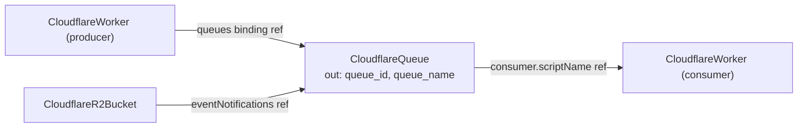

# Cloudflare Queues: A Composable Message Backbone for Workers

## The problem Queues solve

Edge applications often need to do work that should not block the request: send an
email, transcode an upload, fan out a webhook, write to a slow downstream. A queue
decouples the request path (the producer) from that work (the consumer) so each
scales and fails independently, with guaranteed delivery and automatic retries.

## Shape of this component

This kind models a single Cloudflare Queue plus its (single) consumer:

- **settings** — queue-level delivery behavior: `deliveryDelay` (delay every
  message), `deliveryPaused` (hold delivery while still accepting writes), and
  `messageRetentionPeriod` (how long unconsumed messages survive).
- **consumer** — the queue's one consumer:
  - `type` = `worker` (push: a Worker is invoked automatically with batches) or
    `http_pull` (an external client pulls batches over HTTP).
  - `scriptName` — for worker consumers, the consuming Worker (a literal script
    name or a reference to a `CloudflareWorker`).
  - `deadLetterQueue` — where messages go after exhausting their retries (a
    literal name or a reference to another `CloudflareQueue`).
  - `settings` — batching/retry tuning. `maxConcurrency` and `maxWaitTimeMs` apply
    to worker consumers; `visibilityTimeoutMs` applies to http_pull consumers;
    `batchSize`, `maxRetries`, and `retryDelay` apply to both.

### Why the consumer is folded, not a separate kind

At the resource level a queue has exactly one consumer (`cloudflare_queue_consumer`
is keyed by the queue), with no independent lifecycle and no other resource
referencing it — so it is configuration of the queue, not a node of its own. This
mirrors how object-storage sub-resources fold onto a bucket. The deployment still
provisions the consumer as its own provider resource, so editing the consumer does
not churn the queue.

## Composition

A Queue is a first-class node because both producers and the consumer reference it:

- A producing Worker references the queue by name through its `queues` binding
  (`status.outputs.queue_name`).
- An R2 bucket forwards object events to the queue by id through
  `eventNotifications` (`status.outputs.queue_id`).
- The consumer references the consuming Worker by script name.

> Note: avoid having a single Worker both produce to and consume the *same* queue
> via references on both edges — that forms a reference cycle in the dependency
> graph. The common producer-and-consumer-are-different-Workers topology is acyclic;
> for the self-consume case, supply a literal on one edge.

## Operational notes

- The consuming Worker for a `worker` consumer must already exist (reference it so
  the graph deploys it first).
- `cloudflare_queue_consumer` does not support `terraform import`; the queue does
  (`<account_id>/<queue_id>`).
- Pull (`http_pull`) consumers have no Worker; external clients pull and
  acknowledge messages over the REST API within `visibilityTimeoutMs`.
