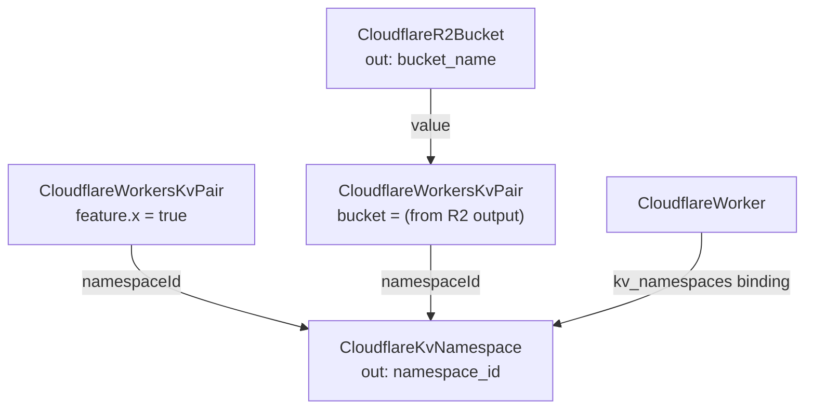

# Workers KV Pair: Configuration as a First-Class Node

## Why a key-value pair is its own kind

Workers KV namespaces hold two very different kinds of data:

1. **Application data** — written and read by the Worker at runtime, high-volume,
   high-churn. This does not belong in infrastructure.
2. **Configuration** — feature flags, routing tables, allowlists, and values
   derived from other infrastructure. This benefits enormously from being
   declarative: versioned, reviewed, and wired to the resources it depends on.

`CloudflareWorkersKvPair` models the second case. It is a first-class kind (not a
field on the namespace) because entries are many-per-namespace, have independent
lifecycles, and — most importantly — can reference other resources' outputs,
making them real nodes in the resource graph.

## Composition

The classic pattern: a chart creates a namespace, seeds config entries into it,
and a Worker binds the namespace to read them. A seeded value can itself come from
another resource's output.

## Field notes

- `keyName` is a key *name*, capped at 512 bytes by Cloudflare.
- `value` can be up to 25 MiB. It is **not** a secret field — KV is
  general-purpose storage. Route real secrets through a Worker `secret_text`
  binding or Cloudflare Secrets Store, which are secret-by-default.
- `metadata` is arbitrary JSON (≤1024 bytes) returned alongside the value on read.

## Operational notes

- The entry's identity is (`account_id`, `namespace_id`, `key_name`); changing the
  key name replaces the entry.
- Deleting the resource deletes the key from the namespace. Do not manage
  runtime-owned application keys this way — only configuration you intend to own
  declaratively.
