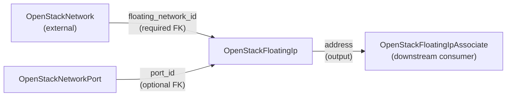

# OpenStack Floating IP

Allocate and optionally associate Neutron floating IPs in OpenStack using Planton's unified API.

## Overview

A Neutron floating IP provides external (public) connectivity to instances or ports on tenant networks. It is allocated from an external provider network and can optionally be associated with a port for immediate connectivity.

This component creates an `openstack_networking_floatingip_v2` resource through both Pulumi and Terraform IaC modules with full feature parity.

Floating IPs in OpenStack do not have a name attribute. The `metadata.name` is used for Planton identity only.

## Prerequisites

1. **OpenStack Cloud**: Access to an OpenStack deployment with Neutron (Networking service)
2. **Credentials**: OpenStack credentials configured via the credential management system
3. **Planton CLI**: Install from [planton.dev](https://planton.dev)
4. **External Network**: An external (provider) network with a pool of public IP addresses

## Quick Start

### Allocation-Only (No Association)

Allocate a floating IP from an external network without associating it to any port:

```yaml
apiVersion: openstack.planton.dev/v1
kind: OpenStackFloatingIp
metadata:
  name: web-fip
spec:
  floating_network_id:
    value: "a1b2c3d4-e5f6-7890-abcd-ef1234567890"
```

### With Foreign Key Reference

Reference an external network managed by Planton:

```yaml
apiVersion: openstack.planton.dev/v1
kind: OpenStackFloatingIp
metadata:
  name: app-fip
spec:
  floating_network_id:
    value_from:
      name: external-network
```

### With Built-In Port Association

Allocate and immediately associate to a port:

```yaml
apiVersion: openstack.planton.dev/v1
kind: OpenStackFloatingIp
metadata:
  name: web-fip
spec:
  floating_network_id:
    value_from:
      name: external-network
  port_id:
    value_from:
      name: web-server-port
```

## Allocation vs. Association

This component supports two modes:

| Mode | port_id | Use Case |
|------|---------|----------|
| **Allocation-only** | omitted | Reserve an IP for later use. Associate separately via `OpenStackFloatingIpAssociate`. |
| **Built-in association** | set | Allocate and bind in one resource. Simpler when association doesn't need its own DAG node. |

For InfraCharts where the association must be a visible dependency edge, use allocation-only mode with `OpenStackFloatingIpAssociate` as a separate component.

## Spec Fields

| Field | Type | Required | Description |
|-------|------|----------|-------------|
| `floating_network_id` | StringValueOrRef | Yes | External network to allocate from |
| `port_id` | StringValueOrRef | No | Port to associate (built-in association) |
| `fixed_ip` | string | No | Fixed IP on the port (multi-IP ports only) |
| `subnet_id` | string | No | Subnet within the external network for allocation |
| `address` | string | No | Request a specific IP address (ForceNew) |
| `description` | string | No | Human-readable description |
| `tags` | repeated string | No | Tags for filtering and organization |
| `region` | string | No | Region override |

## Outputs

| Output | Description |
|--------|-------------|
| `floating_ip_id` | UUID of the floating IP resource |
| `address` | The allocated public IP address (FK target for FloatingIpAssociate) |
| `floating_network_id` | External network UUID |
| `port_id` | Associated port UUID (empty if allocation-only) |
| `fixed_ip` | Mapped fixed IP (empty if allocation-only) |
| `region` | Deployment region |

## Foreign Key Relationships



## See Also

- `OpenStackFloatingIpAssociate` -- Standalone association for DAG-visible binding
- `OpenStackNetwork` -- External network providing the IP pool
- `OpenStackNetworkPort` -- Port target for association
- `examples.md` -- Full YAML examples for all configurations
