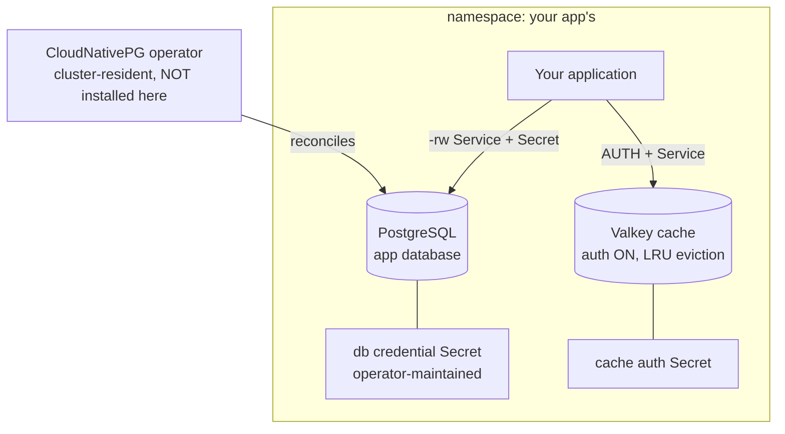

# Kubernetes App Data Services

Your application's data layer, one manifest per app: a dedicated
PostgreSQL database and an authenticated Valkey cache, living in the app's
own namespace with credentials your app reads straight from Secrets. This
chart is the per-app companion to an operator-ready cluster — it teaches
the operator-aware model by construction: the CloudNativePG operator is
one-per-cluster infrastructure that already runs on the cluster (a
full-stack platform chart put it there), while databases are per-app
resources you stamp out as often as you have applications. Nothing here is
shared between apps: each deployment owns its namespace, its database, its
cache, and their credentials.

| Resource | Kind | Purpose | Conditional on |
|---|---|---|---|
| `<env>-<namespace>-ns` | KubernetesNamespace | The app's namespace — owned here, joined by everything | always |
| `<env>-<namespace>-db` | KubernetesPostgres | The app's database, reconciled by the resident operator | always |
| `<env>-<namespace>-cache` | KubernetesValkey | Authenticated Redis-compatible cache, warm restarts | `valkey_enabled` |

**Prerequisite:** the cluster must run the CloudNativePG operator — any
cluster provisioned by a full-stack platform chart does. This chart
deliberately installs no operator: on a cluster without one, the database
declaration waits unreconciled. The Valkey cache has no operator
prerequisite (it is chart-based).

**Deploy once per application**, each with its own `namespace` value — the
namespace doubles as the deployment's identity, so many apps' data layers
coexist in one environment without collisions.

## Architecture



Deployment layers: the namespace deploys first; the database and cache
follow in parallel (each references the namespace — the ordering is
structural). The resident operator reconciles the database declaration the
moment it lands.

## Parameters

| Param | Meaning | Default | Change when |
|---|---|---|---|
| `connection` | Kubernetes connection slug selecting the target cluster | `""` | The environment default is not the cluster you mean |
| `namespace` | The app's namespace AND this deployment's identity prefix | `app-data` | **Every deploy** — one value per application |
| `database_name` | Application database (and owning role) name | `app` | Match your app's conventions |
| `postgres_instances` | PostgreSQL instances (primary + replicas) | `1` | `2`–`3` for apps whose database must survive node loss |
| `postgres_disk_size` | Volume per database instance | `10Gi` | Data growth (grows in place) |
| `valkey_enabled` | Deploy the cache | `true` | The app only needs the database |
| `valkey_password` | The cache's `default`-user password: a `$secret/` reference on Planton, the literal on a deploy without it | `$secret/app-data-services-valkey-password` | Create that secret first (`planton secret set app-data-services-valkey-password --string`), or point at your own, such as `$secret/@<env>/<slug>` |
| `valkey_max_memory` | Cache dataset ceiling (LRU eviction above it) | `256mb` | Hot-set size; keep pod memory above it |
| `valkey_disk_size` | Cache snapshot volume (warm restarts) | `2Gi` | Keep near `valkey_max_memory` |

## After deployment

1. **Read the database credential.** The operator maintains it (across
   failovers) in the `<env>-<namespace>-db-app` Secret:

   ```bash
   kubectl -n <namespace> get secret <env>-<namespace>-db-app \
     -o jsonpath='{.data.uri}' | base64 -d
   ```

   The Secret carries `username`, `password`, and ready-made `uri` /
   `jdbc-uri` connection strings — mount it or env-reference it from your
   app; never copy values out of it.

2. **Connect to the database** through the read-write Service (always the
   current primary): `<env>-<namespace>-db-rw.<namespace>.svc:5432`,
   database `database_name`, as the user of the same name.

3. **Connect to the cache** at `<env>-<namespace>-cache.<namespace>.svc:6379`
   with `AUTH <password>` (the value of the secret `valkey_password` names) — or read it from the
   `<env>-<namespace>-cache-auth` Secret (key `default`) instead of
   configuring it twice.

4. **Deploy your application into the same namespace** so both Secrets are
   readable — that co-location is the chart's design, not a suggestion.

## Day-2 notes

- **Safe to change in place:** `postgres_instances`,
  `postgres_disk_size` (grows only), `valkey_max_memory`,
  `valkey_disk_size`, `valkey_enabled` (off DELETES the cache and its
  snapshot).
- **`database_name` is a bootstrap-time value** — the bootstrap is
  immutable after creation; renaming the database later is a migration,
  not a parameter change.
- **Cache outgrows standalone?** Switch the deployed Valkey resource to
  replication mode (a primary plus replicas with a read Service) — the
  cache contract stays the same for the app.
- **Backups:** the database deploys without object-store backups (the
  backup path needs the operator's Barman Cloud plugin and cert-manager
  on the cluster). Where the cluster has them, declare a `backup` block
  on the deployed KubernetesPostgres resource — WAL archiving starts
  immediately.
- **The eviction posture is deliberate:** the cache evicts LRU keys at
  `valkey_max_memory`. If an app starts treating the cache as a source
  of truth (queues, counters that must not vanish), that data belongs in
  the database or a real queue — not behind an eviction policy.

---

© Planton. Licensed under [Apache-2.0](https://github.com/plantonhq/planton/blob/main/LICENSE).
