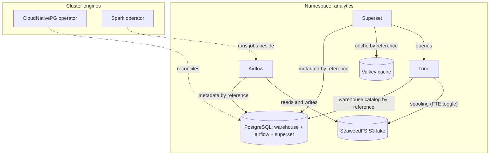

# Kubernetes Data Analytics Platform

The complete modern data stack on a cluster you already have, in one
deploy: Airflow schedules your pipelines, Spark crunches the heavy jobs,
Trino answers SQL across the warehouse, and Superset turns the answers
into dashboards. Underneath, one CloudNativePG-managed PostgreSQL is
bootstrapped with every database the stack needs, a SeaweedFS data lake
exposes authenticated S3 buckets for raw and intermediate data, and an
authenticated Valkey cache backs Superset's query results and job queues.
Every credential flows by reference through operator-maintained Secrets —
nothing to wire, nothing readable in rendered manifests — and the
in-image sample catalogs mean SQL works on the first login, before any
pipeline has landed data.

| Resource | Kind | Purpose | Conditional on |
|---|---|---|---|
| `<env>-analytics-ns` | KubernetesNamespace | The platform's shared home — owns the namespace every tenant joins | — |
| `<env>-cnpg-operator` | KubernetesCloudNativePgOperator | The PostgreSQL engine (cluster singleton, in `cnpg-system`) | `install_cnpg_operator` |
| `<env>-spark-operator` | KubernetesSparkOperator | Turns SparkApplication declarations into running Spark jobs | `install_spark_operator` |
| `<env>-analytics-db` | KubernetesPostgres | One HA PostgreSQL, three databases: `warehouse`, `airflow`, `superset` | — |
| `<env>-analytics-lake` | KubernetesSeaweedFs | The S3 data lake — authenticated, buckets pre-created | — |
| `<env>-analytics-cache` | KubernetesValkey | Superset's cache and Celery queues — authenticated, LRU-evicting | — |
| `<env>-airflow` | KubernetesAirflow | Pipeline orchestration (KubernetesExecutor — no broker, no idle workers) | — |
| `<env>-trino` | KubernetesTrino | Distributed SQL over the warehouse (+ tpch/tpcds samples) | — |
| `<env>-superset` | KubernetesSuperset | Dashboards and exploration, async worker included | — |

**Prerequisite when `install_cnpg_operator: false`:** the cluster must
already run the CloudNativePG operator (any cluster provisioned by a
full-stack platform chart does) — the database declaration is a
CloudNativePG custom resource and stays Pending without it. Likewise,
with `install_spark_operator: false`, SparkApplications in this
namespace need the resident Spark operator watching them.

## Architecture



Deployment layers: the namespace and the operators deploy first (the
database declares an explicit dependency on the CNPG operator when this
chart installs it); the database, lake and cache deploy next, in
parallel; Airflow, Trino and Superset deploy last — each one's Secret
references onto the database and cache are the ordering edges, so the
credentials exist before their consumers start.

## Parameters

| Param | Meaning | Default | Change when |
|---|---|---|---|
| `connection` | Kubernetes connection slug selecting the target cluster | `""` (environment default) | The environment hosts multiple clusters |
| `namespace` | The one namespace the whole platform lives in | `analytics` | Running a second platform on the same cluster |
| `install_cnpg_operator` | Install the PostgreSQL operator (cluster singleton) | `true` | The cluster already runs CloudNativePG |
| `install_spark_operator` | Install the Spark operator (cluster-wide watch) | `true` | The cluster already runs the Spark operator |
| `postgres_instances` | Database instances (1 primary + replicas) | `"2"` | `3` for production; `1` for evaluation only |
| `postgres_disk_size` | Disk per database instance | `20Gi` | Warehouse tables outgrow it (grows apply in place) |
| `lake_buckets` | S3 buckets created in the lake | `[lake]` | One entry per dataset domain |
| `lake_disk_size` | Disk for the lake's object data | `30Gi` | Datasets outgrow it (grows apply in place) |
| `valkey_password` | The cache's `default` ACL user password: a `$secret/` reference on Planton, the literal on a deploy without it | `$secret/data-analytics-platform-valkey-password` | Create that secret first (`planton secret set data-analytics-platform-valkey-password --string`), or point at your own, such as `$secret/@<env>/<slug>` |
| `valkey_max_memory` | Cache eviction ceiling | `256mb` | Dashboard fleet grows |
| `valkey_disk_size` | Cache snapshot volume | `2Gi` | Keep near `valkey_max_memory` |
| `dags_git_repo` | Git repository holding DAGs (git-sync) | `""` (DAGs baked in image) | You want push-to-deploy pipelines |
| `dags_git_ref` | Branch/tag/commit to sync | `""` (default branch) | Pinning DAG releases |
| `airflow_triggerer_disk_size` | Triggerer volume (upstream default is 100Gi) | `2Gi` | Very large deferred-operator fleets |
| `pgbouncer_enabled` | Connection pooling between Airflow and PostgreSQL | `true` | Off only for small evaluations |
| `trino_workers` | Trino worker pods | `"2"` | Concurrent query load grows |
| `trino_fault_tolerant_execution_enabled` | Task-retrying batch posture, spooling to the lake | `false` | Long ETL queries must survive worker loss |

The tightest name budget: Trino worker names suffix the resource name
(`<env>-trino-worker-…`), and the lake's S3 Service is
`<env>-analytics-lake-s3` — environment names up to ~20 characters clear
every derived-name budget in this chart comfortably.

## After deployment

1. **Sign in to Superset** — the admin password is generated into the
   `<env>-superset-admin-auth` Secret:

```bash
kubectl get secret <env>-superset-admin-auth -n analytics -o jsonpath='{.data.password}' | base64 -d
kubectl port-forward svc/<env>-superset -n analytics 8088:8088
```

2. **Run your first SQL in Trino** — the admin password lives in
   `<env>-trino-auth`; the tpch samples answer immediately:

```bash
kubectl get secret <env>-trino-auth -n analytics -o jsonpath='{.data.password}' | base64 -d
kubectl port-forward svc/<env>-trino -n analytics 8080:8080
# then: SELECT count(*) FROM tpch.tiny.orders;
```

3. **Connect Superset to Trino** (Settings → Database Connections):
   SQLAlchemy URI `trino://admin@<env>-trino.analytics.svc.cluster.local:8080/warehouse`
   with the Trino admin password — dashboards over the warehouse from
   here on.

4. **Open Airflow** — the admin password is in `<env>-airflow-admin-auth`:

```bash
kubectl port-forward svc/<env>-airflow-api-server -n analytics 8080:8080
```

5. **Submit your first Spark job**: author a `SparkApplication` in the
   `analytics` namespace referencing service account `spark` (created by
   the operator beside your workloads); read and write the lake at
   `http://<env>-analytics-lake-s3.analytics.svc.cluster.local:8333`
   with the credentials in `<env>-analytics-lake-s3-secret` (path-style
   addressing).

## Day-2 notes

- **Safe in place:** `postgres_instances`, disk sizes (grows only),
  `trino_workers`, `valkey_max_memory`, bucket additions, DAG repo/ref.
- **The Valkey password lives in a managed secret** — rotating it means
  writing a new version of that secret and redeploying; Superset re-reads it
  by reference.
- **Celery Airflow:** moving `executor` to `CeleryExecutor` requires
  declaring a broker on the deployed Airflow resource (its `valkey` arm
  can compose this chart's cache — mind the Redis database numbers
  Superset already uses: cache 1, Celery 0) and sizing workers.
- **Backups:** enable the CNPG operator's Barman Cloud plugin and declare
  a `backup` block on the database once cert-manager runs on the cluster
  — the lake's S3 endpoint is a natural target.
- **Airflow task logs** live on pod-local storage by default and vanish
  with task pods; for durable logs enable the component's logging
  persistence (needs a ReadWriteMany storage class) or a remote logging
  backend on the deployed resource.
- **Fault-tolerant Trino** (`trino_fault_tolerant_execution_enabled`)
  creates the `trino-spool` bucket and restarts Trino in the TASK-retry
  posture — expect higher per-query latency, gain worker-loss survival.
- **Irreversible:** the database bootstrap (three databases, the
  `analytics` owner role) is fixed at first install; removing lake
  buckets from the list never deletes data.

---
© Planton. Licensed under [Apache-2.0](https://github.com/plantonhq/planton/blob/main/LICENSE).
