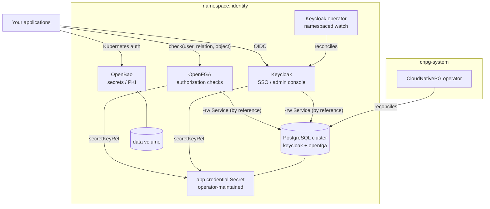

# Kubernetes Identity and Access Platform

The security triad every product platform eventually builds — identity,
authorization, and secrets — self-hosted on your cluster in one deploy,
with the wiring that usually takes a team weeks already right. Keycloak
answers "who is this?" (OIDC single sign-on, user federation, the admin
console); OpenFGA answers "may they do this?" (Zanzibar-style relationship
tuples, for every application that outgrows role checks); OpenBao answers
"what may they know?" (KV secrets, dynamic credentials, PKI). Underneath:
one CloudNativePG-managed PostgreSQL bootstrapped with both databases
under one least-privilege owner role, credentials flowing by reference
through the operator-maintained Secret, and the OpenFGA API shipping with
its keys enabled on day one. The self-hosted alternative to an
Auth0-plus-Vault bill, owned end to end.

| Resource | Kind | Purpose | Conditional on |
|---|---|---|---|
| `<env>-identity-ns` | KubernetesNamespace | The platform's shared home — owned once, joined by every tenant | always |
| `<env>-cnpg-operator` | KubernetesCloudNativePgOperator | The PostgreSQL engine (one per cluster) in `cnpg-system` | `install_cnpg_operator` |
| `<env>-keycloak-operator` | KubernetesKeycloakOperator | The Keycloak engine, namespaced watch, beside its declaration | `install_keycloak_operator` |
| `<env>-identity-db` | KubernetesPostgres | HA PostgreSQL bootstrapped with `keycloak` + `openfga` under owner `identity` | always |
| `<env>-keycloak` | KubernetesKeycloak | The identity provider — SSO, federation, admin console | always |
| `<env>-openfga` | KubernetesOpenFga | The authorization engine — relationship-tuple checks over the shared database | always |
| `<env>-openbao` | KubernetesOpenBao | The secrets manager — initialized and unsealed by you after deploy | always |

**Prerequisite when `install_cnpg_operator` is false:** the cluster must
already run the CloudNativePG operator (any cluster provisioned by a
full-stack platform chart does). **When `install_keycloak_operator` is
false:** a cluster-wide Keycloak operator must be resident — a namespaced
operator elsewhere cannot see this chart's declaration.

## Architecture



Deployment layers: the namespace and (when installed) both operators
deploy first; the database waits for the CNPG operator (an explicit
dependency edge) and the namespace (by reference); Keycloak waits for its
operator (explicit edge) and the database (its host and credential
references are the ordering); OpenFGA waits for the database the same way;
OpenBao waits only for the namespace — it has no database seam.

## Parameters

| Param | Meaning | Default | Change when |
|---|---|---|---|
| `connection` | Kubernetes connection slug selecting the target cluster | `""` | The environment default is not the cluster you mean |
| `namespace` | Shared home of the whole triad | `identity` | Running a second independent identity stack on one cluster |
| `install_cnpg_operator` | Bring the CloudNativePG operator | `true` | **Set false** on operator-ready clusters — a second install fights the resident one |
| `install_keycloak_operator` | Bring the Keycloak operator (namespaced) | `true` | **Set false** only beside a resident CLUSTER-WIDE Keycloak operator |
| `postgres_instances` | PostgreSQL instances (primary + replicas) | `2` | `3` for the production convention; `1` only for evaluation |
| `postgres_disk_size` | Volume size per instance | `10Gi` | Authorization tuples ramp with usage |
| `keycloak_hostname` | Public base URL tokens are minted for (full URL) | `https://auth.example.com` | **MUST change** — the placeholder deploys but mints tokens for a domain you do not own |
| `keycloak_instances` | Keycloak replicas (auto-clustering) | `1` | `2+` for HA once the platform is critical-path |
| `openfga_preshared_api_key` | The API key OpenFGA clients present | `change-me` | **MUST change** — the placeholder is not a credential |
| `openbao_replicas` | OpenBao server replicas on integrated Raft storage (odd numbers only make sense above 1) | `1` | `3` once the cluster has the nodes and secrets are critical-path; `5` to survive two member losses |
| `openbao_disk_size` | OpenBao Raft data volume (per replica) | `10Gi` | Aggressive audit/snapshot schedules |

## After deployment

1. **Initialize and unseal OpenBao — its pods are NotReady until you do,
   by design** (the readiness probe is `bao status`, which fails for
   sealed servers; the Services stay addressable for exactly these
   calls):

   ```bash
   kubectl -n identity exec -it <env>-openbao-0 -- bao operator init
   kubectl -n identity exec -it <env>-openbao-0 -- bao operator unseal   # x3, one share each
   ```

   Store the five unseal key shares and the root token OUTSIDE the
   cluster — they are produced only once, and this chart deliberately
   never knows them. Above one replica, unseal every replica; peers join
   the Raft cluster on their own.

2. **Log in to Keycloak.** The operator generated the bootstrap admin:

   ```bash
   kubectl -n identity get secret <env>-keycloak-initial-admin \
     -o jsonpath='{.data.password}' | base64 -d
   ```

   Sign in as `temp-admin` (port-forward the exported service, or through
   your composed exposure at `keycloak_hostname`), create a durable admin
   user, and treat the bootstrap Secret as break-glass material.

3. **Create your first OpenFGA store.** Every call presents the API key:

   ```bash
   kubectl -n identity port-forward svc/<env>-openfga 8080:8080 &
   curl -X POST localhost:8080/stores \
     -H "Authorization: Bearer <your openfga_preshared_api_key>" \
     -H "Content-Type: application/json" -d '{"name":"platform"}'
   ```

   Then declare authorization models and tuples through the OpenFGA
   provider kinds or SDKs pointed at the resource's exported HTTP/gRPC
   endpoints.

4. **Wire SSO into your first application.** Create a realm and an OIDC
   client in Keycloak; the issuer is
   `<keycloak_hostname>/realms/<realm>`. For applications on this
   cluster, inject the client secret through OpenBao or a
   KubernetesSecret rather than configuration files.

5. **Expose the front doors properly.** Everything stays ClusterIP by
   design — route Keycloak (and OpenBao's UI, if desired) through your
   cluster's ingress or Gateway API entry point over the resources'
   exported service handles. Keycloak already trusts X-Forwarded-*
   headers; the URL it mints tokens for is `keycloak_hostname`.

## Day-2 notes

- **OpenBao restarts re-seal.** Without auto-unseal, every server restart
  returns pods to sealed-NotReady until unsealed again — expected, not an
  outage of the stored data. When that operational tax bites, configure
  cloud-KMS auto-unseal on the deployed resource (an `auto_unseal` values
  change); the one-time initialization stays yours either way.
- **Safe to change in place:** `postgres_disk_size` (grows only),
  `postgres_instances`, `keycloak_instances` (instances cluster
  automatically), `openbao_disk_size`.
- **`keycloak_hostname` is operationally sticky:** changing it re-mints
  issuer URLs, which invalidates existing tokens and breaks OIDC clients
  configured against the old issuer — coordinate with every relying
  application.
- **In-cluster TLS end-to-end:** both Keycloak and OpenBao terminate TLS
  themselves when given a certificate (values changes referencing a
  KubernetesCertificate) — the natural upgrade once cert-manager is
  present. The chart's default posture is TLS at the composed exposure.
- **Backups:** the database deploys without object-store backups because
  the backup path (CloudNativePG's Barman Cloud plugin) requires
  cert-manager. Once present, declare a `KubernetesCnpgBarmanCloudPlugin`
  referencing the operator's namespace and a `backup` block on the
  KubernetesPostgres resource. For OpenBao, declare its `backup` block (S3, GCS,
  Azure Blob, or Cloudflare R2 by reference) and run the four-command login recipe
  the spec prints once the vault is initialized. Snapshots exist only for Raft
  storage, which this chart's vault runs at every `openbao_replicas` count (a
  single-node Raft cluster is the honest start on a small cluster); a declared
  restore additionally needs an `auto_unseal` arm, and the component
  guide's runbook covers the rest.
- **Scaling OpenFGA:** the servers are stateless — raise `replicas` on
  the deployed resource; the database is the shared truth. Its `3`
  default already rides one Service.
- **API-key rotation (OpenFGA):** update `openfga_preshared_api_key` on
  the deployed resource — the module rewrites the authn-keys Secret and
  rolls the servers. Declare two keys during a rotation window (old +
  new) so clients migrate without downtime.

---

© Planton. Licensed under [Apache-2.0](https://github.com/plantonhq/planton/blob/main/LICENSE).
