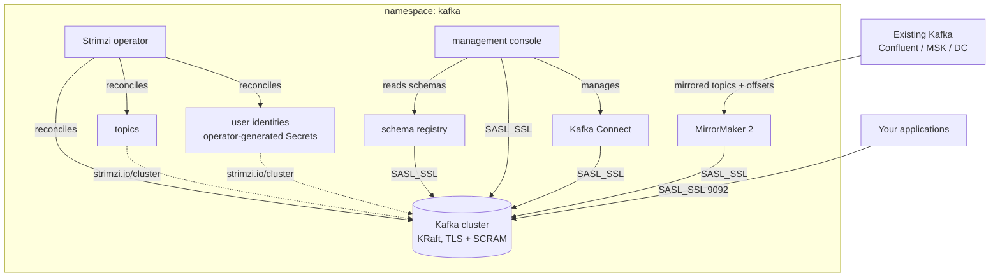

# Kubernetes Kafka Streaming Platform

Confluent-grade Kafka without the contract: a complete streaming platform
on your own cluster in one deploy. The Kafka cluster runs KRaft (no
ZooKeeper) with TLS and SCRAM authentication on by default — there is no
anonymous plaintext path. Topics and client identities are declared as
code and reconciled by the operator, with every credential
operator-generated into a Secret rather than written into configuration. A
Confluent-API-compatible schema registry and a management console arrive
wired in by reference, and two optional arms complete the story: a Kafka
Connect cluster for integrations, and a MirrorMaker 2 migration arm that
streams an existing cluster's topics and consumer-group offsets in so your
consumers cut over without reprocessing.

| Resource | Kind | Purpose | Conditional on |
|---|---|---|---|
| `<env>-kafka-ns` | KubernetesNamespace | The platform's single home (Strimzi's placement grain) | always |
| `<env>-strimzi-operator` | KubernetesStrimziKafkaOperator | The reconciliation engine, watching this namespace | `install_strimzi_operator` |
| `<env>-kafka` | KubernetesKafka | The KRaft cluster: node pools, secure listener, durability config | always |
| `<env>-topic-*` | KubernetesKafkaTopic | One per `topic_names` entry — the declarative topic inventory | always |
| `<env>-user-*` | KubernetesKafkaUser | One per `user_names` entry — application SCRAM identities | always |
| `<env>-schema-registry-user` | KubernetesKafkaUser | The registry's dedicated cluster identity | `schema_registry_enabled` |
| `<env>-schema-registry` | KubernetesKarapace | Confluent-API-compatible schema registry | `schema_registry_enabled` |
| `<env>-kafka-ui-user` | KubernetesKafkaUser | The console's dedicated cluster identity | `kafka_ui_enabled` |
| `<env>-kafka-ui` | KubernetesKafkaUi | Management console (login-gated, ClusterIP-internal) | `kafka_ui_enabled` |
| `<env>-kafka-connect-user` | KubernetesKafkaUser | Connect's dedicated cluster identity | `connect_enabled` |
| `<env>-kafka-connect` | KubernetesKafkaConnect | Declaratively-managed integration engine | `connect_enabled` |
| `<env>-kafka-mirror-user` | KubernetesKafkaUser | The mirror engine's identity on this platform | `mirror_enabled` |
| `<env>-kafka-mirror` | KubernetesKafkaMirrorMaker2 | Migration arm streaming an existing cluster in | `mirror_enabled` |

**Prerequisite when `install_strimzi_operator` is false:** the cluster must
already run a Strimzi operator watching this namespace (any cluster
provisioned by a full-stack platform chart runs one cluster-wide). With the
toggle on — the default — this chart brings its own, watching its own
namespace only.

## Architecture



Deployment layers: the namespace first; the operator beside it (when
installed); the Kafka cluster after the operator (an explicit dependency
edge) and the namespace (by reference); topics, users, and every client
component after the cluster — each one's cluster reference is its ordering
edge. The registry, console, Connect, and mirror deploy in parallel once
the cluster is up.

## Parameters

| Param | Meaning | Default | Change when |
|---|---|---|---|
| `connection` | Kubernetes connection slug selecting the target cluster | `""` | The environment default is not the cluster you mean |
| `namespace` | The platform's single home | `kafka` | Running a second independent platform on one cluster |
| `install_strimzi_operator` | Bring the Strimzi operator | `true` | **Set false** on operator-ready clusters |
| `dedicated_controllers` | Isolate the KRaft quorum in its own 3-node pool | `false` | Broker count/throughput grows enough that quorum latency matters |
| `broker_replicas` | Data-serving Kafka nodes | `3` | Capacity; keep odd while nodes carry the controller role, keep ≥ `replication_factor` |
| `broker_disk_size` | Persistent volume per node | `20Gi` | Retention × throughput × replication grows |
| `replication_factor` | Copies of every partition (cluster default + internal topics) | `3` | `1` only for single-broker evaluation |
| `min_insync_replicas` | Acknowledged-write floor | `2` | Keep at `replication_factor − 1` |
| `topic_names` | Declarative topic inventory | `events` | Always — this is your topic catalog |
| `topic_partitions` | Partitions per declared topic | `3` | Consumer parallelism needs; can grow, never shrink |
| `user_names` | Application SCRAM identities | `app` | One per producing/consuming application |
| `schema_registry_enabled` | Deploy Karapace | `true` | Schemas are governed elsewhere |
| `kafka_ui_enabled` | Deploy the management console | `true` | Console access is not wanted |
| `kafka_ui_username` | Console login user | `admin` | Naming conventions |
| `kafka_ui_password` | Console login password: a `$secret/` reference on Planton, the literal on a deploy without it | `$secret/kafka-streaming-platform-ui-password` | Create that secret first (`planton secret set kafka-streaming-platform-ui-password --string`), or point at your own, such as `$secret/@<env>/<slug>` |
| `connect_enabled` | Deploy Kafka Connect | `false` | You have connectors to run |
| `mirror_enabled` | Deploy the MirrorMaker 2 migration arm | `false` | Migrating an existing cluster in |
| `mirror_source_bootstrap_servers` | Source cluster address | placeholder | **ALWAYS when mirroring** |
| `mirror_source_auth_mechanism` | Source SASL mechanism | `scram-sha-512` | `plain` for Confluent Cloud API keys |
| `mirror_source_username` | Source SASL username / API key | `""` | Authenticated sources |
| `mirror_source_password_secret_name` | Pre-created Secret holding the source password | `""` | Authenticated sources (see below) |
| `mirror_source_ca_secret_name` | Pre-created Secret holding the source CA | `""` | Private-CA sources |
| `mirror_topics_pattern` | Topics to mirror (regex) | `.*` | Selective migration |
| `mirror_keep_topic_names` | Keep original topic names | `true` | `false` for permanent two-live-cluster replication |

## After deployment

1. **Read an application credential.** Each `user_names` entry has an
   operator-generated Secret named after its principal:

   ```bash
   kubectl -n kafka get secret <env>-user-app \
     -o jsonpath='{.data.password}' | base64 -d
   ```

   The same Secret carries a ready-made `sasl.jaas.config`. The client CA
   certificate lives in the cluster CA Secret (the Kafka resource's
   `cluster_ca_cert_secret_name` output).

2. **Connect an application.** Bootstrap
   `<env>-kafka-kafka-bootstrap.kafka.svc:9092` (the Kafka resource's
   `internal_bootstrap_endpoint` output), security protocol `SASL_SSL`,
   mechanism `SCRAM-SHA-512`, the credential from step 1, and the cluster
   CA in the truststore.

3. **Open the console.** It stays ClusterIP-internal by design:

   ```bash
   kubectl -n kafka port-forward svc/<env>-kafka-ui 8080:80
   ```

   Log in with `kafka_ui_username` and the password held in the secret
   `kafka_ui_password` names.

4. **Register the first schema.** Point any Schema Registry client at the
   Karapace endpoint (the registry resource's `endpoint` output) — the
   Confluent API surface works unchanged.

5. **Run a migration (when `mirror_enabled`).** First create the source
   credential Secret the parameters name:

   ```bash
   kubectl -n kafka create secret generic mirror-source-credentials \
     --from-literal=password='<source password or API secret>'
   ```

   Watch mirrored topics appear in the console, then cut consumers over —
   their committed offsets are already checkpointed into this cluster.

## Day-2 notes

- **Safe to change in place:** `topic_names` (additions; removals DELETE
  the topic and its data), `topic_partitions` (grows only; growing remaps
  keys on keyed topics), `user_names` (removals revoke access),
  `broker_replicas` and `broker_disk_size` (grows), every client toggle.
- **The durability pair is a floor, not a dial:** lowering
  `replication_factor` / `min_insync_replicas` on a live cluster does not
  re-replicate existing topics down, but new topics inherit the weaker
  posture — treat 3/2 as permanent for production.
- **External exposure is composed, not built in:** add a `loadbalancer` or
  `nodeport` listener to the deployed Kafka resource when clients outside
  the cluster need in; the secure internal listener keeps serving
  in-cluster traffic unchanged.
- **Authorization:** the cluster runs authenticated-but-unrestricted
  (no ACL authorizer). To scope users down, enable `simple` authorization
  on the deployed Kafka resource and add `authorization` blocks with ACLs
  to each user — do both together: declaring ACLs against a cluster
  without the authorizer makes the user operator reject the user.
- **Connect plugins:** the stock image carries only the MirrorMaker 2
  connectors. Add integration plugins (JDBC, S3, Debezium, ...) through
  the deployed Connect resource's `plugins` (OCI artifacts) or `build`
  arm, then declare connectors as KubernetesKafkaConnector resources —
  never through the REST API.
- **After a migration completes,** set `mirror_enabled` back to false to
  retire the mirror engine and its identity; the mirrored topics and
  checkpointed offsets stay.
- **Retention is per topic** (`retention.ms`, default 7 days on declared
  topics via the platform's recommended config) — size `broker_disk_size`
  against the sum of what retention keeps.

---

© Planton. Licensed under [Apache-2.0](https://github.com/plantonhq/planton/blob/main/LICENSE).
