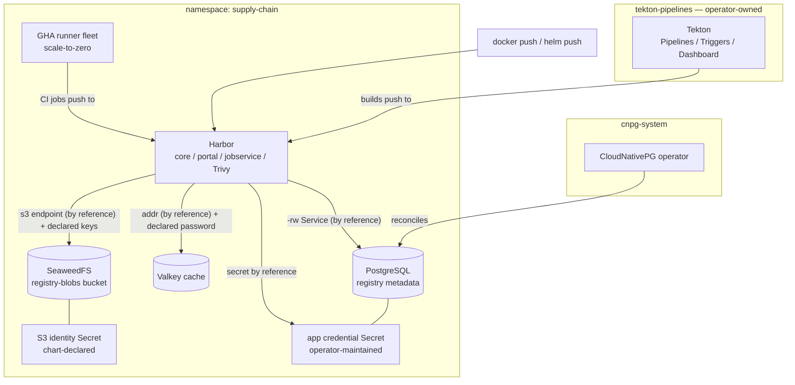

# Kubernetes Software Supply Chain

Build it, store it, run it — inside your cluster. At the center sits a
Harbor registry with Trivy scanning on: private OCI images and charts,
projects with role-based access, and every data arm composed from
first-class kinds rather than bundled — PostgreSQL for metadata, an
authenticated Valkey cache, and an in-cluster S3 object store for the
blobs, the shape that lets the registry scale out because no state lives
in its pods. Beside it, Tekton brings Kubernetes-native CI pipelines, and
an optional GitHub Actions runner fleet gives your existing workflows
scale-to-zero self-hosted runners that push to the registry they sit
next to. Secure by default: the admin credential is generated, every
store is authenticated, and none of the upstream charts' public default
passwords ever ship.

| Resource | Kind | Purpose | Conditional on |
|---|---|---|---|
| `<env>-supply-ns` | KubernetesNamespace | The supply chain's shared home — owned once, joined by the tenants | always |
| `<env>-cnpg-operator` | KubernetesCloudNativePgOperator | The PostgreSQL engine (one per cluster) in `cnpg-system` | `install_cnpg_operator` |
| `<env>-supply-db` | KubernetesPostgres | Registry metadata, bootstrapped with `registry` under owner `harbor` | always |
| `<env>-supply-cache` | KubernetesValkey | Authenticated LRU cache — sessions, job queues, manifest cache | always |
| `<env>-supply-s3cfg` | KubernetesSecret | The chart-declared S3 identity (both sides render from one key pair) | always |
| `<env>-supply-objects` | KubernetesSeaweedFs | The S3 blob store with the `registry-blobs` bucket declared | always |
| `<env>-harbor` | KubernetesHarbor | The registry — core, portal, jobservice, Trivy, nginx front door | always |
| `<env>-tekton-operator` | KubernetesTektonOperator | The Tekton lifecycle manager (fixed `tekton-operator` namespace) | `tekton_enabled` |
| `<env>-tekton` | KubernetesTekton | The one TektonConfig — Pipelines + Triggers + Dashboard | `tekton_enabled` |
| `<env>-gha-controller` | KubernetesGhaRunnerScaleSetController | The runner controller (one per cluster) in `arc-system` | `gha_runners_enabled` |
| `<env>-gha-runners` | KubernetesGhaRunnerScaleSet | The ephemeral runner fleet — `runs-on: <env>-gha-runners` | `gha_runners_enabled` |

**Prerequisites:** with `install_cnpg_operator` false, the cluster must
already run the CloudNativePG operator. With `tekton_enabled` true (the
default), the cluster must NOT already run Tekton — both halves are
one-per-cluster. With `gha_runners_enabled` true, the credential Secret
named by `gha_github_auth_secret_name` must exist in the chart's
namespace first.

## Architecture



Deployment layers: the namespace and (when installed) the CNPG operator
deploy first; the database waits for the operator (explicit edge) and the
namespace; the cache and the identity Secret wait only for the namespace;
the object store waits for its identity Secret (explicit edge — the
gateway mounts it); Harbor waits for all three stores through its
references. The Tekton config waits for the Tekton operator, and the
runner fleet for its controller — each pair inside its own toggle.

## Before you install

Every credential this chart deploys lives in one key-value secret, and each
secret parameter references one of its keys (`$secret/<slug>/<key>`), so the
platform resolves them at deploy and never stores them with the project.
Create it once per install, generating the S3 pair and the identities
document from the same values (letters only: config parsers mangle digits
first, `#`, `$` and braces):

```bash
ACCESS=$(LC_ALL=C tr -dc 'a-z' </dev/urandom | head -c 24)
SECRET=$(LC_ALL=C tr -dc 'a-zA-Z' </dev/urandom | head -c 48)
planton secret set software-supply-chain-credentials \
  valkey-password="$(LC_ALL=C tr -dc 'a-zA-Z' </dev/urandom | head -c 32)" \
  s3-access-key="$ACCESS" \
  s3-secret-key="$SECRET" \
  s3-identities="{\"identities\":[{\"name\":\"harbor\",\"credentials\":[{\"accessKey\":\"$ACCESS\",\"secretKey\":\"$SECRET\"}],\"actions\":[\"Admin\",\"Read\",\"List\",\"Tagging\",\"Write\"]}]}"
```

For a second environment, create its own (`--env <env>`) and point the four
parameters at `$secret/@<env>/software-supply-chain-credentials/<key>`. A
deploy without the platform takes the literals instead.

## Parameters

| Param | Meaning | Default | Change when |
|---|---|---|---|
| `connection` | Kubernetes connection slug selecting the target cluster | `""` | The environment default is not the cluster you mean |
| `namespace` | Shared home of the registry and its data services | `supply-chain` | A second supply chain on one cluster (Tekton stays with the first) |
| `install_cnpg_operator` | Bring the CloudNativePG operator | `true` | **Set false** on operator-ready clusters |
| `harbor_external_url` | The URL OCI clients dial (token-service address) | placeholder | **MUST change** — pushes and pulls fail auth against the wrong URL |
| `postgres_instances` | Metadata database instances | `2` | `3` production convention; `1` evaluation |
| `postgres_disk_size` | Volume per database instance | `10Gi` | Rarely — blobs never land here |
| `valkey_password` | The cache's `default`-user password (both sides) | `$secret/software-supply-chain-credentials/valkey-password` | Your credentials secret has another name |
| `valkey_max_memory` / `valkey_disk_size` | Cache ceiling / warm-restart volume | `256mb` / `2Gi` | Larger installs |
| `objects_disk_size` | Blob store volume | `30Gi` | Image retention appetite |
| `s3_access_key` / `s3_secret_key` / `s3_identities_config` | The registry↔store identity (both sides) and the store's identities document built from it | keys `s3-access-key`, `s3-secret-key`, `s3-identities` of `$secret/software-supply-chain-credentials` | Your credentials secret has another name — letters only, length is the entropy |
| `tekton_enabled` | The Tekton arm (operator + config together) | `true` | **Set false** when the cluster already runs Tekton |
| `gha_runners_enabled` | The GitHub Actions runner fleet | `false` | On, once the URL and credential Secret exist |
| `gha_github_config_url` | Repo/org/enterprise the runners register against | placeholder | **MUST change** with the toggle |
| `gha_github_auth_secret_name` | Pre-created GitHub credential Secret | `gha-github-auth` | Matching the Secret you created |

## After deployment

1. **Log in to Harbor.** The module generated the admin credential:

   ```bash
   kubectl -n supply-chain get secret <env>-harbor-admin-auth \
     -o jsonpath='{.data.HARBOR_ADMIN_PASSWORD}' | base64 -d
   ```

   Sign in as `admin` through your composed exposure at
   `harbor_external_url` (or the resource's exported port-forward
   command), create a project, and invite the robots — CI pushes should
   use per-project robot accounts, never the admin.

2. **Push the first image.** The address must match `harbor_external_url`
   exactly — that is the token-service contract:

   ```bash
   docker login registry.example.com -u admin
   docker tag alpine:3.20 registry.example.com/platform/alpine:3.20
   docker push registry.example.com/platform/alpine:3.20
   ```

   Trivy scans it on push policy or on demand; project policies can
   block pulls of vulnerable images.

3. **Run the first pipeline** (with `tekton_enabled`):

   ```bash
   kubectl create -f - <<'EOF'
   apiVersion: tekton.dev/v1
   kind: TaskRun
   metadata:
     generateName: hello-
     namespace: tekton-pipelines
   spec:
     taskSpec:
       steps:
         - image: alpine:3.20
           script: echo "the supply chain lives"
   EOF
   ```

   The dashboard (ClusterIP, NO built-in auth — expose it only behind an
   authenticating layer) shows the run:
   `kubectl -n tekton-pipelines port-forward svc/tekton-dashboard 9097:9097`.

4. **Bring the runners** (optional): create the credential Secret, then
   redeploy with the toggle on —

   ```bash
   kubectl -n supply-chain create secret generic gha-github-auth \
     --from-literal=github_token=<PAT with repo or admin:org scope>
   ```

   Workflows then declare `runs-on: <env>-gha-runners`. Jobs that build
   images need a container mode on the deployed resource (`dind`, or
   `kubernetes` with a work volume) — the plain default runs plain jobs.

## Day-2 notes

- **Scaling the registry** is what the object-store backend bought:
  raise `registry`/`core`/`jobservice` replicas on the deployed Harbor
  resource — stateless components over one S3 store (the
  filesystem-backend replica fence does not apply here).
- **Safe to change in place:** `postgres_disk_size` /
  `objects_disk_size` / `valkey_disk_size` (grows), `postgres_instances`,
  the cache sizing pair, the GHA parameters.
- **`harbor_external_url` is operationally sticky:** changing it changes
  the token-service address — every client must re-login, and replication
  partners must be updated. Change it together with your exposure, never
  casually.
- **Rotating the S3 identity or cache password:** both are
  declared-on-both-sides values — change the parameter and redeploy; the
  store, the identity Secret, and Harbor's materialized credential
  Secrets all re-render from the one value. Do it in a maintenance
  window (the registry re-authenticates to its stores on rollout).
- **Garbage collection reclaims blob space** (Harbor's admin UI or API,
  scheduled) — deleting tags alone frees nothing in the object store.
- **Destroy ordering for the Tekton arm is designed-in:** the config's
  deletion waits for the operator to tear components down, and the
  dependency edge keeps the operator alive until then. Never delete the
  operator resource alone first.
- **Backups:** the database deploys without object-store backups (the
  Barman Cloud plugin requires cert-manager). Once present, declare a
  `KubernetesCnpgBarmanCloudPlugin` referencing the operator's namespace
  and a `backup` block on the KubernetesPostgres resource — point it at a
  DIFFERENT bucket/path than the registry blobs.

---

© Planton. Licensed under [Apache-2.0](https://github.com/plantonhq/planton/blob/main/LICENSE).
