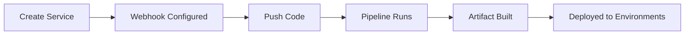

# What is a Service?

Every new backend service requires the same painful CI/CD setup: write pipeline YAML in whatever dialect your CI system uses, configure Docker builds and registry authentication, wire up Kubernetes manifests or ECS task definitions, manage secrets across environments, and hope it all works when someone pushes to main at 2 AM. A developer typically spends two to three days setting up CI/CD for each new service — time not spent building features.

A Service in Planton eliminates this overhead. It is a declaration that connects a Git repository to one or more deployment targets. It is not the application code itself — it is the definition of where code lives, how to build it, where to deploy it, and how to make it accessible. When you create a Service, Planton configures a webhook on your Git provider. From that point forward, every qualifying commit triggers an automated pipeline that builds your code into a deployable artifact and rolls it out to your configured environments.

Think of a Service like a `.vercel.json` file, but for backend applications with multi-environment, multi-cloud deployment support. It captures everything needed to go from source code to running infrastructure — and the complexity of Docker builds, registry authentication, deployment manifests, and deployment orchestration disappears behind a simple declaration.

<!-- SCREENSHOT: Service details overview
  Page: /orgs/{org}/service/{serviceId}
  Action: Show the Overview tab of a configured service with pipeline history
  Focus: Full page showing Git repo connection, pipeline config, and recent pipelines
  Alt: Service details page showing connected Git repository, pipeline configuration, and deployment history
-->

## The Four Pillars of a Service

Every Service is defined by four configuration areas:

### Where Code Lives

The Git repository configuration points to your repository and defines how the pipeline interacts with it:

- **Repository location**: The organization and repository name on your Git provider (GitHub or GitLab)
- **Default branch**: The primary branch for pipeline triggers
- **Git credential**: Which connection to use for clone and webhook access (see [Connections](/docs/connections/git-providers))
- **Project root**: The subdirectory where service code is located — empty for single-service repositories, a specific path for monorepos
- **Trigger paths**: Additional glob patterns that trigger pipelines beyond changes in the project root
- **Sparse checkout directories**: Directories to fetch during clone, reducing clone times for large repositories

For monorepo configurations — where multiple services share a single repository — the project root, trigger paths, and sparse checkout work together to scope each service to its relevant code. See [Monorepo Support](/docs/ci-cd/monorepo-support) for details.

### How to Build

The pipeline configuration determines how code is transformed into a deployable artifact.

Two pipeline providers are available:

- **Platform-managed**: Planton creates and maintains the pipeline. Choose between Cloud Native Buildpacks (auto-detect language and build without a Dockerfile) or Dockerfile (full control over the build process). No pipeline YAML in your repository.
- **Self-managed**: You write a Tekton pipeline YAML in your repository. Planton executes it and handles deployment orchestration. See [Self-Managed Pipelines](/docs/ci-cd/self-managed-pipelines) for details.

See [Build Methods](/docs/ci-cd/build-methods) for a full explanation of Buildpacks, Dockerfile builds, and image tagging.

### Where to Deploy

Services produce one of two artifact types:

- **Container image**: A Docker container image, deployed to Kubernetes, AWS ECS, GCP Cloud Run, or DigitalOcean App Platform.
- **Cloudflare Worker script**: A JavaScript/TypeScript bundle, deployed to Cloudflare Workers.

Deployment configuration comes from one of two sources:

- **Git-based** (default): The pipeline reads deployment manifests from a `_kustomize` directory in your repository. Kustomize overlays define per-environment configuration. This is the traditional approach for teams that manage deployment configuration in version control.
- **Inline** (UI-based): Deployment targets are defined directly in the Service configuration through the web console. This enables complete service onboarding without creating any deployment files in your repository. Each target specifies an environment, cloud provider, resource type, and resource configuration.

Both paths converge at the same outcome: cloud resource manifests that the deploy stage provisions through Planton's infrastructure layer.

See [Deployment Targets](/docs/ci-cd/deployment-targets) for the full list of supported platforms and configuration details.

### How to Reach It

The ingress configuration determines whether a service is publicly accessible:

- **Enabled**: The service is reachable from the internet through a configured DNS domain. Planton creates the appropriate ingress resources (Kubernetes Ingress, load balancer rules, etc.) based on the deployment target.
- **Disabled** (default): The service is deployed but not publicly accessible. This is appropriate for internal services, background workers, and cron jobs.

See [Ingress](/docs/ci-cd/ingress) for DNS domain configuration.

## Service Lifecycle

A Service moves through a predictable lifecycle:



1. **Create**: Define the Service configuration — Git repository, build method, deployment targets, ingress. Planton configures a webhook on your Git provider automatically.
2. **Build**: On each qualifying commit, a pipeline clones the repository, builds the artifact (container image or worker script), and pushes it to the configured registry or storage.
3. **Deploy**: The pipeline deploys the artifact to each configured environment in order, respecting manual approval gates where configured.
4. **Iterate**: Update the Service configuration as requirements change — add environments, switch build methods, adjust trigger paths. Changes take effect on the next pipeline run.

Deleting a Service removes the configuration and disconnects the webhook. It does **not** delete deployed cloud resources — those must be removed separately.

## Related Resources

A Service does not operate in isolation. It connects to several other platform resources:

- **Pipeline**: Each pipeline run is triggered by a Service. Pipelines track build and deployment progress per environment.
- **Secret**: Sensitive configuration (API keys, passwords, tokens) stored provider-native in your organization's secret backend. Scoped to organization or environment. Referenced using `$secret/<slug>` syntax (`$secret/@<env>/<slug>` for environment-scoped secrets, with an optional `/<key>` for key-value secrets).
- **Variable / Variable Group**: Non-sensitive configuration (endpoints, feature flags, port numbers). Scoped to organization or environment. Referenced using `$var/<slug>` or `$var/<group>/<entry>` syntax (`$var/@<env>/...` for environment-scoped variables). Both secrets and variables support dynamic references to infrastructure output fields.
- **DNS Domain**: DNS domains configured for ingress. A Service's ingress references a DNS domain resource for routing.
- **Tekton Pipeline**: Reusable pipeline definitions registered in the Tekton hub. Referenced by self-managed pipeline configurations.

See [Secrets](/docs/secrets) for configuration management.

## Using the Web Console

The web console provides a guided wizard for creating services:

1. **Package type**: Choose between container image and Cloudflare Worker script.
2. **Build configuration**: Select a build method (Buildpacks or Dockerfile), configure the container registry, and set pipeline branch triggers.
3. **Deployment configuration**: Choose between Git-based and inline deployment, then add deployment targets per environment — select the cloud provider, resource type, and optionally enable manual approval.

<!-- SCREENSHOT: Service creation wizard
  Page: /orgs/{org}/services (deploy wizard)
  Action: Show the deployment configuration step with at least one target added
  Focus: The AddTargetModal showing environment, provider, and kind selection
  Alt: Service creation wizard showing deployment target configuration with environment name, cloud provider, and resource kind selection
-->

After creation, the service details page provides three tabs:

- **Overview**: Git repository connection, pipeline configuration, ingress settings, deployment history
- **Pipelines**: Pipeline run history with status, real-time log streaming, and DAG visualization
- **Settings**: Advanced configuration including monorepo settings, pipeline controls, and the danger zone for deletion

## Using the CLI

```bash
# Register a service interactively from a project directory
planton service register

# Deploy an image you built into one environment, from the service's configuration
planton service deploy my-service --env dev --image ghcr.io/acme/my-service:1.4.2

# The same, but from the _kustomize overlay in the folder you are standing in
planton service deploy my-service --env dev --image ghcr.io/acme/my-service:1.4.2 --from-tree

# Everything that ran for a service, newest first
planton service runs my-service

# Start a build by hand
planton service run my-service --branch main

# View deployment history
planton service deployments my-service

# Configure or reconfigure the Git webhook
planton service configure-webhook my-service
```

## Related Documentation

- [Build Methods](/docs/ci-cd/build-methods) — Buildpacks, Dockerfile, and image tagging
- [Pipelines](/docs/ci-cd/pipelines) — The pipeline execution model
- [Self-Managed Pipelines](/docs/ci-cd/self-managed-pipelines) — Custom Tekton pipelines
- [Deployment Targets](/docs/ci-cd/deployment-targets) — Supported platforms and configuration
- [Secrets](/docs/secrets) — Secrets management and configuration variables
- [Ingress](/docs/ci-cd/ingress) — DNS and domain routing
- [Monorepo Support](/docs/ci-cd/monorepo-support) — Multi-service repositories
