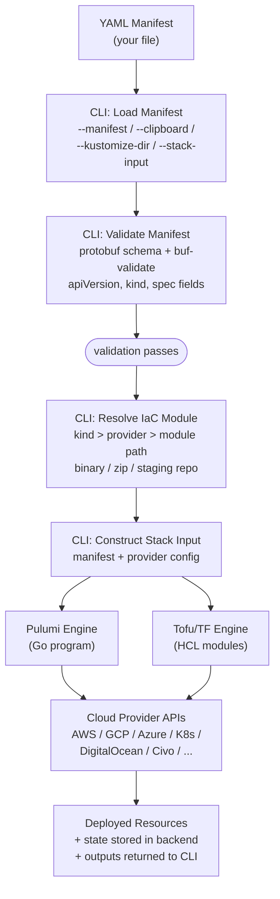
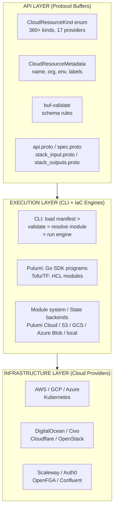

# Architecture

This page shows how the different parts of OpenMCF connect. Each diagram is a visual summary -- follow the links to the deep-dive page for any concept that needs more detail.

## The Deployment Flow

When you run a deployment command, this is the path your manifest takes from YAML file to deployed cloud resources:



**Deep dives**: [Manifests](manifests) | [Validation](validation) | [Module System](module-system) | [Dual IaC Engines](dual-iac-engines) | [State Management](state-management)

## Component Anatomy

Every deployment component is a self-contained package at a fixed path. The Protocol Buffer definitions define the contract. The IaC modules implement it.

```text
apis/org/openmcf/provider/{provider}/{component}/v1/
|
|-- api.proto                 <- Resource envelope
|   apiVersion, kind,           (apiVersion + kind are const-validated)
|   metadata, spec, status
|
|-- spec.proto                <- Configuration surface
|   All configurable fields     (types, validation rules, defaults,
|   for this component           nested messages, enums)
|
|-- stack_input.proto         <- IaC input contract
|   target (full manifest)      (bridges manifest -> IaC module)
|   + provider_config
|
|-- stack_outputs.proto       <- IaC output contract
|   Deployment results          (endpoints, ARNs, secrets,
|   returned after apply         connection strings)
|
|-- iac/
|   |-- pulumi/               <- Pulumi implementation (Go)
|   |   |-- main.go             Load stack input -> module.Resources()
|   |   \-- module/             Actual resource creation logic
|   |
|   \-- tf/                   <- Terraform implementation (HCL)
|       |-- main.tf             Resource creation
|       |-- variables.tf        Mirrors spec.proto structure
|       |-- provider.tf         Cloud provider configuration
|       \-- outputs.tf          Stack outputs
|
\-- docs/
    \-- README.md             <- Auto-generated documentation
```

**Deep dive**: [Deployment Components](deployment-components)

## The Three Layers

OpenMCF's architecture has three distinct layers, each with a clear responsibility:



**The API layer** is the source of truth. It defines the vocabulary, the resource models, and the validation rules. Everything downstream -- the CLI, the IaC modules, the documentation, the SDKs -- is derived from these Protocol Buffer definitions.

**The execution layer** turns manifests into cloud resources. The CLI orchestrates the process: loading manifests, running validation, resolving modules, and delegating to the correct IaC engine. The module system ensures the right code runs. The state backends ensure deployments are tracked.

**The infrastructure layer** is the real world. Cloud provider APIs, actual resources, real costs. OpenMCF does not abstract this layer -- it provides consistent structure and workflow above it while exposing each provider's full native capability.

**Deep dives**: [Cloud Resource Kinds](cloud-resource-kinds) | [Dual IaC Engines](dual-iac-engines) | [Module System](module-system) | [State Management](state-management)

## Auto-Generated SDKs

The Protocol Buffer definitions in the API layer are published to the [Buf Schema Registry](https://buf.build/openmcf/openmcf), which auto-generates client SDKs in multiple languages:

| Language | Generation Plugin | Use Case |
|----------|------------------|----------|
| **Go** | `protocolbuffers/go` + `grpc/go` | CLI internals, Pulumi modules, custom tooling |
| **TypeScript** | `bufbuild/es` + `connectrpc/es` | Web applications, Node.js tooling |
| **Java** | `protocolbuffers/java` + `grpc/java` | JVM-based tooling and integrations |

These SDKs enable teams to build custom tools that work with OpenMCF manifests programmatically -- creating manifests, validating them, and interacting with the API surface in type-safe code.

## What's Next

- **[Deployment Components](deployment-components)** -- Deep dive into the component structure
- **[Manifests](manifests)** -- The KRM manifest model
- **[Validation](validation)** -- The three-layer validation architecture
- **[Component Catalog](/docs/catalog)** -- Browse all 360+ deployment components
