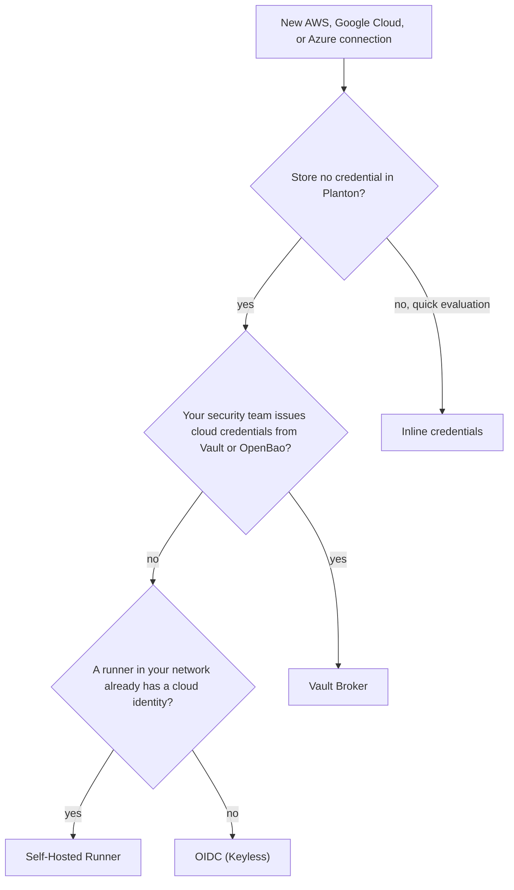

# Cloud Providers

To deploy infrastructure through Planton, the platform needs permission to act in your cloud accounts. Cloud provider connections give Planton that permission — to create, update, and manage resources from VPCs and Kubernetes clusters to databases and DNS zones — scoped to the environments you authorize. Depending on the method you choose, a connection holds an encrypted credential, or holds no credential at all.

## Choosing an Authentication Method

Every AWS, Google Cloud, and Azure connection starts with a choice: how should Planton authenticate? The connection wizard lists the methods your Planton instance offers; on planton.ai, **OIDC (Keyless)** is listed first.

### OIDC (Keyless)

Your account trusts Planton's identity issuer directly. For each operation, Planton signs a short-lived token for this one connection, and your cloud exchanges it for short-lived credentials: an IAM role on AWS, a service account through Workload Identity Federation on Google Cloud, or an app registration through a federated identity credential on Azure. Planton stores no access key, key file, or client secret, so there is nothing to leak or rotate.

You set up the trust once, in your own account, with a script the console fills in for you. On planton.ai, the Google Cloud and Azure wizards can also set it up for you after a one-time sign-in. See [Keyless Cloud Connections](/docs/connections/keyless-cloud-connections) for the setup on each cloud, and [What Your Cloud Trusts](/docs/security/what-your-cloud-trusts) for exactly what the trust admits.

**When to use**: Production accounts, and any account where you want no stored credential and trust you can read and revoke in your own cloud.

### Inline Credentials

Provide an access key, a service account key, or a service principal's client secret. The connection references them as encrypted secrets in your organization, and Planton supplies them to each deployment.

**When to use**: Quick evaluation, development accounts, or when you cannot create an identity provider or federated credential in the account.

**Trade-off**: The credential is long-lived and stored (encrypted) in Planton. You rotate it yourself.

### Self-Hosted Runner

Deploy a [Planton Runner](/docs/runner) in your own infrastructure and let it authenticate with the identity its environment already provides — the AWS SDK credential chain (IRSA, an instance profile, an ECS task role), GCP Application Default Credentials (Workload Identity), or the Azure credential chain (Managed Identity). No credential is stored in Planton; deployments for the connection run on that runner.

**When to use**: Teams that already run a runner with a cloud identity and require credentials to stay inside their network.

**Trade-off**: You deploy and maintain the runner. See the [Runner documentation](/docs/runner) for deployment options.

### Vault Broker

Your HashiCorp Vault or OpenBao issues short-lived cloud credentials at deploy time through its AWS, GCP, or Azure secrets engine. The connection stores no cloud credential: it names a Vault connection in your organization and the secrets-engine role to read. The runner logs in to your Vault, reads credentials for one job, and revokes its Vault session when the job ends. Optionally pick the runner that can reach your Vault over the network.

**When to use**: Organizations whose security team issues cloud credentials through a broker.

### Sign In with Google or Microsoft (GCP and Azure)

Google Cloud and Azure connections also offer a browser sign-in. You authorize Planton with your Google or Microsoft account, and Planton stores the resulting refresh token (encrypted) and exchanges it for access tokens when a deployment runs. Unlike the keyless method, this stores a long-lived token tied to the account that signed in.

**When to use**: A quick start or evaluation with the account you are already signed in to.

---

## AWS

AWS connections support OIDC (Keyless), Inline API Keys, Self-Hosted Runner, and Vault Broker.

### Connecting via the Web Console

1. Navigate to **Connections** and click the **AWS** card under Infrastructure.
2. **Name your connection** — choose a descriptive name like "AWS Production" or "aws-dev-sandbox". The slug is derived from the name ("AWS Production" becomes `aws-production`), because a slug is lowercase letters and digits joined by single hyphens, like my-app-2.
3. **Choose your authentication method**:
   - **OIDC (Keyless)** — Enter your account ID and region, select the capabilities Planton may use, then create the connection and run the AWS CLI script the console gives you. The script registers Planton's identity issuer in your account and creates a role only this connection can assume. See [Keyless Cloud Connections](/docs/connections/keyless-cloud-connections#aws).
   - **Inline API Keys** — Select the secrets that hold your Access Key ID and Secret Access Key (and a session token, for temporary credentials).
   - **Self-Hosted Runner** — Select an existing runner or create a new one, then identify the account and region. The runner authenticates with its own AWS identity.
   - **Vault Broker** — Identify the account, then point the connection at the Vault connection and secrets-engine role that issue its credentials.
4. **Create the connection**.

<!-- SCREENSHOT: AWS connection wizard - auth method selection
  Page: /orgs/{org}/connections (AWS connect wizard, Connection Method step)
  Action: Show the method step with the four method cards visible
  Focus: The OIDC (Keyless), Inline API Keys, Self-Hosted Runner, and Vault Broker cards
  Alt: AWS connection wizard showing OIDC (Keyless), Inline API Keys, Self-Hosted Runner, and Vault Broker options
-->

### AWS Capabilities

A keyless AWS connection's role carries one IAM policy per capability you select. This follows the principle of least privilege — grant only the permissions Planton needs for the resource types you plan to deploy.

Available capabilities: Amazon EKS, Amazon ECS, AWS Lambda, Amazon S3, Amazon ECR, Amazon RDS, VPC Networking, Amazon Route 53, AWS KMS, Amazon CloudWatch. Select at least one.

### What You Need

| Field | Description |
|-------|-------------|
| Account ID | Your 12-digit AWS account number |
| Region | The connection's primary region (required for OIDC (Keyless)) |
| Access Key ID | A secret holding the 20-character key starting with AKIA (inline only) |
| Secret Access Key | A secret holding the 40-character secret (inline only) |

For OIDC (Keyless), the setup script creates the IAM role, so you supply no key. For runner-delegated auth, you need a runner deployed with appropriate IAM permissions.

---

## Google Cloud Platform

GCP connections support Sign in with Google, OIDC (Keyless), Service Account Key, Self-Hosted Runner, and Vault Broker.

### Connecting via the Web Console

1. Navigate to **Connections** and click the **GCP** card under Infrastructure.
2. **Name your connection** and choose an authentication method:
   - **OIDC (Keyless)** — Enter your project number, the workload identity pool and provider IDs (the console proposes them), and the service account Planton acts as, then create the connection and either click **Set it up for me** or run the `gcloud` script the console gives you. See [Keyless Cloud Connections](/docs/connections/keyless-cloud-connections#google-cloud).
   - **Service Account Key** — Reference a secret holding the service account's JSON key.
   - **Sign in with Google**, **Self-Hosted Runner**, or **Vault Broker** — as described in [Choosing an Authentication Method](#choosing-an-authentication-method).
3. **Create the connection**.

<!-- SCREENSHOT: GCP connection wizard - auth method selection
  Page: /orgs/{org}/connections (GCP connect wizard, Connection Method step)
  Action: Show the method step with all method cards visible
  Focus: The OIDC (Keyless), Sign in with Google, Service Account Key, Self-Hosted Runner, and Vault Broker cards
  Alt: GCP connection wizard showing OIDC (Keyless), Sign in with Google, Service Account Key, Self-Hosted Runner, and Vault Broker options
-->

### What You Need

| Method | What you provide |
|--------|-----------------|
| OIDC (Keyless) | The project number, and a service account email (the setup script can create the service account) |
| Service Account Key | A secret holding the service account's JSON key, raw or base64-encoded |

### Preparing a Service Account Key

For the Service Account Key method, in the Google Cloud Console:

1. Create a service account in the project where Planton will manage resources.
2. Grant the service account the IAM roles needed for your resource types (e.g., Kubernetes Engine Admin for GKE clusters, Cloud SQL Admin for databases).
3. Create a JSON key for the service account.
4. Store the key's contents as a secret in your organization, raw or base64-encoded, and select that secret in the wizard.

---

## Microsoft Azure

Azure connections support Sign in with Microsoft, OIDC (Keyless), Service Principal, Self-Hosted Runner, and Vault Broker. Every method needs your tenant ID and subscription ID.

### Connecting via the Web Console

1. Navigate to **Connections** and click the **Azure** card under Infrastructure.
2. **Name your connection** and choose an authentication method:
   - **OIDC (Keyless)** — Enter the tenant ID, subscription ID, and the app registration's client ID (no client secret), then create the connection and add the federated identity credential, by clicking **Add the credential for me** or by running the `az` command the console gives you. See [Keyless Cloud Connections](/docs/connections/keyless-cloud-connections#azure).
   - **Service Principal** — Enter the tenant ID and subscription ID, and select the secrets that hold the client ID and client secret.
   - **Sign in with Microsoft**, **Self-Hosted Runner**, or **Vault Broker** — as described in [Choosing an Authentication Method](#choosing-an-authentication-method).
3. **Create the connection**.

<!-- SCREENSHOT: Azure connection wizard - auth method selection
  Page: /orgs/{org}/connections (Azure connect wizard, Connection Method step)
  Action: Show the method step with all method cards visible
  Focus: The OIDC (Keyless), Sign in with Microsoft, Service Principal, Self-Hosted Runner, and Vault Broker cards
  Alt: Azure connection wizard showing OIDC (Keyless), Sign in with Microsoft, Service Principal, Self-Hosted Runner, and Vault Broker options
-->

### What You Need

| Field | Description |
|-------|-------------|
| Tenant ID | Your Microsoft Entra ID tenant identifier (every method) |
| Subscription ID | The Azure subscription where resources will be managed (every method) |
| Client ID | The application (client) ID of your app registration, stored as a secret (OIDC (Keyless) and Service Principal) |
| Client Secret | The client secret value, stored as a secret (Service Principal only) |

### Preparing a Service Principal

For the Service Principal method, in the Azure Portal:

1. Register an application in Microsoft Entra ID.
2. Create a client secret for the application.
3. Assign the application the Contributor role (or more restrictive custom roles) on the subscription or resource groups where Planton will manage resources.

For OIDC (Keyless), skip the client secret: the console creates the app registration for you or gives you a script that does, and the trust is a federated identity credential.

---

## DigitalOcean

DigitalOcean connections use an API token to authenticate. Optionally, you can provide Spaces credentials for object storage operations.

### What You Need

| Field | Description |
|-------|-------------|
| API Token | A personal access token from the DigitalOcean control panel |
| Default Region | The region for new resources (required) |
| Spaces Access ID | Access key for DigitalOcean Spaces (optional, for object storage) |
| Spaces Secret Key | Secret key for DigitalOcean Spaces (optional) |

Generate an API token from the DigitalOcean control panel under **API > Tokens/Keys**. For Spaces, create a separate Spaces access key under **API > Spaces Keys**.

---

## Cloudflare

Cloudflare connections support two authentication schemes. The recommended approach uses a scoped API token; the legacy approach uses a global API key with your account email.

### What You Need (Recommended)

| Field | Description |
|-------|-------------|
| API Token | A scoped API token created in the Cloudflare dashboard |

### What You Need (Legacy)

| Field | Description |
|-------|-------------|
| API Key | Your global API key from the Cloudflare dashboard |
| Email | The email address associated with your Cloudflare account |

### R2 Storage Credentials

If you deploy a Cloudflare Worker whose code is a pre-built bundle stored in R2 (the Worker's `r2Bundle` source), the connection also needs an R2 key pair. Planton reads the bundle through R2's S3-compatible API, which the API token cannot sign for. A Worker that is only bound to an R2 bucket needs no R2 keys.

| Field | Description |
|-------|-------------|
| R2 Access Key ID | Access key of an R2 API token with Object Read on the bundle bucket (minimum 20 characters) |
| R2 Secret Access Key | Secret key paired with the access key (minimum 20 characters) |
| R2 Endpoint | Custom endpoint URL (optional; defaults to `https://<account_id>.r2.cloudflarestorage.com`) |

Create an R2 key pair in the Cloudflare dashboard under **R2 > Manage R2 API Tokens**.

Create API tokens in the Cloudflare dashboard under **My Profile > API Tokens**. Use the **Create Token** button to create a scoped token with only the permissions your deployments need.

---

## Common Patterns

### One Connection Per Account

Create separate connections for each cloud account. A "production AWS account" and a "development AWS account" should be two distinct connections, even if they belong to the same organization. This makes it straightforward to authorize the right credential for the right environment.

### Naming Conventions

Use names that identify both the provider and the purpose:

- `aws-production` — clear and specific
- `gcp-analytics-project` — identifies the GCP project's role
- `azure-staging` — identifies the environment intent

Avoid generic names like `aws1` or `my-cloud` — they become confusing as the number of connections grows.

### Credential Rotation

Keyless connections need no rotation: Planton stores no credential for them, each token it signs is valid for 15 minutes, and your cloud trusts the issuer's published keys, which Planton rotates without any change on your side. Runner-delegated and Vault Broker connections store nothing to rotate either; the runner's environment or your Vault issues the credentials.

To rotate inline credentials, update the secret the connection references, or point the connection at a new secret. Planton uses the new values for operations that start after the change.

## Related Documentation

- [Keyless Cloud Connections](/docs/connections/keyless-cloud-connections) — Set up OIDC (Keyless) trust in AWS, Google Cloud, and Azure
- [What Your Cloud Trusts](/docs/security/what-your-cloud-trusts) — The exact values a keyless trust pins, and how to revoke it
- [Connections Overview](/docs/connections) — Understanding the Connect system
- [Environment Mappings](/docs/connections/environment-mappings) — Authorize connections for specific environments
- [Default Connections](/docs/connections/default-connections) — Configure automatic credential selection
- [Runner](/docs/runner) — Deploy a Runner for runner-delegated authentication
