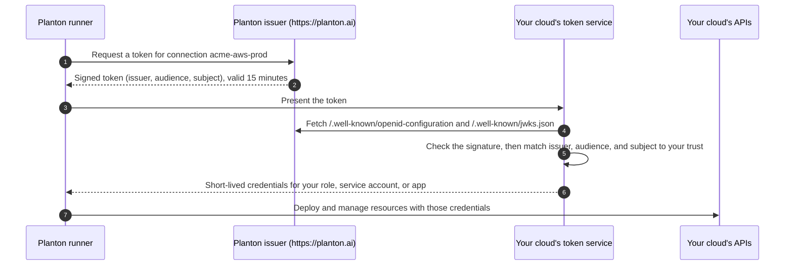

# Keyless Cloud Connections

A keyless connection lets Planton work in your AWS account, Google Cloud project, or Azure subscription without storing a credential for it. For each operation, Planton signs a short-lived token that names exactly one connection. Your cloud checks the token against Planton's published signing keys and against a trust you create once in your own account, then exchanges it for short-lived credentials. In the console this method is called **OIDC (Keyless)**, and on planton.ai it is the first method listed for AWS, Google Cloud, and Azure.

## Why Keyless

An access key, a service account key file, or a client secret is a long-lived credential. Whoever holds a copy can use it until someone rotates it, and rotating it means finding every place it was pasted. A keyless connection has no such credential:

- **Nothing to leak.** The connection stores no access key, no key file, and no client secret. It holds only pointers: the role ARN on AWS, the workload identity provider and service account on Google Cloud, and the app registration's tenant, subscription, and client ID on Azure.
- **Nothing to rotate.** Each token Planton signs is valid for 15 minutes, and the credentials your cloud exchanges it for are short-lived too.
- **The trust lives in your account.** You decide what the role, service account, or app registration may do, and you can read every line of the setup before it runs. Deleting that trust in your cloud ends Planton's access, with no key to revoke.
- **One trust per connection.** The trust pins the connection's exact subject, so a token for any other connection, in your organization or anyone else's, is refused.
- **No Planton cloud account is involved.** Your cloud trusts Planton's issuer URL, `https://planton.ai`. No Planton-owned AWS account, Google project, or Azure tenant appears in your trust, and no shared secret such as an external ID exists.

## How It Works



Every token carries three values, and your cloud's trust pins all three:

| Value | What it is | Example |
|-------|-----------|---------|
| Issuer | Who signed the token | `https://planton.ai` |
| Audience | Which token service the token is for | `sts.amazonaws.com` on AWS, `api://AzureADTokenExchange` on Azure, and the workload identity provider's full resource name on Google Cloud |
| Subject | Exactly one connection | `planton:v1:org:acme:conn:acme-aws-prod:provider:aws` |

The subject always has the form `planton:v1:org:<organization slug>:conn:<connection slug>:provider:<aws|gcp|azure>`. The signing keys are not pinned: your cloud reads them from Planton's published key set, so Planton can rotate them without any change on your side. [What Your Cloud Trusts](/docs/security/what-your-cloud-trusts) describes these values, and how to inspect them, in detail.

What you create in each cloud:

| Cloud | What trusts Planton's issuer | What Planton acts as |
|-------|------------------------------|----------------------|
| AWS | An IAM OIDC identity provider for `planton.ai`, one per account, shared by every Planton connection in it | An IAM role named `planton-aws-connection-<connection name>-role`, whose trust policy accepts only this connection's subject |
| Google Cloud | A workload identity pool (`planton` by default), shared by every Planton connection in the project, holding one OIDC provider per connection | A service account that only this connection's subject may impersonate |
| Azure | A federated identity credential on an app registration, one per connection | The app registration's service principal, with a role on your subscription |

## Setting Up a Keyless Connection

The steps are the same on every cloud:

1. **Create the connection in the console.** The subject is assigned when the connection is created, so the connection comes first. It stores no credential and can do nothing until your cloud trusts it.
2. **Copy the script the console shows.** Every Planton value is already filled in: the issuer and the subject come from the connection you just created.
3. **Run it in your cloud's shell**, or let Planton run the same setup for you with a one-click consent where the console offers one (Google Cloud and Azure).
4. **Click Verify.** The console runs the real token exchange and shows what Planton presented next to what your cloud granted.

The scripts on this page are what the console renders for an example connection: organization `acme`, connections `acme-aws-prod`, `acme-gcp-prod`, and `acme-azure-prod`, AWS account `123456789012`, Google Cloud project `acme-prod` (project number `123456789012`), and placeholder Azure IDs. Copy your script from the console, not from this page. Your subject, account, and names differ, and your cloud matches them as exact strings.

## AWS

### What You Need

- Your 12-digit AWS account ID and a region.
- A shell with the AWS CLI signed in to that account, with permission to manage IAM OIDC identity providers, roles, and role policies. The console notes that AWS CloudShell works. The script also uses `openssl` when it registers the identity provider for the first time.

### Steps in the Console

1. Open **Connections** and click the **AWS** card under Infrastructure.
2. **Name** the connection, for example `acme-aws-prod`. The role's name is derived from it.
3. Choose **OIDC (Keyless)**.
4. **AWS Account**: enter the account ID and the region.
5. **Permissions**: select at least one capability (Amazon EKS, Amazon ECS, AWS Lambda, Amazon S3, Amazon ECR, Amazon RDS, VPC Networking, Amazon Route 53, AWS KMS, Amazon CloudWatch). Each capability becomes one inline policy on the role.
6. **Set Up Trust**: choose **Run an AWS CLI Script**. Because planton.ai does not offer a one-click setup for AWS, this option is already selected. Click **Create Connection**. Planton creates the connection with the role's ARN, for example `arn:aws:iam::123456789012:role/planton-aws-connection-acme-aws-prod-role`, before the role exists.
7. The console shows the connection's trusted subject, the role and identity provider the script will create, and the script itself. Copy the script and run it.
8. Click **Verify Connection**. Until the script has run, Verify reports that the connection can't assume credentials yet. That is the expected starting state. Once Verify passes, click **Next**, then **Open Connection**.

> **Note:** Keep the wizard open until Verify passes. The AWS script is shown only in the wizard, and **Next** stays disabled until Planton has assumed the role.

<!-- SCREENSHOT: AWS keyless setup - script door after the connection is created
  Page: /orgs/{org}/connections (AWS connect wizard, Set Up Trust step)
  Action: Choose OIDC (Keyless), complete the account and permissions steps, click Create Connection on the Run an AWS CLI Script card
  Focus: The Connection Created notice with the trusted subject, the setup script block with its copy button, and the Verify Connection panel
  Alt: AWS keyless connection wizard showing the trusted subject, the AWS CLI setup script, and the Verify Connection button
-->

### The Script the Console Gives You

For `acme-aws-prod` with the Amazon S3 capability selected:

```bash
#!/usr/bin/env bash
# Keyless trust for your Planton AWS connection.
# Values from the connection are baked in verbatim -- do not edit them;
# AWS matches the issuer, audience, and subject as exact strings.
# Safe to run again: it adopts what exists and updates what changed.
set -euo pipefail

ACCOUNT_ID="123456789012"
ISSUER_URL="https://planton.ai"
ISSUER_HOST="planton.ai"
ROLE_NAME="planton-aws-connection-acme-aws-prod-role"
PROVIDER_ARN="arn:aws:iam::${ACCOUNT_ID}:oidc-provider/${ISSUER_HOST}"

# 1/3 The identity provider for this Planton instance's issuer -- shared by every
# Planton connection in this account, so it is adopted when it already exists
# and never deleted with a connection. IAM pins the certificate authority
# that issued the issuer's TLS certificate: for a public CA it uses its own
# trust store and ignores the thumbprint, for a private CA the thumbprint is
# what makes the trust work -- so it is read from the certificate chain the
# issuer actually presents (the last certificate is the CA).
if aws iam get-open-id-connect-provider --open-id-connect-provider-arn "$PROVIDER_ARN" >/dev/null 2>&1; then
  echo "Identity provider already registered: $PROVIDER_ARN"
  # A provider registered for another audience still needs STS's, or AWS
  # rejects this connection's tokens; adding it leaves the others in place.
  if [ "$(aws iam get-open-id-connect-provider --open-id-connect-provider-arn "$PROVIDER_ARN" --query "contains(ClientIDList, 'sts.amazonaws.com')" --output json)" != "true" ]; then
    aws iam add-client-id-to-open-id-connect-provider --open-id-connect-provider-arn "$PROVIDER_ARN" --client-id "sts.amazonaws.com"
  fi
else
  TLS_ENDPOINT="${ISSUER_HOST%%/*}"; case "$TLS_ENDPOINT" in *:*) ;; *) TLS_ENDPOINT="$TLS_ENDPOINT:443";; esac
  THUMBPRINT="$(openssl s_client -servername "${TLS_ENDPOINT%%:*}" -connect "$TLS_ENDPOINT" -showcerts </dev/null 2>/dev/null \
    | awk '/-----BEGIN CERTIFICATE-----/{cert=""} {cert=cert $0 "\n"} /-----END CERTIFICATE-----/{last=cert} END{printf "%s", last}' \
    | openssl x509 -fingerprint -sha1 -noout | cut -d= -f2 | tr -d ':')"
  aws iam create-open-id-connect-provider \
    --url "$ISSUER_URL" \
    --client-id-list "sts.amazonaws.com" \
    --thumbprint-list "$THUMBPRINT" \
    --tags Key=planton:managed,Value=true
fi

# 2/3 The role only this connection can assume: the trust policy accepts a
# token from this issuer, for the STS audience, with exactly this subject.
TRUST_POLICY="$(cat <<JSON
{
  "Version": "2012-10-17",
  "Statement": [
    {
      "Effect": "Allow",
      "Principal": {
        "Federated": "${PROVIDER_ARN}"
      },
      "Action": "sts:AssumeRoleWithWebIdentity",
      "Condition": {
        "StringEquals": {
          "planton.ai:aud": "sts.amazonaws.com",
          "planton.ai:sub": "planton:v1:org:acme:conn:acme-aws-prod:provider:aws"
        }
      }
    }
  ]
}
JSON
)"
if aws iam get-role --role-name "$ROLE_NAME" >/dev/null 2>&1; then
  aws iam update-assume-role-policy --role-name "$ROLE_NAME" --policy-document "$TRUST_POLICY"
else
  aws iam create-role \
    --role-name "$ROLE_NAME" \
    --description "Keyless OIDC role for Planton Platform (acme-aws-prod), issuer planton.ai" \
    --max-session-duration 3600 \
    --assume-role-policy-document "$TRUST_POLICY" \
    --tags Key=planton:managed,Value=true Key=planton:connection-name,Value=acme-aws-prod
fi

# 3/3 One inline policy per capability -- the same statements the quick-create
# attaches; these are the only actions Planton can perform in your account.
aws iam put-role-policy --role-name "$ROLE_NAME" --policy-name "planton-s3-access" --policy-document '{"Version":"2012-10-17","Statement":[{"Sid":"S3FullAccess","Effect":"Allow","Action":"s3:*","Resource":"*"}]}'

# Done. This is the role the connection was created with; Verify in the
# wizard proves the exchange end to end.
echo "arn:aws:iam::${ACCOUNT_ID}:role/${ROLE_NAME}"
```

The script does three things:

1. **Registers Planton's issuer** as an IAM OIDC identity provider, `arn:aws:iam::123456789012:oidc-provider/planton.ai`. AWS allows one provider per issuer URL in an account, and every Planton connection in the account shares it. If it already exists, the script adopts it and adds the `sts.amazonaws.com` audience when that is missing. The script never deletes it.
2. **Creates the role**, or updates its trust policy if the role already exists. The trust policy accepts a token only when `planton.ai:aud` is `sts.amazonaws.com` and `planton.ai:sub` is this connection's subject. Sessions last at most one hour.
3. **Attaches one inline policy per capability** you selected. `put-role-policy` replaces a policy of the same name, so the role's permissions are exactly the ones in the script.

### Running It Again, and a Second Connection

Running the script again ends in the same state: it adopts the identity provider, rewrites the role's trust policy, and replaces each policy by name. Run it again after a failed Verify, or after reviewing a change.

A second connection in the same account, for example `acme-aws-staging`, gets its own script. That script adopts the identity provider the first one registered and creates a second role, `planton-aws-connection-acme-aws-staging-role`, whose trust policy pins the second connection's subject. Neither role accepts the other connection's tokens.

## Google Cloud

### What You Need

- Your project's number (shown on the Google Cloud console home page) and its project ID.
- A service account for Planton to act as. The script creates it if it does not exist, for example `planton-provisioner@acme-prod.iam.gserviceaccount.com`.
- A shell with `gcloud` signed in, with permission to create workload identity pools and providers, service accounts, and IAM bindings in the project. The console suggests Cloud Shell. For the one-click option, a Google account that administers the project.

### Steps in the Console

1. Open **Connections** and click the **GCP** card under Infrastructure.
2. **Name** the connection, for example `acme-gcp-prod`.
3. Choose **OIDC (Keyless)**.
4. **Federation Config**: with **Guide me** selected, enter the **GCP Project Number** (`123456789012`), keep the **Workload Identity Pool ID** (`planton`), and keep the proposed **OIDC Provider ID** (`planton-acme-gcp-prod`, derived from the connection's slug). Enter the **Service Account Email**. The console composes the audience from these values and shows it on **Review & Launch** as **Audience (Workload Identity provider)**: `//iam.googleapis.com/projects/123456789012/locations/global/workloadIdentityPools/planton/providers/planton-acme-gcp-prod`.
5. **Home Project** (optional): the project the connection is labelled by. It does not fill the script's `PROJECT_ID`; set that line to the project that holds the pool.
6. **Deployment Roles**: select the services you deploy. Each one adds roles the setup grants to the service account; Cloud Storage, for example, grants `roles/storage.admin`.
7. **Review & Launch**: click **Create connection**. The console then shows the federated subject, the audience, and the service account.
8. Set up the trust in one of two ways:
   - **Set it up for me**: sign in with a Google account that administers the project. Planton uses the one-time consent to create the same pool, provider, service account, binding, and role grants as the script, then discards the token. No refresh token is minted and nothing about your Google access is stored.
   - **Prefer to review and run it yourself? Show the script**: copy the script below and run it.
9. Click **Verify connection**. New trust in Google IAM can take a couple of minutes to propagate. Once Verify passes, click **Next**, then **Create** on **Review & Create**: the connection already exists, so this opens it. You can also finish first and run the setup later from the connection's page.

<!-- SCREENSHOT: Google Cloud keyless setup - after the connection is created
  Page: /orgs/{org}/connections (GCP connect wizard, Review & Launch step)
  Action: Choose OIDC (Keyless), complete Federation Config and Deployment Roles, click Create connection, expand Show the script
  Focus: The federated subject and audience, the Set it up for me button, the expanded gcloud script, and the Verify connection panel
  Alt: Google Cloud keyless connection wizard showing the federated subject, the one-click setup button, the gcloud setup script, and the Verify connection button
-->

### The Script the Console Gives You

For `acme-gcp-prod` with Cloud Storage selected. Replace `<your-project-id>` on the `PROJECT_ID` line with your project ID (`acme-prod` here). That is the only edit the script needs.

```bash
#!/usr/bin/env bash
# Workload Identity Federation trust for your Planton GCP connection.
# Values from the connection are baked in verbatim -- do not edit them;
# the audience and subject must match byte-for-byte.
# Safe to run again: it adopts what exists and creates what is missing.
set -euo pipefail

PROJECT_ID="<your-project-id>"  # your GCP project id (project number 123456789012 is already baked into the audience)
SA_EMAIL="planton-provisioner@acme-prod.iam.gserviceaccount.com"

# 1/4 Workload Identity Pool -- shared by every Planton connection in this
# project, so it is adopted when it already exists.
if POOL_STATE="$(gcloud iam workload-identity-pools describe planton \
    --project="$PROJECT_ID" --location=global --format='value(state)' 2>/dev/null)"; then
  if [ "$POOL_STATE" != "ACTIVE" ]; then
    echo "Workload Identity Pool planton already exists but is $POOL_STATE -- undelete it, or use a different pool id in the connection's audience." >&2
    exit 1
  fi
  echo "Workload Identity Pool already exists: planton"
else
  gcloud iam workload-identity-pools create planton \
    --project="$PROJECT_ID" --location=global \
    --display-name="Planton" \
    --description="External identities minted by the Planton OIDC issuer."
fi

# 2/4 This connection's own OIDC provider, trusting the Planton issuer; the
# attribute condition pins this exact connection's subject -- no other token
# is accepted. An existing provider is kept only when it already trusts
# exactly this connection.
if PROVIDER_TRUST="$(gcloud iam workload-identity-pools providers describe planton-acme-gcp-prod \
    --project="$PROJECT_ID" --location=global --workload-identity-pool=planton \
    --format='value(state,oidc.issuerUri,attributeCondition)' 2>/dev/null)"; then
  if [ "$PROVIDER_TRUST" != "$(printf 'ACTIVE\t%s\t%s' "https://planton.ai" "assertion.sub == 'planton:v1:org:acme:conn:acme-gcp-prod:provider:gcp'")" ]; then
    echo "OIDC provider planton-acme-gcp-prod already exists but trusts a different issuer or subject, or is deleted. Each connection needs its own provider -- use a different provider id in the connection's audience." >&2
    exit 1
  fi
  echo "OIDC provider already trusts this connection: planton-acme-gcp-prod"
else
  gcloud iam workload-identity-pools providers create-oidc planton-acme-gcp-prod \
    --project="$PROJECT_ID" --location=global \
    --workload-identity-pool=planton \
    --display-name="Planton OIDC" \
    --issuer-uri="https://planton.ai" \
    --allowed-audiences="//iam.googleapis.com/projects/123456789012/locations/global/workloadIdentityPools/planton/providers/planton-acme-gcp-prod" \
    --attribute-mapping="google.subject=assertion.sub" \
    --attribute-condition="assertion.sub == 'planton:v1:org:acme:conn:acme-gcp-prod:provider:gcp'"
fi

# 3/4 Provisioner service account (adopted when it already exists)
if gcloud iam service-accounts describe "$SA_EMAIL" --project="$PROJECT_ID" >/dev/null 2>&1; then
  echo "Service account already exists: $SA_EMAIL"
else
  gcloud iam service-accounts create planton-provisioner \
    --project="$PROJECT_ID" \
    --display-name="Planton Provisioner"
fi

# 4/4 Let this connection's federated identity impersonate the service account
# (adding a binding that already exists changes nothing)
gcloud iam service-accounts add-iam-policy-binding "$SA_EMAIL" \
  --project="$PROJECT_ID" \
  --member="principal://iam.googleapis.com/projects/123456789012/locations/global/workloadIdentityPools/planton/subject/planton:v1:org:acme:conn:acme-gcp-prod:provider:gcp" \
  --role="roles/iam.workloadIdentityUser"

# Grant deployment roles (from this connection's selected capabilities;
# the one-click setup grants exactly the same set)
gcloud projects add-iam-policy-binding "$PROJECT_ID" \
  --member="serviceAccount:$SA_EMAIL" --role="roles/storage.admin"
```

The script does four things, then grants the deployment roles:

1. **Ensures the workload identity pool** `planton`. If the pool exists and is active, the script reuses it. If it exists in any other state (for example, deleted), the script stops and says so.
2. **Creates this connection's own OIDC provider** in the pool. The provider trusts `https://planton.ai`, accepts only the audience above, and its attribute condition accepts only this connection's subject.
3. **Ensures the service account**, creating it only if it does not exist. If you entered a service account whose email is not in the standard `<name>@<project-id>.iam.gserviceaccount.com` form, the console leaves this step out and uses your existing account.
4. **Lets this connection's subject impersonate the service account** by granting `roles/iam.workloadIdentityUser` to that one subject.

### Running It Again, and a Second Connection

Running the script again ends in the same state: the pool, the provider, and the service account are kept when they already match, and adding an IAM binding that already exists changes nothing.

A second connection in the same project, for example `acme-gcp-staging`, reuses the `planton` pool and gets its own provider, `planton-acme-gcp-staging`. Each provider accepts one connection's subject, so each connection needs a different provider ID. If a provider with the proposed ID already exists and trusts a different issuer or subject, or was deleted, the script stops with this message instead of changing it:

```text
OIDC provider planton-acme-gcp-staging already exists but trusts a different issuer or subject, or is deleted. Each connection needs its own provider -- use a different provider id in the connection's audience.
```

Google limits provider IDs to 32 characters. For a long connection slug, the console shortens the proposed ID and appends a short hash of the slug, so two long slugs still get two different providers.

## Azure

Azure's setup has two parts. The connection needs the app registration's client ID before it can be created, and the federated identity credential needs the connection's subject, which exists only after the connection is created.

### What You Need

- Your tenant ID and subscription ID.
- An app registration for Planton to act as. If you don't have one, the console creates it for you or gives you a script that does, named `planton-provisioner` by default. One app registration can carry the federated credentials of several connections.
- A shell with `az` signed in to your tenant, with permission to create app registrations and role assignments on the subscription. The console suggests Cloud Shell. For the one-click option, a Microsoft Entra admin who also holds Owner or User Access Administrator on the subscription.

### Steps in the Console

1. Open **Connections** and click the **Azure** card under Infrastructure.
2. **Name** the connection, for example `acme-azure-prod`.
3. Choose **OIDC (Keyless)**.
4. **App Registration**: enter the **Tenant ID**, the **Subscription ID**, and the **Client ID**. **Client ID** is a secret picker: pick the secret that holds the app's client ID, or choose **Create Secret** and paste the client ID as its value. No client secret is collected. If you don't have an app registration yet, expand **Need an app registration?** and either click **Set it up for me** (one Microsoft consent; Planton creates the app registration, its service principal, and the role assignment, and fills in the fields) or show the first script below, run it, and paste the three values it prints.
5. **Review & Launch**: click **Create connection**. The console shows the federated subject, the audience (`api://AzureADTokenExchange`), and the app registration.
6. Add the federated credential in one of two ways:
   - **Add the credential for me**: Planton adds the credential through a Microsoft sign-in. If you used **Set it up for me** in the previous step, it reuses that consent, with no second consent screen.
   - **Prefer to review and run it yourself? Show the command**: copy the second script below and run it.
7. Click **Verify connection**. A new federated credential takes a few minutes to propagate. If Verify reports no matching credential right after you add it, wait and verify again. Once Verify passes, click **Next**, then **Create** on **Review & Create**: the connection already exists, so this opens it.

<!-- SCREENSHOT: Azure keyless setup - after the connection is created
  Page: /orgs/{org}/connections (Azure connect wizard, Review & Launch step)
  Action: Choose OIDC (Keyless), fill App Registration, click Create connection, expand Show the command
  Focus: The federated subject, the constant audience, the Add the credential for me button, the expanded az script, and the Verify connection panel
  Alt: Azure keyless connection wizard showing the federated subject, the one-click button, the federated credential script, and the Verify connection button
-->

### The Scripts the Console Gives You

The first script creates the app registration, its service principal, and a role assignment on the subscription. The console fills in the subscription ID you entered (shown here as all zeros) and the app registration's display name:

```bash
#!/usr/bin/env bash
# App registration + service principal + RBAC for your Planton Azure
# connection (keyless). Safe to re-run: existing objects are reused.
set -euo pipefail

SUBSCRIPTION_ID="00000000-0000-0000-0000-000000000000"
APP_DISPLAY_NAME="planton-provisioner"
ROLE="Contributor"  # narrow to what you provision through Planton (least privilege)

# 1/3 App registration -- the identity Planton authenticates as
APP_CLIENT_ID="$(az ad app list --display-name "$APP_DISPLAY_NAME" --query '[0].appId' --output tsv)"
if [ -z "$APP_CLIENT_ID" ]; then
  APP_CLIENT_ID="$(az ad app create --display-name "$APP_DISPLAY_NAME" --query appId --output tsv)"
fi

# 2/3 Service principal -- RBAC attaches here, never to the app object
SP_OBJECT_ID="$(az ad sp list --filter "appId eq '${APP_CLIENT_ID}'" --query '[0].id' --output tsv)"
if [ -z "$SP_OBJECT_ID" ]; then
  SP_OBJECT_ID="$(az ad sp create --id "$APP_CLIENT_ID" --query id --output tsv)"
fi

# 3/3 Role assignment (new grants take ~2 minutes to propagate)
az role assignment create \
  --assignee-object-id "$SP_OBJECT_ID" \
  --assignee-principal-type ServicePrincipal \
  --role "$ROLE" \
  --scope "/subscriptions/${SUBSCRIPTION_ID}" \
  --output none

echo "Paste these into the Planton connection:"
echo "  client_id:       ${APP_CLIENT_ID}"
echo "  tenant_id:       $(az account show --query tenantId --output tsv)"
echo "  subscription_id: ${SUBSCRIPTION_ID}"
```

The role defaults to Contributor. Narrow it to what you deploy through Planton before you run the script.

The second script, shown after the connection is created, adds the federated identity credential for `acme-azure-prod`:

```bash
#!/usr/bin/env bash
# Federated Identity Credential for your Planton Azure connection.
# The subject is baked in verbatim -- do not edit it; Microsoft Entra
# matches issuer + subject + audience as exact strings.
# Safe to run again: a credential that already trusts this connection is kept.
set -euo pipefail

APP_DISPLAY_NAME="planton-provisioner"
FIC_NAME="planton-conn-acme-azure-prod"

APP_OBJECT_ID="$(az ad app list --display-name "$APP_DISPLAY_NAME" --query '[0].id' --output tsv)"

# The credential is named after the connection: a rerun keeps it, and one
# with this name that trusts a different issuer or subject is never repointed.
if FIC_TRUST="$(az ad app federated-credential show --id "$APP_OBJECT_ID" --federated-credential-id "$FIC_NAME" \
    --query "join(' ', [issuer, subject])" --output tsv 2>/dev/null)"; then
  if [ "$FIC_TRUST" != "https://planton.ai planton:v1:org:acme:conn:acme-azure-prod:provider:azure" ]; then
    echo "Federated credential $FIC_NAME already exists but pins a different issuer or subject; remove or rename it, then run this again." >&2
    exit 1
  fi
  echo "Federated credential already trusts this connection: $FIC_NAME"
else
  az ad app federated-credential create --id "$APP_OBJECT_ID" --parameters '{
    "name": "planton-conn-acme-azure-prod",
    "issuer": "https://planton.ai",
    "subject": "planton:v1:org:acme:conn:acme-azure-prod:provider:azure",
    "audiences": ["api://AzureADTokenExchange"],
    "description": "Planton connection (keyless OIDC federation)."
  }'
fi

# New FICs take a few minutes to propagate -- if the first Verify reports
# "no matching federated identity credential", wait and re-verify.
```

Both scripts find the app registration by its display name. If you bring your own app registration, change `APP_DISPLAY_NAME` to its name in both.

### Running It Again, and a Second Connection

The first script reuses an app registration and service principal that already exist. The second script names the credential after the connection, `planton-conn-<connection slug>`. Running it again keeps a credential that already trusts this connection. If a credential with that name pins a different issuer or subject, the script stops and asks you to remove or rename it, rather than taking that trust away from whatever it belongs to.

A second connection, for example `acme-azure-staging`, can use the same app registration: enter the same client ID and, under **Need an app registration?**, set **App registration display name** to that app's name (the credential script finds the app by it), skip the first script, and run the second connection's credential script, which adds `planton-conn-acme-azure-staging` beside the first credential.

## Details

### Check What the Script Created

Each cloud's own CLI shows the trust exactly as your cloud will evaluate it:

```bash
# AWS: the role's trust policy (issuer host, audience, and subject)
aws iam get-role --role-name planton-aws-connection-acme-aws-prod-role --query Role.AssumeRolePolicyDocument

# Google Cloud: the provider's issuer, allowed audience, and attribute condition
gcloud iam workload-identity-pools providers describe planton-acme-gcp-prod \
  --project=acme-prod --location=global --workload-identity-pool=planton

# Azure: the app registration's federated credentials
az ad app federated-credential list --id "$(az ad app list --display-name planton-provisioner --query '[0].id' --output tsv)"
```

### When Verify Fails

Verify shows the subject and issuer Planton presented. Compare them with your cloud's trust; a single different character is enough to fail.

| Cloud | What you see | Most likely cause |
|-------|-------------|-------------------|
| AWS | This Connection Can't Assume Credentials Yet: AWS denied the assume-role request | The script has not run yet, or the role's trust policy names a different subject or issuer host |
| Google Cloud | Google denied service-account impersonation | The `roles/iam.workloadIdentityUser` binding is still propagating (wait a couple of minutes and verify again), or it names a different subject |
| Google Cloud | The audience does not match, or the issuer is not trusted | The provider trusts a different issuer, or the connection names a different provider |
| Azure | `AADSTS70021` (no matching federated identity record) | The credential is still propagating (wait a few minutes), or its issuer, subject, or audience differs |

Run the script again after you fix the cause. Every script is safe to rerun.

### Self-Hosted Planton

A self-hosted Planton instance signs tokens as its own issuer, its own public address, instead of `https://planton.ai`. The console reports that issuer after the connection is created and puts it in the script. Keyless connections need the issuer to be reachable from the public internet; where it is not, the console shows the method as unavailable and says why.

### Removing Access

To end a keyless connection's access, delete its trust in your cloud: the IAM role on AWS, the OIDC provider (or the service account binding) on Google Cloud, or the federated identity credential on Azure. Your cloud then refuses Planton's tokens for that connection. Deleting the connection in Planton also stops Planton from signing tokens for it. On AWS, leave the identity provider in place while other Planton connections in the account still use it.

## Related Documentation

- [Cloud Providers](/docs/connections/cloud-providers) — Every authentication method for AWS, Google Cloud, Azure, DigitalOcean, and Cloudflare
- [What Your Cloud Trusts](/docs/security/what-your-cloud-trusts) — The three pinned values, Planton's published keys, and how to revoke
- [Environment Mappings](/docs/connections/environment-mappings) — Authorize a connection for specific environments
- [Default Connections](/docs/connections/default-connections) — Configure automatic credential selection
- [Runner Security Model](/docs/runner/security-model) — How the runner authenticates to your cloud in each mode
