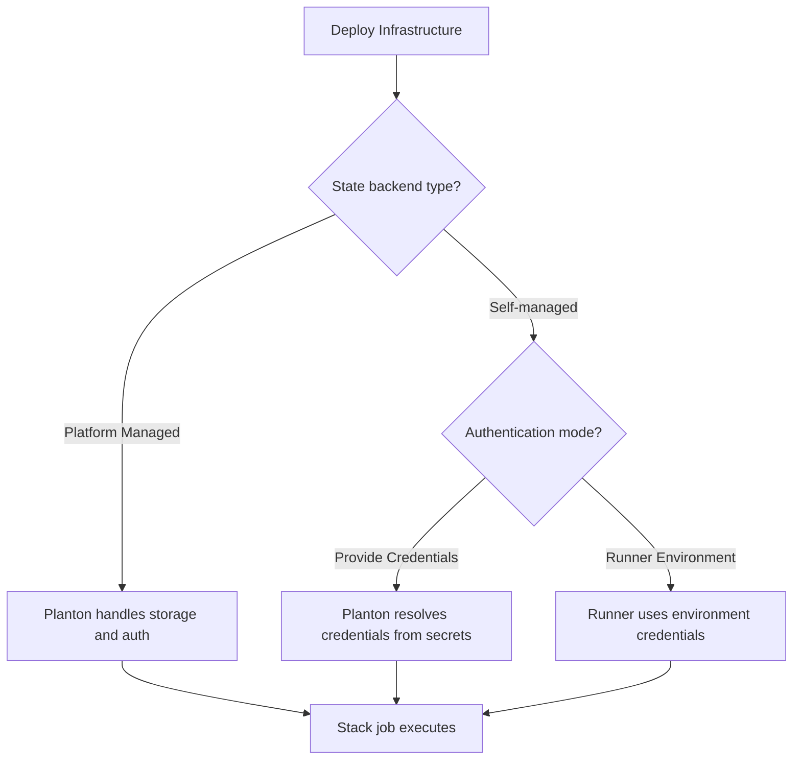

# State Backends

Every infrastructure deployment managed by Planton uses an Infrastructure as Code (IaC) engine — Pulumi, Terraform, or OpenTofu — under the hood. These engines track the state of your infrastructure in state files: a record of what resources exist, their current configuration, and the relationships between them. Without state, the IaC engine cannot determine what to create, update, or delete on the next deployment.

State backend connections tell Planton where to store these state files. Every new organization starts with Planton-managed backends for both Pulumi and Terraform/OpenTofu, so you can deploy infrastructure immediately. OpenTofu uses the same state format and backend configuration as Terraform, so a single Terraform state backend serves both engines. If you need state to live in your own cloud account, you configure a self-managed backend and Planton handles reading, writing, and locking state during deployments. Import operations also write to the state backend — when you [import an existing cloud resource](/docs/infrastructure/importing-resources), the runner writes the resource's current state to the backend without modifying the actual infrastructure.

## Why State Backend Choice Matters

State files contain sensitive information — resource IDs, connection strings, and sometimes credentials. Where you store them is a security and operational decision:

- **Pulumi Cloud or Terraform Cloud** — Managed services that handle storage, encryption, locking, and access control. Lowest setup overhead, but state leaves your infrastructure. (OpenTofu does not have its own managed cloud service; it uses the same self-managed backends as Terraform.)
- **S3, GCS, or Azure Blob** — You control the storage location, encryption keys, and access policies. State stays in your cloud account. Requires more setup but gives you full control.
- **S3-compatible storage (R2, MinIO)** — Self-hosted state that avoids vendor lock-in to either cloud provider or IaC vendor. Planton itself uses Cloudflare R2 as its default state backend.

There is no universally right answer. The choice depends on your security requirements, compliance constraints, and operational preferences.

## Planton-Managed Defaults

Every new organization comes with two pre-configured state backends: one for Pulumi and one for Terraform/OpenTofu. Planton provisions and manages the underlying storage, so you can start deploying infrastructure without any state backend configuration.

Planton-managed backends are the default for new organizations. When a stack job runs, it uses the organization's default backend automatically. You do not need to select a backend, provide credentials, or manage storage buckets.

**Limitations:**

- Planton-managed backends are only available when using Planton-hosted runners. If you deploy a runner in your own infrastructure, you need a self-managed backend (S3, GCS, Azure Blob, Cloudflare R2, Terraform Cloud/Enterprise, or Pulumi Cloud) because a runner you operate cannot access Planton-managed storage. For the same reason, Planton refuses to make one of your runners the organization's default runner while any of your state lives in Planton-managed storage.
- You do not control the storage location or encryption keys. If compliance requirements mandate that state files remain in your cloud account, configure a self-managed backend instead.

To switch away from Planton-managed defaults, create a new state backend connection, configure it with your preferred storage, and mark it as the default for your organization. See [Switching from Planton-Managed to Self-Managed](#switching-from-planton-managed-to-self-managed) for details.

## Authentication Mode

When you configure a self-managed state backend (S3, GCS, Azure Blob, Cloudflare R2, Terraform Cloud/Enterprise, or Pulumi Cloud), you choose how the runner authenticates with the storage provider. This choice appears as the first step in the connection wizard.

### Provide Credentials

Planton resolves credentials from the platform's secrets system at deploy time and injects them into the IaC engine. You store secrets (access keys, service account keys, access tokens) in Planton, and the runner receives them just before executing a stack job.

This is the default mode. Use it when:

- Credentials are managed centrally through Planton's [Secrets Manager](/docs/secrets)
- You want the platform to handle credential injection without any runner-side configuration
- The runner does not have direct access to the storage provider

### Runner Environment

The runner authenticates using credentials already available in its own environment. Planton skips credential resolution entirely — only the storage location (bucket name, endpoint, region) is configured in the connection. The runner relies on mechanisms like:

- **AWS S3**: IRSA (EKS), EC2 instance profile, ECS task role, or `AWS_ACCESS_KEY_ID` / `AWS_SECRET_ACCESS_KEY` environment variables
- **GCS**: Workload Identity (GKE), Application Default Credentials, or `GOOGLE_CREDENTIALS` environment variable
- **Azure Blob**: Managed Identity or `AZURE_STORAGE_KEY` environment variable
- **Pulumi Cloud**: `PULUMI_ACCESS_TOKEN` environment variable

Use this mode when:

- You deploy runners in your own infrastructure where IAM roles or environment variables provide storage access
- You prefer not to store state backend credentials in the platform
- You use cloud-native identity federation (IRSA, Workload Identity) for least-privilege access

### Compatibility

Planton-managed backends always handle their own authentication. The authentication mode choice applies only to self-managed backends. If you create a self-managed backend and select Runner Environment, the platform validates that the combination is valid — for example, you cannot pair a Planton-managed backend with runner-provided credentials.



## Pulumi Backends

Pulumi state can be stored in four locations:

### Pulumi Cloud (HTTP Backend)

The managed option. Pulumi Cloud stores state, provides a web UI for inspecting resources, and handles concurrent access control.

| Field | Description |
|-------|-------------|
| API URL | Pulumi Cloud API endpoint (defaults to `https://api.pulumi.com`) |
| Pulumi Organization | Your Pulumi Cloud organization name |
| Access Token | A Pulumi access token with write permissions |

**When to use**: Getting started quickly, small teams, or when you want a managed experience and don't need state to remain in your infrastructure.

### S3 Backend

Store Pulumi state in an Amazon S3 bucket (or any S3-compatible storage).

| Field | Description |
|-------|-------------|
| S3 Bucket | The bucket name for state storage |
| Access Key ID | AWS IAM credentials for bucket access |
| Secret Access Key | AWS IAM credentials for bucket access |
| Endpoint | Custom endpoint for S3-compatible storage (R2, MinIO, etc.) |
| Region | AWS region, or "auto" for R2 |

**When to use**: State must stay in your AWS account, or you want to use S3-compatible storage like Cloudflare R2 or MinIO for a vendor-neutral backend.

### GCS Backend

Store Pulumi state in a Google Cloud Storage bucket.

| Field | Description |
|-------|-------------|
| GCS Bucket | The bucket name for state storage |
| Service Account Key | JSON key for a service account with Storage Object Admin role |

**When to use**: State must stay in your GCP project, or your organization standardizes on GCS for all object storage.

### Azure Blob Backend

Store Pulumi state in an Azure Blob Storage container.

| Field | Description |
|-------|-------------|
| Blob Storage Container | The container name for state storage |
| Storage Account Name | Your Azure Storage account name |
| Storage Account Key | Access key for the storage account |

**When to use**: State must stay in your Azure subscription.

### Secrets Passphrase

For S3, GCS, and Azure Blob backends (the "DIY" backends), Pulumi encrypts sensitive values in state using a passphrase. You provide this passphrase when configuring the backend, and Planton uses it during deployments.

This is not needed for the Pulumi Cloud backend, which handles encryption internally.

---

## Terraform and OpenTofu Backends

Terraform and OpenTofu share the same state format and backend configuration. A state backend configured for Terraform works identically for OpenTofu — you do not need separate backends for each.

State can be stored in several locations:

### S3 Backend

The most common choice for AWS-centric organizations. Optionally, use a DynamoDB table for state locking to prevent concurrent modifications.

| Field | Description |
|-------|-------------|
| S3 Bucket | The bucket name for state storage |
| Access Key ID | AWS IAM credentials for bucket access |
| Secret Access Key | AWS IAM credentials for bucket access |
| Region | AWS region for the bucket |
| DynamoDB Table | Table name for state locking (optional but recommended) |
| Endpoint | Custom endpoint for S3-compatible storage (optional) |

The S3 backend supports S3-compatible storage providers (Cloudflare R2, MinIO) by specifying a custom endpoint. When using non-AWS S3-compatible storage, you may need to enable compatibility flags for credential and region validation.

**When to use**: State must stay in your AWS account, you want DynamoDB-based locking, or you want to use S3-compatible storage.

### GCS Backend

| Field | Description |
|-------|-------------|
| GCS Bucket | The bucket name for state storage |
| Service Account Key | JSON key for a service account with Storage Object Admin role |

**When to use**: State must stay in your GCP project.

### Azure RM Backend

| Field | Description |
|-------|-------------|
| Resource Group Name | Azure resource group containing the storage account |
| Storage Account Name | Your Azure Storage account name |
| Container Name | The blob container for state files |
| Tenant ID | Azure AD tenant identifier |
| Subscription ID | Azure subscription identifier |
| Client ID | Service principal application ID |
| Client Secret | Service principal secret |

**When to use**: State must stay in your Azure subscription.

### Remote Backend (Terraform Cloud, Terraform Enterprise, Scalr)

Store state in any service speaking the TFE protocol — HCP Terraform (app.terraform.io), self-hosted Terraform Enterprise, or Scalr. Planton uses these services for **state storage only**: your HCL always executes on Planton's OpenTofu engine, and Planton keeps each workspace in local execution mode — no remote runs, ever.

| Field | Description |
|-------|-------------|
| Hostname | The service hostname (`app.terraform.io` for HCP Terraform; your own for Terraform Enterprise or Scalr) |
| Organization | The organization that owns the workspaces (for Scalr, this is an environment ID like `env-xxxx`) |
| Workspace Prefix | Planton derives one workspace per resource, named from this prefix plus the resource's identity |
| Token | A TFE API token — use a **team token** (organization tokens cannot upload state) |

Authentication supports three modes: a token stored as a Planton secret reference, the runner's own environment (`TF_TOKEN_<hostname>` — nothing stored in Planton), or short-lived tokens minted at deploy time by your own Vault through its Terraform Cloud secrets engine.

**When to use**: Your team already lives in Terraform Cloud or Terraform Enterprise and state should stay there while Planton handles provisioning.

---

## Connecting via the Web Console

1. Navigate to **Connections** and click the **Pulumi** or **Terraform** card under Infrastructure as Code. (The Terraform card serves both Terraform and OpenTofu deployments.)
2. **Name your connection**.
3. **Select the backend type**. Choose **Platform Managed** to use Planton's built-in storage with no further configuration, or select a self-managed option (Pulumi Cloud, S3, GCS, Azure, or Cloudflare R2 for Pulumi; Terraform Cloud, S3, GCS, Azure RM, or Cloudflare R2 for Terraform/OpenTofu).
4. **Choose the authentication mode** (self-managed backends only). Select **Provide Credentials** to store secrets in Planton, or **Runner Environment** if your runner already has access to the storage provider.
5. **Provide the backend-specific credentials** if you selected Provide Credentials. This step is skipped when using Runner Environment or Platform Managed.
6. **Create the connection**.

<!-- SCREENSHOT: State backend connection form
  Page: /orgs/{org}/connections/pulumi-backend/create
  Action: Show the backend type selector with available options
  Focus: The backend type selection and authentication mode cards
  Alt: Pulumi state backend connection wizard showing backend type selection and authentication mode choice
-->

## The Cloudflare R2 Story

Planton itself moved from Pulumi Cloud to Cloudflare R2 as its default state backend. The motivation was straightforward: self-hosted state eliminates dependency on a third-party service for a critical path operation (state reads happen on every deployment), reduces costs at scale, and keeps state geographically close to where deployments run.

R2 is S3-compatible, so it works with the Pulumi S3 backend and the Terraform/OpenTofu S3 backend. You configure it by specifying the R2 endpoint and using "auto" as the region.

This isn't a recommendation — Pulumi Cloud and Terraform Cloud are excellent choices for many teams, and OpenTofu works with the same S3 backend configuration. But if you want self-hosted state without managing your own object storage infrastructure, R2 is worth considering.

## Practical Guidance

### One Backend Per IaC Engine

You can configure separate state backends for Pulumi and Terraform/OpenTofu if your organization uses both provisioner families. Each has its own connection type and configuration. Terraform and OpenTofu share the same backend — you do not need separate connections for each.

### State File Organization

Planton automatically organizes state files within the backend bucket. Each deployment gets a unique state path based on the organization, environment, resource type, and resource name. You don't need to manage state file paths manually.

### Concurrent Access

Pulumi, Terraform, and OpenTofu all support state locking to prevent concurrent modifications. For the S3 backend with Terraform or OpenTofu, configure a DynamoDB table for locking. Pulumi handles locking differently depending on the backend (Pulumi Cloud handles it natively; DIY backends use the storage provider's conditional writes).

### Switching from Planton-Managed to Self-Managed

To move from the Planton-managed default to your own storage:

1. Create a new state backend connection (Pulumi or Terraform/OpenTofu) through the web console or CLI.
2. Select your preferred backend type (S3, GCS, Azure Blob, Cloudflare R2, or Pulumi Cloud for Pulumi; Terraform Cloud, S3, GCS, Azure RM, or Cloudflare R2 for Terraform/OpenTofu).
3. Choose the authentication mode and provide credentials if using Provide Credentials.
4. Mark the new connection as the default for your organization.

New deployments use the new default backend. The Planton-managed connection remains in your organization but is no longer used for new stack jobs. Existing resources keep their state in the Planton-managed backend until you move them. Move them all at once, from **Settings → State Backends** in the console or from the CLI:

```bash
# See what still lives in Planton-managed storage
planton state-backend list-planton-managed

# Preview the move, then run it (give --to once per provisioner)
planton state-backend move-off-planton --to <your-backend> --dry-run
planton state-backend move-off-planton --to <your-backend>
```

To move a single resource, use `planton tofu state migrate-backend <kind> <name> --destination-state-backend <slug>` (or `planton pulumi state migrate-backend` for Pulumi). Moving every resource off Planton-managed state is what lets a runner of your own carry your deploys (see [Planton-Hosted Runners](/docs/runner/planton-hosted-runners#running-deploys-on-your-own-runner)).

## Related Documentation

- [Connections Overview](/docs/connections) — Understanding the Connect system
- [Infrastructure](/docs/infrastructure) — How infrastructure deployments use state backends
- [Infrastructure: Stack Jobs](/docs/infrastructure/stack-jobs) — The atomic execution units that read and write state
- [Importing Resources](/docs/infrastructure/importing-resources) — Import operations that write to the state backend
- [Runner: Deployment](/docs/runner/deployment) — Deploying runners in your own infrastructure (relevant for Runner Environment auth mode)
