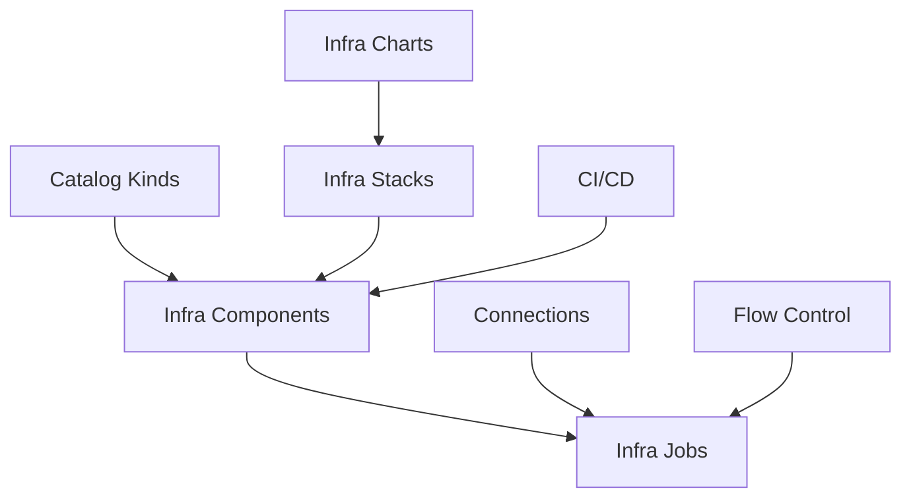

# Infra Hub

Infra Hub is Planton's infrastructure half — Cursor for Cloud Infrastructure. Describe or configure what you need, verify cost and permissions, deploy into your own account, and publish it as an Infra Chart — a template your team reuses. It handles the full lifecycle of infra components — from browsing a catalog of Catalog Kinds, to deploying them as Infra Components, to orchestrating multi-resource deployments through Infra Charts and Infra Pipelines.

Infrastructure is provisioned using Pulumi, Terraform, or OpenTofu modules, executed through Infra Jobs, with credentials managed automatically via Connections.

<!-- SCREENSHOT: Infra Hub Infra Components view
  Page: /orgs/{org}/infra-components
  Action: Show the Infra Components tab with at least 3 deployed resources visible
  Focus: The resource list showing names, kinds, environments, and status
  Alt: Infra Hub Infra Components tab showing deployed infrastructure with status indicators
-->

## Core Concepts

### Infra Components

The fundamental unit of infrastructure in Planton. An Infra Component is a deployed instance of a catalog kind — a VPC, a database, a Kubernetes cluster. Each belongs to an environment and is tracked through its full lifecycle.

[Learn about Infra Components](/docs/infrastructure/infra-components)

### Catalog Kinds

The taxonomy of available catalog kinds. Planton supports resource kinds across AWS, GCP, Azure, Kubernetes, Cloudflare, and other providers.

[Browse Catalog Kinds](/docs/infrastructure/catalog-kinds)

### Infra Charts

Composed collections of Catalog Kinds that deploy together as a coordinated unit. An Infra Chart handles dependency ordering, shared configuration, and multi-resource orchestration.

[Learn about Infra Charts](/docs/infrastructure/infra-charts)

### Infra Stacks

Running instances of Infra Charts with your specific configuration. Infra Stacks track deployment progress via DAG visualization and maintain the history of all changes.

[Learn about Infra Stacks](/docs/infrastructure/infra-stacks)

### Infra Pipelines

DAG-based orchestration for deploying multiple Infra Components and Infra Stacks in dependency order. Infra Pipelines coordinate the execution of Infra Jobs across resources.

[Learn about Infra Pipelines](/docs/infrastructure/infra-pipelines)

### Infra Jobs

The atomic execution unit that provisions infrastructure. Every infrastructure change triggers an Infra Job that runs `init → refresh → plan → apply` using Pulumi, Terraform, or OpenTofu.

[Learn about Infra Jobs](/docs/infrastructure/infra-jobs)

### Flow Control

Governance policies that control how infrastructure changes are deployed — approval gates, plan-before-apply requirements, and deployment pauses.

[Learn about Flow Control](/docs/infrastructure/flow-control)

## How Infrastructure Fits in the Platform

- **Infrastructure** provisions the infrastructure where everything runs
- **CI/CD** deploys applications to infrastructure provisioned by Infrastructure
- **[Connections](/docs/connections)** provides the cloud provider credentials for Infra Job execution
- **Flow Control** policies govern the deployment workflow

## Open Source

Infrastructure is built on [Planton open source](https://planton.dev), an open-source foundation that provides the Protocol Buffer APIs, IaC modules, and CLI for multi-cloud infrastructure provisioning. Planton adds workflow orchestration, governance, and a web console on top of the open-source core.

[Learn about the open-source foundation](/docs/infrastructure/open-source)

## Getting Started

- [Getting Started Guide](/docs/infrastructure/getting-started) — Deploy your first Infra Component
- [Catalog Kinds](/docs/infrastructure/catalog-kinds) — Browse the catalog
- [Infra Jobs](/docs/infrastructure/infra-jobs) — Understand the execution model
