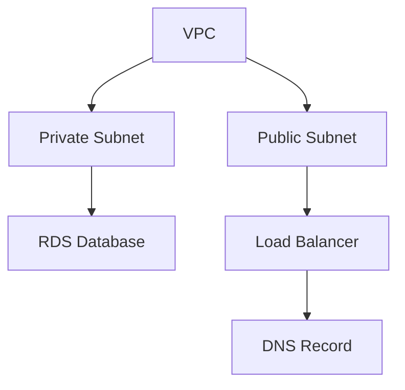

# Infra Pipelines

An Infra Pipeline coordinates the deployment of multiple Cloud Resources in the right order. When an Infra Project defines resources that depend on each other — a VPC that must exist before the database inside it, a security group that must exist before the load balancer that references it — the Infra Pipeline figures out the order, deploys independent resources in parallel, and waits for dependencies to complete before starting their dependents.

## Why Infra Pipelines Exist

Deploying a single Cloud Resource is straightforward — define it, submit it, and a Stack Job provisions it. But real environments rarely consist of a single resource. An AWS environment might include a VPC, subnets, security groups, an ECS cluster, a load balancer, Route 53 records, and an ACM certificate — with specific dependency relationships between them.

Without orchestration, you would deploy each resource manually, wait for it to complete, copy output values (like a VPC ID) into the next resource's configuration, and repeat. Sequential, error-prone, and slow.

Infra Pipelines automate this. They read the dependency graph from the Infra Project, deploy independent resources in parallel, pass outputs from completed resources to their dependents, and give you a single view of the entire deployment's progress. What might take 25 minutes of sequential manual work completes in roughly half the time with parallel execution.

## How It Works

When an Infra Project is created or updated, the system generates an Infra Pipeline from the project's dependency graph (DAG). Each node in the graph is a Cloud Resource; each edge is a dependency where one resource needs an output from another.

The pipeline executes the graph:

1. Resources with no dependencies start immediately, in parallel.
2. When a resource completes, its dependents become eligible.
3. Independent branches of the graph execute concurrently.
4. Each resource deployment runs as a separate [Stack Job](/docs/infrastructure/stack-jobs).
5. If a resource fails, all of its downstream dependents are cancelled.



In this example, the VPC deploys first. Once it completes, both subnets start in parallel. The database waits for the private subnet; the load balancer waits for the public subnet. The DNS record waits for the load balancer.

<!-- SCREENSHOT: Infra Pipeline DAG visualization
  Page: /resource/infra-hub/infra-pipeline (DAG graph component)
  Action: Show a running pipeline with some nodes completed, some in progress, and some pending
  Focus: The DAG graph with node status indicators
  Alt: Infra Pipeline DAG visualization showing an AWS environment deployment with VPC completed, subnets in progress, and RDS pending
-->

## Operation Types

Infra Pipelines support two operations:

- **Deploy** — Create or update Cloud Resources. This is the default, triggered when an Infra Project is created, updated, or explicitly redeployed.
- **Undeploy** — Destroy Cloud Resources in reverse dependency order. The database is destroyed before the VPC it depends on, ensuring clean teardown.

## Manual Approval Gates

Infra Pipelines support approval gates at two levels, giving you control over when deployments proceed.

### Environment-Level Gates

An environment within the pipeline can require manual approval before any of its resources start deploying. When a gate is active, the pipeline pauses and waits for a team member to approve or reject.

```bash
planton infra-pipeline resolve-env-manual-gate <pipeline-id> <env-name> yes
```

### Node-Level Gates

Individual resources within the dependency graph can have their own gates. A node gate pauses the pipeline after that specific resource completes, requiring approval before its downstream dependents proceed. This is useful for high-risk resources where you want to verify the deployment before allowing dependents to start.

```bash
planton infra-pipeline resolve-node-manual-gate <pipeline-id> <env-name> <node-id> yes
```

<!-- SCREENSHOT: Pipeline with manual gate awaiting approval
  Page: /resource/infra-hub/infra-pipeline (DAG graph component)
  Action: Show a pipeline paused at a manual gate with an approval prompt visible
  Focus: The gate approval UI element
  Alt: Infra Pipeline paused at a manual approval gate showing approve/reject buttons
-->

## Monitoring Progress

The web console displays the dependency graph with real-time status updates for each resource. Completed resources are marked as successful, active deployments show as in progress, and pending resources wait for their dependencies. Click any resource node to drill down to its Stack Job logs.

The pipeline detail view shows the full graph along with timing information — when each resource started, how long it took, and the overall pipeline duration.

## Cancelling a Pipeline

Running pipelines can be cancelled. The currently executing resource deployment completes its in-flight infrastructure operation (to avoid leaving resources in an inconsistent state), then remaining resources are cancelled.

```bash
planton infra-pipeline cancel <pipeline-id>
```

The web console provides a cancel button with a confirmation dialog explaining that in-flight operations will complete before cancellation takes effect.

## Pipeline vs Direct Deployment

| Aspect | Direct Deployment | Infra Pipeline |
|--------|------------------|----------------|
| Scope | Single Cloud Resource | Multiple Cloud Resources |
| Dependencies | None — each resource is independent | Automatic — resources deploy in dependency order |
| Execution | One Stack Job | Multiple Stack Jobs, with parallelism |
| Approval | Per-resource | Environment-level and per-resource gates |
| Tracking | Individual Stack Job status | Unified view across all resources |

Use direct deployment for standalone resources. Use Infra Pipelines (via [Infra Projects](/docs/infrastructure/infra-projects)) when resources depend on each other or when you need coordinated, multi-resource deployments.

## Using the CLI

```bash
# Cancel a running pipeline
planton infra-pipeline cancel <pipeline-id>

# Approve an environment gate
planton infra-pipeline resolve-env-manual-gate <pipeline-id> <env-name> yes

# Approve a resource-level gate
planton infra-pipeline resolve-node-manual-gate <pipeline-id> <env-name> <node-id> yes
```

Infra Pipelines are typically created automatically when you create or update an Infra Project. To trigger a pipeline manually:

```bash
# Deploy an Infra Project (starts a deploy run and follows it)
planton infra project deploy <project-id>

# List pipelines for a project
planton infra-project infra-pipelines --project <project-id>

# Get the last pipeline for a project
planton infra-project last-pipeline <project-id>
```

## Related Documentation

- [Infra Projects](/docs/infrastructure/infra-projects) — The projects that pipelines execute
- [Cloud Resources](/docs/infrastructure/cloud-resources) — The resources deployed by pipelines
- [Stack Jobs](/docs/infrastructure/stack-jobs) — The atomic IaC execution units within pipelines
- [Flow Control](/docs/infrastructure/flow-control) — Governance policies for approval gates
- [Infra Charts](/docs/infrastructure/infra-charts) — Templates that define resources in chart-based projects
