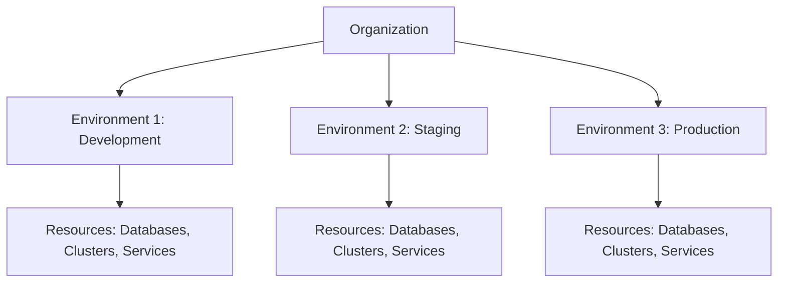
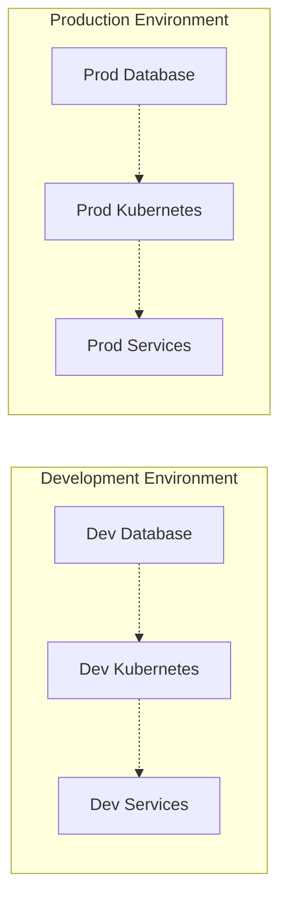

# Resource Hierarchy

Planton organizes everything into a three-level hierarchy: **Organization > Environments > Resources**. This structure controls visibility, credential scoping, access control, and deployment isolation. If you have used Google Cloud's organization/project model or AWS Organizations, the pattern will be familiar.

## The Three-Level Hierarchy



### Level 1: Organization

The top-level container, typically representing a company or team.

**What belongs here:**
- All environments
- Team members and their roles
- Connections to cloud providers, Git providers, registries, and state backends
- Billing and subscription management
- Organization-wide settings

**Key facts:**
- Created once when you first set up the platform
- Has a unique slug across the platform (e.g., `acme-corp`)
- The person who creates it becomes the organization owner
- Can have multiple administrators

### Level 2: Environments

Logical groupings that separate resources by deployment stage or purpose.

**What belongs here:**
- Cloud Resources deployed via Infra Hub
- Services deployed via Service Hub
- Environment-specific connection authorizations

**Key facts:**
- Created within an organization
- Names must be lowercase alphanumeric with hyphens
- Each environment has its own credential authorizations — a connection must be explicitly authorized for an environment before it can be used there
- Resources in one environment cannot directly access resources in another

**Common naming patterns:**
- `dev` or `development`
- `staging` or `stage`
- `production` or `prod`
- `test` — for automated testing
- `feature-auth-rework` — short-lived feature environments

### Level 3: Resources

The actual infrastructure and applications.

- **Cloud Resources** — VPCs, databases, Kubernetes clusters, storage buckets, and other infrastructure deployed through Infra Hub
- **Services** — applications from Git repositories deployed through Service Hub

**Key facts:**
- Every resource belongs to exactly one environment
- Resources have unique identifiers within their environment
- Cloud Resources are provisioned by Stack Jobs; Services are deployed by Pipelines

## Context Selection

The context selector in the top-left of the console shows your current position in the hierarchy:

```
Acme Corp / production
    ↑           ↑
Organization  Environment
```

Clicking the context selector opens a dropdown where you can switch between environments. The console updates to show resources scoped to your selection:

- **Organization level** — manage connections, billing, settings, team members
- **Environment level** — deploy and manage cloud resources and services

<!-- SCREENSHOT: Context selector
  Page: /orgs/{org}/cloud-resources (header area)
  Action: Click context selector dropdown to expand org/environment hierarchy
  Focus: The context selector dropdown in the top-left header
  Alt: Context selector dropdown showing organization and environment selection
-->

**Using the CLI:**

```bash
# Set your default context
planton context set --org acme-corp --env production

# View your current context
planton context get

# Look up available organizations and environments
planton context lookup
```

## Resource Isolation

Environments provide strong isolation. Resources in development cannot access production resources, and vice versa. This isolation operates at three levels:

**Credential isolation** — each environment has its own authorized connections. A production AWS account cannot be accidentally used in development unless explicitly authorized for both.

**Deployment isolation** — infrastructure changes in one environment do not affect others. A failed deployment in staging does not impact production.

**Access control isolation** — permissions are granted per environment. A team member with admin access to development does not automatically have access to production.



## Credential Scoping

Connections are created at the organization level but must be authorized for specific environments before they can be used. This two-step process prevents accidental credential misuse.

1. **Create** the connection at the organization level (Connections page)
2. **Authorize** the connection for specific environments
3. Optionally, **set as default** so deployments in that environment use it automatically

```
AWS Production Account (Org Level)
├── Authorized for: production
└── Default for: production

AWS Development Account (Org Level)
├── Authorized for: dev, staging
└── Default for: dev
```

See [Environment Mappings](/docs/connections/environment-mappings) and [Default Connections](/docs/connections/default-connections) for the full credential resolution model.

## Access Control

Planton uses role-based access control powered by OpenFGA. Roles are scoped to specific resource types, not generic platform-wide labels.

### Organization Roles

| Role | What It Grants |
|------|---------------|
| **Owner** | Full control including billing, organization deletion, and all admin capabilities |
| **Admin** | Manage members, environments, settings, and connections |
| **IAM Admin** | Manage role assignments and access policies |
| **Member** | Create and manage resources within authorized environments |
| **Viewer** | Read-only access to organization resources |

### Environment Roles

| Role | What It Grants |
|------|---------------|
| **Admin** | Full control of the environment — deploy, update, and delete resources |
| **IAM Admin** | Manage role assignments within the environment |
| **Viewer** | Read-only access to environment resources |

Organization-level roles do not automatically cascade to all environments. An Organization Admin has broad organizational access, but environment-level permissions are granted separately for finer-grained control.

## Common Hierarchy Patterns

### Small Team

Two environments, straightforward separation:

```
my-startup/
├── dev/
│   ├── postgres-db
│   ├── redis-cache
│   └── api-service
└── prod/
    ├── postgres-db
    ├── redis-cache
    └── api-service
```

### Growing Organization

Add staging and testing environments as the team grows:

```
acme-corp/
├── dev/
│   └── (individual developer resources)
├── test/
│   └── (automated testing resources)
├── staging/
│   └── (preproduction validation)
└── prod/
    └── (production resources)
```

### Multi-Region

Use environment naming to represent regional deployments:

```
acme-corp/
├── dev/
├── staging/
├── prod-us-east/
└── prod-eu-west/
```

## Common Questions

### Can I move resources between environments?

No. Resources are created in a specific environment and stay there. This is by design — it enforces isolation and simplifies credential scoping. To replicate a resource in another environment, create a new instance there with the same configuration.

### Can I have multiple organizations?

Yes, but one per company is typical. Multiple organizations make sense for consulting firms managing client infrastructure, completely separate business units, or strict isolation requirements between divisions.

### How many environments should I have?

Start with two or three (`dev`, `staging`, `prod`). Add more when you have a specific need — too many environments add complexity without proportional value.

### Can environments span cloud regions?

Yes. An environment is a logical grouping, not a region constraint. You can deploy resources to multiple cloud regions within the same environment. Use resource naming conventions to indicate region when needed.

## Related Documentation

- [Core Concepts](/docs/platform/core-concepts) — reference for key platform terminology
- [Connections](/docs/connections) — how credentials and integrations are managed
- [Teams and Access](/docs/teams-and-access) — role-based permissions and team management
