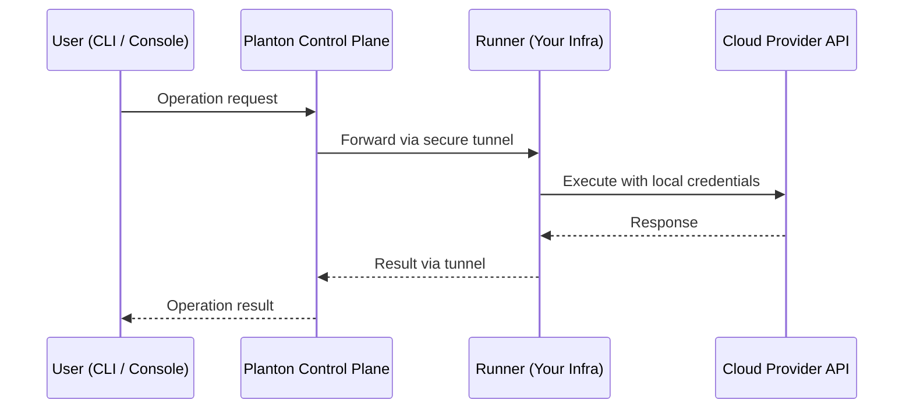

# Runner

Planton Runner is a lightweight agent you deploy in your own infrastructure — a Kubernetes cluster, an AWS ECS task, a GCP Cloud Run service, or an Azure Container App. It enables Planton to execute infrastructure-as-code operations and real-time cloud operations on your behalf, without you ever sharing cloud credentials with Planton or opening inbound firewall rules.

On Planton's hosted product you do not need one to start: until you add a runner of your own, your work runs on a [Planton-hosted runner](/docs/runner/planton-hosted-runners). This page is about the runner you run yourself.

## Why Runner Exists

Any platform that manages infrastructure on your behalf faces a fundamental tension: it needs to act in your cloud accounts, but you cannot simply hand over your AWS keys, GCP service accounts, or Azure credentials to a SaaS vendor. And even if you were willing to share credentials, the platform still needs network access to your private Kubernetes clusters, VPCs, and cloud resources — access that typically requires VPN tunnels, IP allowlisting, or inbound firewall rules.

Runner resolves both problems at once. Instead of pulling credentials up to Planton's control plane, Runner pushes execution down to your infrastructure. The runner holds your cloud credentials locally and connects outbound to Planton through a secure mutual TLS tunnel. Planton sends operation requests through this tunnel, and the runner executes them using the credentials it already has. Credentials never leave your environment. No inbound ports are opened. No VPN is needed.

This architecture means:

- **Your credentials stay local.** Cloud provider keys, service accounts, and kubeconfig files remain in your infrastructure. Planton's control plane never sees them.
- **No inbound firewall rules.** The runner initiates all connections outbound over HTTPS (port 443). Your network perimeter stays intact.
- **Operations execute where the resources are.** Kubernetes commands run from inside the cluster. AWS API calls originate from your VPC. Latency is lower, and network topology is simpler.

## What Runner Does

Runner handles two categories of work for the Planton platform:

### Cloud Operations

When you view Kubernetes pods, stream logs, exec into containers, or browse AWS/GCP/Azure resources through Planton's web console or CLI, those requests flow through the runner. The runner receives them via the secure tunnel, executes them against the target cloud APIs using local credentials, and streams the results back. This is what powers the [Operations](/docs/operations) section of the platform.

### Infrastructure Deployments

When Planton runs a deployment — creating a VPC, provisioning a database, updating a Kubernetes cluster — the runner executes the underlying Pulumi, Terraform, or OpenTofu operations. It retrieves the infrastructure code, runs the deployment with your credentials, and reports progress back to the platform. This is the engine behind [Infrastructure](/docs/infrastructure) stack jobs.

## How It Works

### Secure Outbound Connectivity

The runner establishes a secure outbound connection to the control plane. On startup, the runner initiates an outbound connection over HTTPS (port 443) with mutual TLS — both sides present certificates and verify identity. Once established, the connection is persistent and bidirectional, allowing Planton to send operational requests to the runner through it.

From your network's perspective, the runner is making an outbound HTTPS call — the same as any other cloud API client. No inbound ports need to be opened, no VPN tunnels need to be maintained, and no IP allowlisting is required.

### Mutual TLS Authentication

Every runner authenticates with Planton's control plane using mutual TLS. During credential generation, Planton produces a credentials file that gives the runner a unique cryptographic identity bound to your organization, along with an API key for control-plane authentication. When the runner connects:

1. The runner presents its certificate to prove its identity.
2. Planton verifies the certificate was issued by the trusted authority.
3. Planton verifies the identity matches the runner's organization.
4. Planton presents its own certificate.
5. The runner verifies Planton's identity.

Both sides are authenticated. A runner registered to one organization cannot receive requests intended for another, even if both connect to the same infrastructure. This identity enforcement is cryptographic — it cannot be bypassed by configuration changes.

### Resilience

The runner handles connection disruptions automatically:

- **Auto-reconnect**: If the connection drops, the runner reconnects automatically with backoff.
- **Keepalives**: The runner sends periodic health checks to detect dead connections before requests fail.
- **Graceful shutdown**: When the runner stops, it deregisters cleanly from the control plane.

During a disconnection, cloud operations requests to the affected runner will fail with a connection error and succeed again as soon as the runner reconnects. Infrastructure deployments already in progress continue executing without interruption — their execution is independent of the tunnel connection.

## Network Requirements

For the runner to operate, your network needs to allow the following outbound connections:

| Destination | Port | Protocol | Purpose |
|------------|------|----------|---------|
| Planton's tunnel service | 443 | HTTPS | Secure tunnel for cloud operations |
| Planton's execution service | 443 | HTTPS | Infrastructure deployment jobs |
| Cloud provider APIs (AWS, GCP, Azure, Kubernetes) | 443 | HTTPS | Executing operations against your resources |

No inbound ports need to be opened. No VPN or IP allowlisting is required.

If your environment uses an egress proxy or firewall that inspects TLS traffic, you will need to allowlist Planton's endpoints. The runner uses mutual TLS with its own certificate authority, so TLS-inspecting proxies that re-sign traffic will break the mutual authentication.

<!-- SCREENSHOT: Runners list
  Page: /orgs/{org}/runners
  Action: Show the runners page with at least one registered runner and its connection status
  Focus: The runner list showing name, deployment target, and connection status indicator
  Alt: Runners page showing registered runners with their deployment targets and online/offline status
-->

## Getting Started

Deploying a runner takes three steps:

1. **Create a runner token** in the console (Organization Settings → Runner Tokens) or with `planton runner token create`. The token authorizes runners to join your organization — it is never a runner's identity.
2. **Start or deploy** a runner with the token — Kubernetes, AWS ECS, GCP Cloud Run, or Azure Container Apps. Each runner enrolls itself on arrival and receives its own individually revocable identity.
3. **Name it on your connections**, or set it as your organization's default runner for live cloud operations (optional). See [Where Your Work Runs](/docs/runner/planton-hosted-runners#where-your-work-runs).

See [Deployment](/docs/runner/deployment) for the complete walkthrough.

## Related Documentation

- [Planton-Hosted Runners](/docs/runner/planton-hosted-runners) — Where your work runs before you add a runner, and how to move it onto yours
- [Deployment](/docs/runner/deployment) — Generating credentials, installing, and deploying runners to your infrastructure
- [Security Model](/docs/runner/security-model) — Credential isolation, service account identity, authentication modes, and trust boundaries
- [Authentication and Authorization](/docs/security/authentication-and-authorization) — Service accounts, API keys, and the permission model
- [Operations](/docs/operations) — The operations gateway that routes requests through runners
- [Connections](/docs/connections) — Credential management, including runner-delegated authentication
