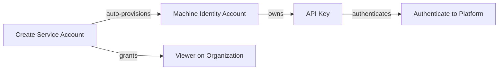
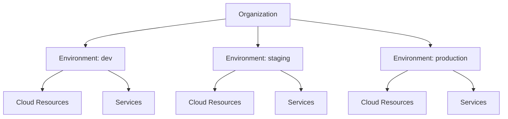

# Authentication and Authorization

Access control in Planton answers two questions: **who are you** (authentication) and **what can you do** (authorization). Authentication verifies identity through an OAuth provider, API key, or service account credentials. Authorization evaluates permissions using a relationship-based model that automatically inherits access through the resource hierarchy.

## Authentication

### Interactive Login

Users authenticate through an OAuth identity provider. The web console handles this automatically when you visit the platform. The CLI signs in through the console in your browser: it opens the console's sign-in page, and the CLI receives a sign-in of its own. If the browser is already signed in as the account you asked for, no password is typed. No client secrets are stored locally.

```bash
# Sign in (opens the browser); name the account to skip the picker
planton auth login you@example.com

# Check your current identity and whether the sign-in renews automatically
planton auth whoami
```

A login is checked before it reports success: if the platform does not accept the new sign-in, the login fails and saves nothing. A sign-in renews itself while its renewal is good. When it can no longer be renewed, every command says whose sign-in expired, on which instance and why, and gives the exact `planton auth login <email>` to run.

You can hold several accounts per instance, and several instances:

```bash
# List every saved account, each with its own status
planton auth list

# Switch the active account on the current instance (checked, and renewed if needed)
planton auth switch other@example.com

# Switch to a different instance
planton auth use <instance>
```

### API Keys

For automation, CI/CD pipelines, and scripts that cannot use a browser-based login, Planton supports API keys.

API keys carry the permissions of the user who created them. If Alice has admin access to the production environment and creates an API key, that key has the same admin access Alice has. If Alice's permissions change, the key's effective permissions change with them.

```bash
# Create a new API key
planton iam apikey new --name "ci-pipeline"

# List existing API keys
planton iam apikey list
```

Key properties:

- **Hashed storage** — Planton stores a cryptographic hash of the key, never the plaintext. The key is displayed once at creation and cannot be retrieved afterward.
- **Fingerprint** — Each key has a short fingerprint (last 6 characters) for identification in the web console and CLI output.
- **Expiration** — Keys can be set to expire on a specific date or configured to never expire.
- **Last-used tracking** — Planton records when each key was last used, so you can identify unused keys for rotation or cleanup.

<!-- SCREENSHOT: API Keys page
  Page: /orgs/{org}/iam/api-keys
  Action: Show the API keys list with at least 2 keys
  Focus: The table showing key names, fingerprints, last used dates, and expiration status
  Alt: API Keys page showing a list of keys with fingerprints, last used timestamps, and expiration dates
-->

### Service Accounts

Service accounts are machine identities for automation workloads that need to authenticate with the Planton platform. Where API keys are tied to a human user's permissions, service accounts are standalone identities with their own permission grants — purpose-built for [Runners](/docs/runner), CI/CD pipelines, and other automated systems.

Each service account is scoped to an organization and backed by a dedicated machine identity account. It uses the same API key infrastructure as user keys, so the authentication pipeline is identical: the platform sees an API key, resolves the owning identity, and evaluates permissions. The difference is that the identity belongs to a machine, not a person.

#### How Service Accounts Work

When you create a service account, Planton:

1. Creates the service account resource in the IAM domain
2. Auto-provisions a backing machine identity account
3. Grants the identity `viewer` access on the owning organization — this cascades through the permission hierarchy to secrets and variables, enabling the service account to resolve credentials at runtime

Deleting a service account cascades completely: all API keys are revoked, all permission grants are removed, and the backing identity account is deleted.



#### Key Management

Service account keys work like user API keys — they are displayed once at creation and stored only as a cryptographic hash. You can create multiple keys for a single service account (for key rotation without downtime) and revoke individual keys when they are no longer needed.

#### When Runners Use Service Accounts

When a [Runner](/docs/runner) enrolls — started with a runner token, it registers itself on arrival — Planton auto-provisions a service account for that runner and mints an API key delivered in the runner's identity document. The runner uses this key to authenticate with the control plane at startup and to resolve secrets and variables at runtime. You do not need to create the service account manually — enrollment handles everything.

For details on how this fits into the runner's security model, see [Runner Security Model](/docs/runner/security-model).

#### Using the Web Console

Navigate to **Organization Settings > Service Accounts** to manage service accounts. The page shows all service accounts in the organization with their name, description, and creation date.

To create a service account, click **Create Service Account** and provide a name and optional description. After creation, navigate to the service account's detail page to manage its API keys.

The key creation dialog uses a two-phase flow: confirm creation, then copy the key from the one-time reveal. You must acknowledge that you have saved the key before the dialog closes — the key cannot be retrieved afterward.

<!-- SCREENSHOT: Service Accounts page
  Page: /orgs/{org}/settings/service-accounts
  Action: Show the service accounts list with at least one entry
  Focus: The table showing service account names, descriptions, and creation dates
  Alt: Service Accounts settings page showing a list of service accounts in the organization
-->

#### Using the CLI

```bash
# List service accounts in an organization
planton sa list --org acme

# Create a service account
planton sa create --org acme --name deploy-runner --description "Production runner identity"

# View service account details
planton sa get sa_01abc123

# Create an API key for a service account
planton sa key create sa_01abc123

# List API keys belonging to a service account
planton sa key list sa_01abc123

# Revoke a specific API key
planton sa key revoke sa_01abc123 --key-id ak_01xyz789

# Delete a service account (cascades: revokes all keys, removes permissions)
planton sa delete sa_01abc123
```

#### Authenticating with an API Key

Both user API keys and service account API keys can be used to authenticate the CLI without a browser. This is useful for CI/CD environments, scripts, and any context where interactive OAuth login is not possible:

```bash
# Authenticate with an API key (user or service account)
planton auth login --api-key pak_abc123...

# Verify the authenticated identity
planton auth who
```

When authenticated with a service account key, `planton auth who` displays the service account name and organization instead of a user email. `planton auth list` shows these sessions as "API Key (SA)" to distinguish them from user API key sessions.

## Authorization

### The Model

Planton uses [OpenFGA](https://openfga.dev/) for all access control decisions. OpenFGA is an open-source fine-grained authorization engine based on Google's Zanzibar paper. Rather than maintaining simple access control lists, it evaluates permissions through **relationships** between users, teams, and resources.

This means Planton does not store a flat list of "Alice can access Resource X." Instead, it stores relationships — "Alice is an admin of Organization Acme" and "Organization Acme owns Environment Production" — and computes that Alice can access resources in Production because admin access flows through the ownership chain.

### Why This Matters

The practical benefit is that you manage access at the right level of granularity and it propagates automatically:

- Grant someone admin on the **organization** → they are admin on every environment and every resource within it
- Grant someone viewer on an **environment** → they can view every cloud resource and service in that environment
- Grant a **team** admin on an environment → every member of that team (including members of nested sub-teams) inherits admin access

You do not need to manually assign permissions to each individual resource. The authorization engine computes effective permissions by traversing the relationship graph.

### Resource Hierarchy

Permissions flow through a three-level hierarchy:



Each level inherits permissions from its parent:

| If you are... | Then you automatically have... |
|---------------|-------------------------------|
| Organization **admin** | Admin on all environments, all cloud resources, all services in the organization |
| Organization **viewer** | Viewer on all environments, all cloud resources, all services |
| Environment **admin** | Admin on all cloud resources and services in that environment |
| Environment **viewer** | Viewer on all cloud resources and services in that environment |

You can also grant permissions directly on individual resources when you need more granular control.

### Roles

Planton defines five standard roles that apply across most resource types:

| Role | What It Can Do |
|------|---------------|
| **Owner** | Full control including ownership transfer. Automatically granted to the creator of an organization. |
| **Admin** | Create, update, delete, and restore resources. Manage team assignments. The primary operational role. |
| **IAM Admin** | View and manage IAM policies — who has what access. Cannot modify the resources themselves. |
| **Viewer** | Read-only access. Can view resource details, configurations, and status. Cannot make changes. |
| **Member** | Basic membership. Can view and participate but has limited operational capabilities. Primarily used at the organization level. |

Roles are scoped to resource types. An "Organization Admin" is a different role from a "Service Admin" — they share the same capabilities (create, update, delete) but apply to different resource types. This prevents a team that manages services from accidentally gaining access to infrastructure credentials.

### Teams

Teams allow you to manage permissions for groups of people instead of individuals. A team has members, and any permission granted to the team flows to all members.

Teams support nesting — a team can include other teams as members. For example:

- **Platform Engineering** team includes the **Infrastructure** team and the **SRE** team
- A permission granted to Platform Engineering automatically applies to all members of Infrastructure and SRE
- When someone joins the Infrastructure team, they inherit permissions from both Infrastructure and Platform Engineering

This models real organizational structures without requiring you to duplicate permission grants across multiple teams.

### Resource Sharing

Some resources — particularly credentials and secrets — use a **sharing** model in addition to the standard role hierarchy. A credential created at the organization level can be **shared** with specific environments, which controls where that credential can be used.

This is distinct from viewer/admin access. Sharing controls whether a resource can be referenced during deployments, while roles control who can view or modify the resource itself. See [Connections: Environment Mappings](/docs/connections/environment-mappings) for how this applies to credentials.

### Context Switching

When a user belongs to multiple organizations, Planton tracks their active context — which organization they are currently operating in. List operations are context-aware: you only see resources in your active organization.

This prevents data leakage between organizations. A user with access to both Organization A and Organization B sees only Organization A's resources when their active context is set to A, regardless of their permissions in B.

## Managing Access

### Web Console

The web console provides a visual interface for managing access:

- **Organization Settings > Members** — Invite new members, assign initial roles, manage membership
- **Organization Settings > Teams** — Create teams, add members (individuals or other teams), view team permissions
- **Organization Settings > Service Accounts** — Create and manage machine identities with API key lifecycle
- **Resource Detail > IAM** — View and manage permissions on individual resources

<!-- SCREENSHOT: Grant permission dialog
  Page: /orgs/{org}/settings/members
  Action: Show the grant permission dialog with role selection
  Focus: The permission grant modal showing principal search and role dropdown
  Alt: Grant permission dialog showing a user search field and role selection dropdown with available roles
-->

### CLI

The CLI provides commands for managing IAM policies programmatically:

```bash
# Grant a role on a resource
planton iam iam-policy add \
  --resource-kind organization \
  --resource-id org-acme \
  --principal-id ia-usr-alice \
  --role admin

# View who has access to a resource
planton iam iam-policy get \
  --resource-kind environment \
  --resource-id env-production

# View access grouped by role
planton iam iam-policy get \
  --resource-kind environment \
  --resource-id env-production \
  --group-by-role

# Include inherited permissions (from parent resources)
planton iam iam-policy get \
  --resource-kind environment \
  --resource-id env-production \
  --show-inherited

# Remove a role from a principal
planton iam iam-policy remove \
  --resource-kind organization \
  --resource-id org-acme \
  --principal-id ia-usr-alice \
  --role admin

# List all available roles
planton iam role list
```

The `get` command supports multiple output formats (`--output-format table`, `json`, or `yaml`) for integration with scripts and automation.

## CLI Reference

| Command | Description |
|---------|-------------|
| `planton auth login` | Authenticate via browser-based OAuth |
| `planton auth login --api-key <key>` | Authenticate with an API key (user or service account) |
| `planton auth who` | Show current authenticated identity |
| `planton auth list` | List authentication sessions |
| `planton auth use` | Switch authentication context |
| `planton iam iam-policy add` | Grant a role on a resource to a principal |
| `planton iam iam-policy get` | View IAM policies for a resource |
| `planton iam iam-policy remove` | Remove a role binding |
| `planton iam role list` | List all available IAM roles |
| `planton iam apikey new` | Create a new API key |
| `planton iam apikey list` | List existing API keys |
| `planton iam invite` | Invite a member to the organization |
| `planton sa list` | List service accounts in an organization |
| `planton sa create` | Create a new service account |
| `planton sa get` | View service account details |
| `planton sa delete` | Delete a service account (cascading) |
| `planton sa key list` | List API keys for a service account |
| `planton sa key create` | Create a new API key for a service account |
| `planton sa key revoke` | Revoke a specific service account API key |

## Related Documentation

- [Security Overview](/docs/security) — Platform security model and architecture
- [Audit Trails](/docs/security/audit-trails) — Immutable change tracking
- [Teams and Access](/docs/teams-and-access) — Member management, team structure, and billing
- [Connections](/docs/connections) — Credential management and environment authorization
- [Runner Security Model](/docs/runner/security-model) — Credential isolation and mTLS
