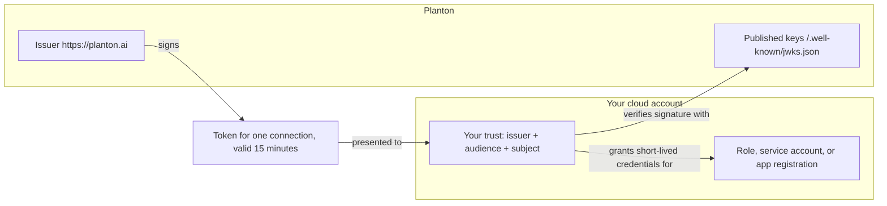

# What Your Cloud Trusts When You Connect It to Planton

When you set up a [keyless cloud connection](/docs/connections/keyless-cloud-connections), you write a trust into your own AWS account, Google Cloud project, or Azure subscription. That trust admits a token only when three values match exactly: the issuer that signed it, the audience it was signed for, and the subject that names one connection. This page lists those values for each cloud, explains where Planton's signing keys come from, what your cloud does not trust, and how to inspect and revoke the trust.

## Why It Matters

A security review of a cloud integration asks one question first: what exactly does this trust admit, and who else could satisfy it? With a keyless connection, the answer fits in three strings. Nothing else is accepted: no Planton cloud account, no shared secret, and no token minted for another connection.



## The Three Pinned Values

Each value is compared byte for byte. The issuer on planton.ai is always `https://planton.ai`, and the subject has the same form on every cloud:

```text
planton:v1:org:<organization slug>:conn:<connection slug>:provider:<aws|gcp|azure>
```

| Value | AWS | Google Cloud | Azure |
|-------|-----|--------------|-------|
| **Issuer** | `https://planton.ai`, registered as the IAM OIDC identity provider `arn:aws:iam::<account>:oidc-provider/planton.ai` | `https://planton.ai`, the OIDC provider's issuer URI | `https://planton.ai`, the federated identity credential's issuer |
| **Audience** | `sts.amazonaws.com`, the trust policy's `planton.ai:aud` condition | The OIDC provider's full resource name, for example `//iam.googleapis.com/projects/123456789012/locations/global/workloadIdentityPools/planton/providers/planton-acme-gcp-prod` | `api://AzureADTokenExchange`, the credential's audience |
| **Subject** | The trust policy's `planton.ai:sub` condition, for example `planton:v1:org:acme:conn:acme-aws-prod:provider:aws` | The provider's attribute condition, `assertion.sub == '<subject>'`, and the service account binding for `principal://.../subject/<subject>` | The credential's subject, for example `planton:v1:org:acme:conn:acme-azure-prod:provider:azure` |

On AWS, one identity provider serves every Planton connection in the account, and each connection's role pins its own subject. On Google Cloud, each connection has its own OIDC provider, so its audience is unique too. On Azure, each connection has its own federated credential.

### The Issuer Is Permanent

`https://planton.ai` is the company's own domain, not the hostname of the servers that sign the tokens. Planton keeps it fixed so the trust you write lasts as long as the connection: when Planton moves or rebuilds the servers behind it, the issuer stays the same and your trust keeps working.

A self-hosted Planton instance is a different issuer: it signs as its own public address, and the console puts that address in the setup script.

## Where the Keys Come From

The signing keys are the one thing your trust does not pin. Your cloud reads the issuer's discovery document, which points to the published key set, and checks each token's signature against it. Because no key is pinned, Planton can rotate its signing keys without any change in your cloud.

| Document | URL |
|----------|-----|
| Discovery | `https://planton.ai/.well-known/openid-configuration` |
| Key set | `https://planton.ai/.well-known/jwks.json` |

Fetch them the way your cloud does:

```bash
curl -s https://planton.ai/.well-known/openid-configuration
curl -s https://planton.ai/.well-known/jwks.json
```

The discovery document names `https://planton.ai` as its issuer and `https://planton.ai/.well-known/jwks.json` as its key set, and lists `RS256` as the signing algorithm:

```json
{"issuer":"https://planton.ai","jwks_uri":"https://planton.ai/.well-known/jwks.json","authorization_endpoint":"https://planton.ai/authorize","response_types_supported":["id_token"],"subject_types_supported":["public"],"id_token_signing_alg_values_supported":["RS256"],"claims_supported":["sub","aud","iss","exp","iat","nbf","jti"],"scopes_supported":["openid"]}
```

Each token Planton signs is valid for 15 minutes. Planton signs a new one when an operation needs it, and only for a connection the requester is authorized to use. The issuer, audience, and subject are derived from the connection itself; no caller can choose them.

## What Your Cloud Does Not Trust

- **No Planton cloud account.** No Planton-owned AWS account, Google Cloud project, or Azure tenant appears in your trust. Your cloud trusts an issuer URL, and only tokens that URL's keys signed.
- **No shared secret.** There is no external ID, client secret, or key file to store, leak, or rotate.
- **No other connection.** A token for any other connection, in your organization or any other, carries a different subject and is refused.
- **Not Planton's sign-in applications.** On Google Cloud and Azure, the console's one-click setup signs you in through Planton's Google or Microsoft application once, to create the trust. The trust it creates names the issuer, not the application, so it does not depend on that application afterwards.

## How to Inspect the Trust

Read the trust in your cloud and compare it with the values above:

- **AWS**: the IAM identity provider for `planton.ai`, and the trust policy of the connection's role (`planton-aws-connection-<connection name>-role` when the console's script created it).
- **Google Cloud**: the OIDC provider in the workload identity pool (`planton` by default), and the `roles/iam.workloadIdentityUser` binding on the service account.
- **Azure**: the federated identity credentials of the app registration (`planton-conn-<connection slug>` when the console's script created it).

[Keyless Cloud Connections](/docs/connections/keyless-cloud-connections#check-what-the-script-created) has the exact commands for each cloud. In the console, **Verify** on a connection shows the subject and issuer Planton presented next to what your cloud granted.

## How to Revoke

Delete the trust in your cloud. Planton holds nothing it could use without it:

| Cloud | Delete |
|-------|--------|
| AWS | The connection's IAM role. Keep the `planton.ai` identity provider while other Planton connections in the account use it |
| Google Cloud | The connection's OIDC provider, or the service account's `roles/iam.workloadIdentityUser` binding for the connection's subject |
| Azure | The connection's federated identity credential on the app registration |

Deleting the connection in Planton also stops Planton from signing tokens for it. Delete the trust in your cloud as well: the subject is built from the organization and connection slugs, so a connection created later with the same slug in the same organization would present the same subject.

## Related Documentation

- [Keyless Cloud Connections](/docs/connections/keyless-cloud-connections) — Set up the trust in AWS, Google Cloud, and Azure, with the scripts the console gives you
- [Cloud Providers](/docs/connections/cloud-providers) — Every authentication method for cloud connections
- [Security Overview](/docs/security) — How Planton protects credentials across the platform
- [Runner Security Model](/docs/runner/security-model) — How the runner authenticates to your cloud in each mode
